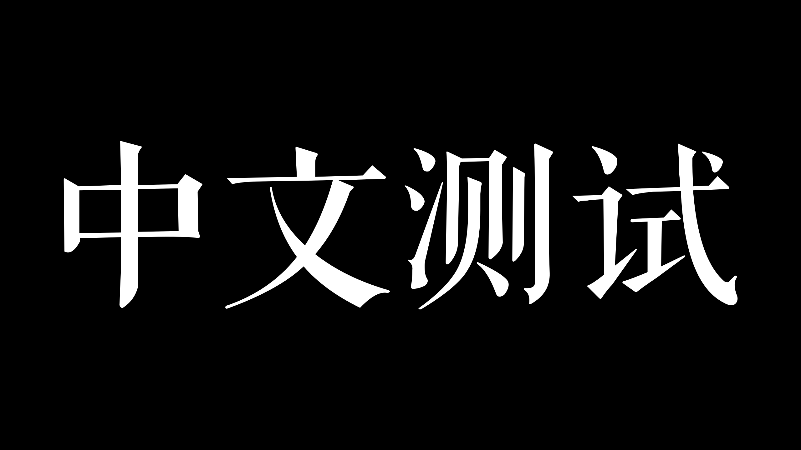
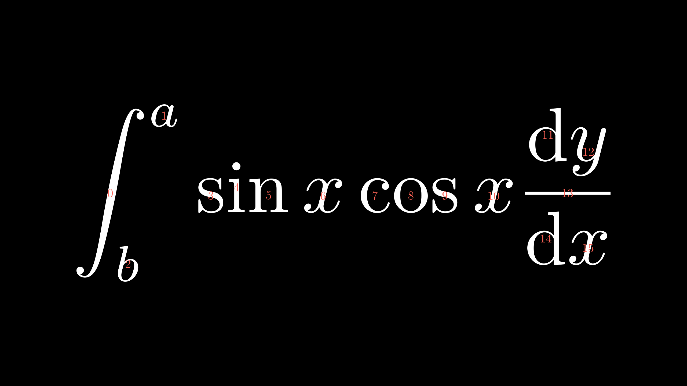
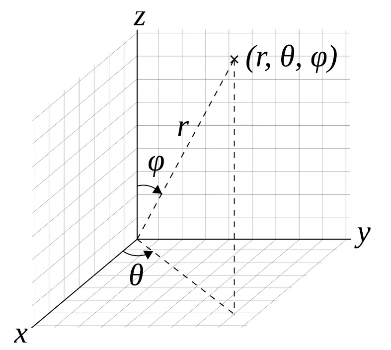
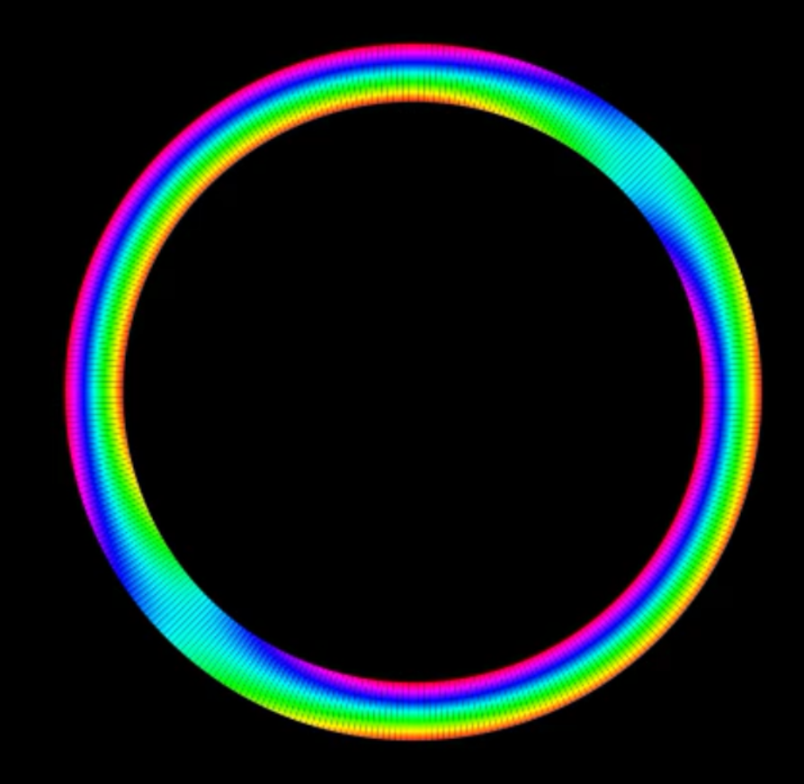
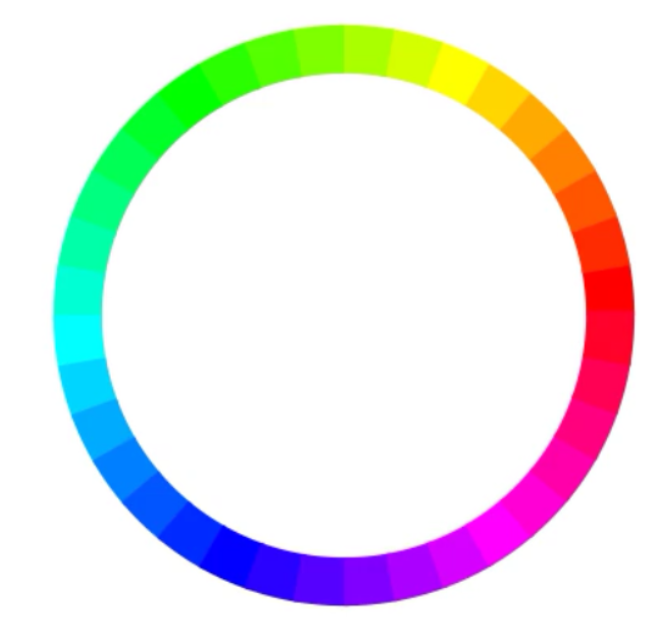

# 研究manim小结

## 总结

## 12月份

### 1228

#### 研究贝多芬的代码1 - 4

学习了 rotate旋转、Flip翻折、字体大小设置、字体样式设置、公式上色（首先建立在对公式的注释上）、framebox方框、bracetext 横框、公式里的拷贝及变换


```python
from manimlib.imports import *


# pycharm有自动调整代码格式的快捷键，默认为Alt + Ctrl + L

class TipesOfText2(Scene):
	def construct(self):
		typesOfText = TextMobject("""
			This is a regular text,
			$\\frac{x}{y}$,
			$\\displaystyle\\frac{x}{y}$,
			$x^2+y^2=a^2$，
			$$x^2+y^2=a^2$$
			""")
		trytext = TextMobject(
			'''
			$\\frac{x}{y}$,
			$\\displaystyle\\frac{x}{y}$,
			'''
		)
		#行内公式displaystyle
		self.play(Write(typesOfText))
		self.play(FadeOut(typesOfText))
		self.play(Write(trytext))
		self.wait(3)
#公式格式
class RotateObject(Scene):
	def construct(self):
		textM = TextMobject("Text")
		textC = TextMobject("Reference text")
		textM.shift(UP)
		textM.rotate(PI/4) # <- Radians
		# You can use .rotate(45*DEGREES) too
		self.play(Write(textM),Write(textC))
		self.wait(1)
		textM.rotate(PI/4)
		self.wait(1)
		textM.rotate(PI/4)
		self.wait(1)
		textM.rotate(PI/4)
		self.wait(1)
		textM.rotate(PI)
		self.wait(1)
#旋转
class FlipObject(Scene):
	def construct(self):
		textM = TextMobject("Text")
		textM.flip(UP)
		self.play(Write(textM))
		self.wait(2)
#翻转
class SizeTextOnLaTeX(Scene):
	def construct(self):
		textHuge = TextMobject("{\\Huge Huge Text 012.\\#!?} Text")
		texthuge = TextMobject("{\\huge huge Text 012.\\#!?} Text")
		textLARGE = TextMobject("{\\LARGE LARGE Text 012.\\#!?} Text")
		textLarge = TextMobject("{\\Large Large Text 012.\\#!?} Text")
		textlarge = TextMobject("{\\large large Text 012.\\#!?} Text")
		textNormal = TextMobject("{\\normalsize normal Text 012.\\#!?} Text")
		textsmall = TextMobject("{\\small small Text 012.\\#!?} Texto normal")
		textfootnotesize = TextMobject("{\\footnotesize footnotesize Text 012.\\#!?} Text")
		textscriptsize = TextMobject("{\\scriptsize scriptsize Text 012.\\#!?} Text")
		texttiny = TextMobject("{\\tiny tiny Texto 012.\\#!?} Text normal")
		textHuge.to_edge(UP)
		texthuge.next_to(textHuge,DOWN,buff=0.1)
		textLARGE.next_to(texthuge,DOWN,buff=0.1)
		textLarge.next_to(textLARGE,DOWN,buff=0.1)
		textlarge.next_to(textLarge,DOWN,buff=0.1)
		textNormal.next_to(textlarge,DOWN,buff=0.1)
		textsmall.next_to(textNormal,DOWN,buff=0.1)
		textfootnotesize.next_to(textsmall,DOWN,buff=0.1)
		textscriptsize.next_to(textfootnotesize,DOWN,buff=0.1)
		texttiny.next_to(textscriptsize,DOWN,buff=0.1)
		self.add(textHuge,texthuge,textLARGE,textLarge,textlarge,textNormal,textsmall,textfootnotesize,textscriptsize,texttiny)
		self.wait(3)
#字体大小
class TextFonts(Scene):
	def construct(self):
		textNormal = TextMobject("\\textrm{Roman serif text 012.\\#!?} Text")
		textItalic = TextMobject("\\textit{Italic text 012.\\#!?} Text")
		textTypewriter = TextMobject("\\texttt{Typewritter text 012.\\#!?} Text")
		textBold = TextMobject("\\textbf{Bold text 012.\\#!?} Text")
		textSL = TextMobject("\\textsl{Slanted text 012.\\#!?} Text")
		textSC = TextMobject("\\textsc{Small caps text 012.\\#!?} Text")
		textNormal.to_edge(UP)
		textItalic.next_to(textNormal,DOWN,buff=.5)
		textTypewriter.next_to(textItalic,DOWN,buff=.5)
		textBold.next_to(textTypewriter,DOWN,buff=.5)
		textSL.next_to(textBold,DOWN,buff=.5)
		textSC.next_to(textSL,DOWN,buff=.5)
		self.add(textNormal,textItalic,textTypewriter,textBold,textSL,textSC)
		self.wait(3)
#字体
class FormulaColor1(Scene):
	def construct(self):
		text1 = TexMobject("x","=","{a","\\over","b}")
		text1[0].set_color(RED)
		text1[1].set_color(BLUE)
		text1[2].set_color(GREEN)
		text1[3].set_color(ORANGE)
		text1[4].set_color("#DC28E2")
		text2 = TexMobject("x","=","\\frac{a}{b}")
		text2[0].set_color(RED)
		text2[1].set_color(BLUE)
		text2[2].set_color(GREEN)
		text2.next_to(text1,RIGHT,buff=0.5)
		self.play(Write(text1))
		self.play(Write(text2))
		self.wait(1)
#公式上色
def debugTeX(self, texm):
	for i, j in enumerate(texm):
		tex_id = Text(str(i), font="Euclid").scale(0.2).set_color(RED)
		tex_id.move_to(j)
		self.add(tex_id)
#公式注释
class FormulaColor3(Scene):

	def construct(self):
		plane = NumberPlane()
		# plane.add(plane.get_axis_labels(x_label_tex="x", y_label_tex="y"))
		plane.add(plane.get_axis_labels())
		# ???plane.add(plane.get_axis_label(label_tex: "x", axis:"y" , edge: UP, direction: DL))
		#self.add(plane)
		text1 = TexMobject("\\sqrt{","\\int_{","a}^","{b}","\\left(","\\frac{x}{y}","\\right)","dx}")
		text1[0].set_color(RED)
		text1[1].set_color(BLUE)
		text1[2].set_color(GREEN)
		text1[3].set_color(YELLOW)
		text1[4].set_color(PINK)
		text1[5].set_color(ORANGE)
		text1[6].set_color(PURPLE)
		text1[7].set_color(MAROON)
		text1.to_corner(UL)
		text1.scale(2)
		text1.move_to([-3.5,2,0])
		self.add(text1)
		debugTeX(self, text1)
		text2 = TexMobject("\\sqrt{", "\\int_{", "a}^", "{b}", "\\left(", "\\frac{x}{y}", "\\right)", "dx.}")
		text2[0].set_color(RED)
		text2[1].set_color(BLUE)
		text2[2].set_color(GREEN)
		text2[3].set_color(YELLOW)
		text2[4].set_color(PINK)
		text2[5].set_color(ORANGE)
		text2[6].set_color(PURPLE)
		text2[7].set_color(MAROON)
		text2.scale(2)
		text2.move_to([3.5, 2, 0])
		self.add(text2)
		debugTeX(self, text2)
		text3 = TexMobject("\\sqrt{", "\\int_", "{a}^", "{b}", "{\\left(", "{x", "\\over", "y}", "\\right)}", "d", "x",
						  ".}")
		text3[0].set_color(RED)
		text3[1].set_color(BLUE)
		text3[2].set_color(GREEN)
		text3[3].set_color(YELLOW)
		text3[4].set_color(PINK)
		text3[5].set_color(ORANGE)
		text3[6].set_color(PURPLE)
		text3[7].set_color(MAROON)
		text3[8].set_color(TEAL)
		text3[9].set_color(GOLD)
		text3.scale(2)
		text3.move_to([-3.5, -2, 0])
		self.add(text3)
		debugTeX(self, text3)
		text4 = TexMobject("\\sqrt{", "\\int_", "{a", "+", "c}^", "{b}", "{\\left(", "{x", "\\over", "y}", "\\right)}",
						  "d", "x", ".}")
		text4[0].set_color(RED)
		text4[1].set_color(BLUE)
		text4[2].set_color(GREEN)
		text4[3].set_color(YELLOW)
		text4[4].set_color(PINK)
		text4[5].set_color(ORANGE)
		text4[6].set_color(PURPLE)
		text4[7].set_color(MAROON)
		text4[8].set_color(TEAL)
		text4[9].set_color(GOLD)
		text4[10].set_color(GRAY)
		text4[11].set_color(RED)
		text4.scale(2)
		text4.move_to([3.5, -2, 0])

		#text = VGroup(text1,text2,text3,text4).arrange(DOWN, aligned_edge=LEFT, buff=0.3)
		self.play(Write(text4[0:6]))
		self.wait(2)
		self.add(text4)
		debugTeX(self, text4)
		self.wait(3)
#公式上色进阶
class ColorByCaracter(Scene):
	def construct(self):
		text = TexMobject("{d","\\over","d","x","}","\\int_","{a}^","{","x","}","f(","t",")d","t","=","f(","x",")")
		#text1 = TexMobject("\\frac{","\\mathrm","{d","}"," }","{","\\mathrm","{","d}"," x}", "\\int_{","a}","^{","x}"," f","(t)","\\mathrm{","d}","t" ,"=" ,"f","(","x",")")
		text1.set_color_by_tex("x",RED)
		self.play(Write(text))
		#self.play(Write(text1))
		self.wait(2)
'''##!!公式字上色，还需要学习latex。'''
class ForTwoVariables(Scene):
	def construct(self): #no usar siempre frac
		text = TexMobject("[0]","[1]","[2]","[3]","[4]","[5]","[6]","[7]")
		for i,color in [(2,RED),(4,PINK)]:
			text[i].set_color(color)
		self.play(Write(text))
		self.wait(3)
#两个变量上色
class ColoringText(Scene):
	def construct(self):
		text = TextMobject("Text or object")
		self.add(text)
		self.wait(0.5)
		for letter in text:
			self.play(LaggedStart(
				letter,
				lambda m: (m.set_color, YELLOW)
			))
		self.wait(0.5)
'''##!!字符串上色，新旧版本，需要理解'''
class FrameBox1(Scene):
	def construct(self):
		text=TexMobject(
			"\\hat g(", "f", ")", "=", "\\int", "_{t_1}", "^{t_{2}}",
			"g(", "t", ")", "e", "^{-2\\pi i", "f", "t}", "dt"
		)
		frameBox = SurroundingRectangle(text[4], buff = 0.2*SMALL_BUFF,color=BLUE)
		seleccion = VGroup(text[7], text[8], text[9])
		frameBox2 = SurroundingRectangle(seleccion, buff=0.5 * SMALL_BUFF)
		frameBox2.set_stroke(GREEN, 9)
		cross = Cross(text[11])
		cross.set_stroke(RED, 6)
		eq = VGroup(text[2], text[3])
		cross2= Cross(eq)
		cross2.set_stroke(PINK, 3)
		self.play(Write(text))
		self.wait(.5)
		self.play(ShowCreation(frameBox))
		self.wait(.5)
		self.play(ShowCreation(frameBox2))
		self.wait(.5)
		self.play(ShowCreation(cross))
		self.wait(.5)
		self.play(ShowCreation(cross2))
		self.wait(2)
#框框及叉叉
class BraceText(Scene):
	def construct(self):
		text=TexMobject(
			"\\frac{d}{dx}f(x)g(x)=","f(x)\\frac{d}{dx}g(x)","+",
			"g(x)\\frac{d}{dx}f(x)"
		)
		self.play(Write(text))
		brace_top = Brace(text[1], UP, buff = SMALL_BUFF)
		brace_bottom = Brace(text[3], DOWN, buff = SMALL_BUFF)
		text_top = brace_top.get_text("$g'f$")
		text_bottom = brace_bottom.get_text("$f'g$")
		self.play(
			GrowFromCenter(brace_top),
			GrowFromCenter(brace_bottom),
			FadeIn(text_top),
			FadeIn(text_bottom)
			)
		self.wait()
#上框及下框
class TransformIssues(Scene):
	def construct(self):
		#                   0   1   2
		text_1=TextMobject("A","B","C")
		#                   0
		text_2=TextMobject("B")

		text_2.next_to(text_1,UP,buff=1)

		#Add the elements 0 and 2 of text_1 to screen and text_2
		self.play(
					*[
						FadeIn(text_1[i])
						for i in [0,2]
					],
					FadeIn(text_2)
			)

		self.wait()

		self.play(
					ReplacementTransform(text_2[:],text_1[1])
			)

		self.wait()
#物体变换，貌似并没有贝多芬发现的问题，不管加不加：
class CopyTextV1(Scene):
	def construct(self):
		formula = TexMobject(
			"\\frac{d}{dx}", #0
			"(", #1
			"u", #2
			"+", #3
			"v", #4
			")", #5
			"=", #6
			"\\frac{d}{dx}", #7
			"u", #8
			"+", #9
			"\\frac{d}{dx}", #10
			"v" #11
			)
		formula.scale(2)
		for letter, color in [("u", RED), ("v", BLUE)]:
			formula.set_color_by_tex(letter, color)
		self.play(Write(formula[0:7]))
		#这里只能到第六个
		self.wait()
		self.play(
			ReplacementTransform(formula[2].copy(),formula[8]),
			ReplacementTransform(formula[4].copy(),formula[11]),
			ReplacementTransform(formula[3].copy(),formula[9])
			)
		self.wait()
		self.play(
			ReplacementTransform(formula[0].copy(),formula[7]),
			ReplacementTransform(formula[0].copy(),formula[10])
			)
		self.wait()
		self.add(formula)
		debugTeX(self, formula)
		self.wait(3)
#公式复制及上色
class CopyTwoFormulas2(Scene):
	def construct(self):
		formula1 = TexMobject(
				"\\neg","\\forall","x",":","P(x)"
			)
		formula2 = TexMobject(
				"\\exists","x",":","\\neg","P(x)"
			)
		for tam,pos,formula in [(2,2*UP,formula1),(2,2*DOWN,formula2)]:
			formula.scale(tam)
			formula.move_to(pos)
		self.play(Write(formula1))
		self.wait(3)
		changes = [
			# First time
			[(2,3,4),
			# | | |
			# v v v
			 (1,2,4)],
			# Second time
			[(0,),
			# |
			# v
			 (3,)],
			# Third time
			[(1,),
			# |
			# v
			 (0,)]
		]
		for pre_ind,post_ind in changes:
			self.play(*[
				ReplacementTransform(
					formula1[i].copy(),formula2[j]
					)
				for i,j in zip(pre_ind,post_ind)
				],
					  #zip将两个表打包成元组
				run_time=2
			)
			self.wait()
#公式变换，有个骚操作可以学一下
class ChangeColorAndSizeAnimation(Scene):
	def construct(self):
		text = TextMobject("T", "e", "x", "t")
		text.scale(2)
		text.shift(LEFT*2)
		self.play(Write(text))
		self.wait()
		self.play(
                text.shift, RIGHT*2,
                text.scale, 2,
                text[2].set_color, RED,
				text[2].next_to(text[1],RIGHT,buff=1),
				text[2].scale, 2,
                run_time=2,
            )
		self.wait(2)
'''想实现字符串中一个字边移动边变大边变色，差一点意思'''

```


### 1231

#### 研究贝多芬代码5-6a

学习了移动边框、设计箭头、实验了各种坐标系

在研究坐标系里面，发现坐标系的绘制出现一些问题，


这是因为np的问题，详见代码136行

贝多芬的解决方式是，用list来确定位置，自己来做字符串或tex进行填充


代码如下

```python
from manimlib.imports import *


# pycharm有自动调整代码格式的快捷键，默认为Alt + Ctrl + L
# Alt + Ctrl + - 快速折叠
#$5
class MoveBraces(Scene):
	def construct(self):
		text=TexMobject(
			"\\frac{d}{dx}f(x)g(x)=",       #0
			"f(x)\\frac{d}{dx}g(x)",        #1
			"+",                            #2
			"g(x)\\frac{d}{dx}f(x)"         #3
		)
		self.play(Write(text))
		brace1 = Brace(text[1], UP, buff = SMALL_BUFF)
		brace2 = Brace(text[3], UP, buff = SMALL_BUFF)
		t1 = brace1.get_text("$g'f$")
		t2 = brace2.get_text("$f'g$")
		brace3 = Brace(text[1], DOWN, buff=SMALL_BUFF)
		brace4 = Brace(text[3], DOWN, buff=SMALL_BUFF)
		t3 = brace3.get_text("$g'f$")
		t4 = brace4.get_text("$f'g$")
		framebox1 = SurroundingRectangle(text[1], buff=.1)
		framebox2 = SurroundingRectangle(text[3], buff=.1)
		self.play(
			GrowFromCenter(brace1),
			FadeIn(t1),
			)
		self.wait()
		self.play(
			ReplacementTransform(brace1,brace2),
			ReplacementTransform(t1,t2)
			)
		self.wait()
		self.play(
			GrowFromCenter(brace3),
			FadeIn(t3),
		)
		self.play(
			ReplacementTransform(brace3.copy(), brace4),
			ReplacementTransform(t3.copy(), t4)
		)
		self.wait()

		self.play(
			ShowCreation(framebox1),
		)
		self.wait()
		self.play(
			ReplacementTransform(framebox1, framebox2),
		)
		self.wait()
#移动上下框
class MoveBraces2(Scene):
	def construct(self):
		text=TexMobject(
			"\\frac{d}{dx}f(x)g(x)=",       #0
			"f(x)\\frac{d}{dx}g(x)",        #1
			"+",                            #2
			"g(x)\\frac{d}{dx}f(x)"         #3
		)
		self.play(Write(text))

		framebox1 = SurroundingRectangle(text[1], buff=.1)
		framebox2 = SurroundingRectangle(text[3], buff=.1)


		self.play(
			ShowCreation(framebox1),
		)
		self.wait()
		self.play(
			ReplacementTransform(framebox1, framebox2),
		)
		self.wait()
		self.play(ShowCreation(framebox2.set_color(BLUE)))
		framebox1 = SurroundingRectangle(text[1], buff=.1)
		#framebox1在之前已经被移动了位置，需要复原。
		self.play(
			ReplacementTransform(framebox2, framebox1),
			path_arc=np.pi*3
			# np.pi 逆时针旋转，
		)
#移动框
class Arrow2(Scene):
	def construct(self):
		step1 = TextMobject("Step 1")
		step2 = TextMobject("Step 2")
		step1.move_to(LEFT*2+DOWN*2)
		step2.move_to(4*RIGHT+2*UP)
		arrow1 = Arrow(step1.get_right(),step2.get_left(),buff=0.1)
		arrow1.set_color(RED)
		arrow2 = Line(step1.get_top(),step2.get_bottom(),buff=0.1)
		arrow2.set_color(BLUE)
		arrow3 = DashedLine(step1.get_right(), step2.get_right(), buff=0.1)
		arrow3.set_color(ORANGE)
		self.play(Write(step1),Write(step2),ShowCreation(arrow3))
		self.play(GrowArrow(arrow1))
		self.play(GrowArrow(arrow2))
		self.wait()

		step3 = TextMobject("Step 3")
		step3.move_to(2*UP+LEFT*2)
		step4=step3.copy()
		step4.move_to(1*UP+3*LEFT)
		line = Line(step1.get_right(), step3.get_bottom(), buff=0.1)
		lineCopy = Arrow(step1.get_right(), step4.get_bottom(), buff=0.1)

		self.play(Write(step3))
		self.play(GrowArrow(line))
		self.play(
			ReplacementTransform(step3, step4),
			ReplacementTransform(line, lineCopy)
		)
		self.wait()
#箭头类移动

#$6
def Range(in_val,end_val,step=1):
	return list(np.arange(in_val,end_val+step,step))
class Plot1(GraphScene):
	G = np.arange(0, 8, 0.5)
	X = list(G)
	print(X)
	CONFIG = {
		"y_max" : 50,
		"y_min" : 0,
		"x_max" : 7,
		"x_min" : 0,
		"y_tick_frequency" : 5,
		"x_tick_frequency" : 0.5,
		"axes_color" : BLUE,
		"y_labeled_nums": range(0,60,10),
		"x_labeled_nums": X,
# TODO, this is broken...这里有问题，b=np.arange(0, 7.0+0.5, 0.5) array([0. , 0.5, 1. , 1.5, 2. , 2.5, 3. , 3.5, 4. , 4.5, 5. , 5.5, 6. ,6.5, 7. ])
#		1.5 2 2.5 都被当做是2
		"x_label_decimal":1,
		"y_label_direction": RIGHT,
		"x_label_direction": UP,
		"y_label_decimal":3
	}
	def construct(self):
		self.setup_axes(animate=True)
		graph = self.get_graph(lambda x : x**2,
									color = PINK,
									x_min = 0,
									x_max = 7
									)
		self.play(
			ShowCreation(graph),
			run_time = 3
		)
		self.wait()
##!!试一试坐标，发现有些问题。
class Plot1v2(GraphScene):
	CONFIG = {
		"y_max" : 50,
		"y_min" : 0,
		"x_max" : 7,
		"x_min" : 0,
		"y_tick_frequency" : 5,
		"x_tick_frequency" : 1,
		"axes_color" : BLUE,
		"graph_origin" : np.array((0,0,0))
	}
	def construct(self):
		self.setup_axes(animate=True)
		graph = self.get_graph(lambda x : x**2,
									color = GREEN,
									x_min = 2,
									x_max = 4
									)
		self.play(
			ShowCreation(graph),
			run_time = 2
		)
		self.wait()
#坐标系，设置里中心点
class Plot2(GraphScene):
	CONFIG = {
		"y_max": 70,
		"y_min": 0,
		"x_max": 7,
		"x_min": 0,
		"y_tick_frequency": 5,
		"axes_color": BLUE,
		"x_axis_label": "$t$",
		"y_axis_label": "$f(t)$",
	}

	def construct(self):
		self.setup_axes()
		graph = self.get_graph(lambda x: x ** 2, color=GREEN)
		self.play(
			ShowCreation(graph),
			run_time=2
		)
		self.wait()
# Todo 自己写了个画坐标系的函数 本质上就是在空坐标轴上加number
	def setup_axes(self):
		# Add this line
		GraphScene.setup_axes(self)
		# Parametters of labels
		#   For x
		init_label_x = 2
		end_label_x = 8
		step_x = 1
		#   For y
		init_label_y = 20
		end_label_y = 60
		step_y = 5
		# Position of labels
		#   For x
		self.x_axis.label_direction = DOWN  # DOWN is default
		#   For y
		self.y_axis.label_direction = LEFT
		# Add labels to graph
		#   For x
		self.x_axis.add_numbers(*range(
			init_label_x,
			end_label_x + step_x,
			step_x
		))
		#   For y
		self.y_axis.add_numbers(*range(
			init_label_y,
			end_label_y + step_y,
			step_y
		))
		#   Add Animation
		self.play(
			ShowCreation(self.x_axis),
			ShowCreation(self.y_axis)
		)
#依旧是整数坐标系
class Plot5(GraphScene):
	CONFIG = {
		"y_max" : 50,
		"y_min" : 0,
		"x_max" : 7,
		"x_min" : 0,
		"y_tick_frequency" : 10,
		"x_tick_frequency" : 0.5,
		"axes_color" : BLUE,
	}
	def construct(self):
		self.setup_axes()
		graph = self.get_graph(lambda x : x**2, color = GREEN)

		self.play(
			ShowCreation(graph),
			run_time = 2
		)
		self.wait()

	def setup_axes(self):
		GraphScene.setup_axes(self)
		self.x_axis.label_direction = UP
		values_x = [
			(3.5,"3.5"), # (position 3.5, label "3.5")
			(4.5,"\\frac{9}{2}") # (position 4.5, label "9/2")
		]
		self.x_axis_labels = VGroup() # Create a group named x_axis_labels
		#   pos.   tex.
		for x_val, x_tex in values_x:
			tex = TexMobject(x_tex) # Convert string to tex
			tex.scale(0.6)
			tex.next_to(self.coords_to_point(x_val, 0), DOWN) #Put tex on the position
			self.x_axis_labels.add(tex) #Add tex in graph
		self.play(
			Write(self.x_axis_labels),
			Write(self.x_axis),
			Write(self.y_axis)
		)
#通过tex添加小数和分数
class Plot6(GraphScene):
	CONFIG = {
		"y_max" : 50,
		"y_min" : 0,
		"x_max" : 7,
		"x_min" : 0,
		"y_tick_frequency" : 10,
		"x_tick_frequency" : 0.5,
		"axes_color" : BLUE,
	}
	def construct(self):
		self.setup_axes()
		graph = self.get_graph(lambda x : x**2, color = GREEN)

		self.play(
			ShowCreation(graph),
			run_time = 2
		)
		self.wait()

	def setup_axes(self):
		GraphScene.setup_axes(self)
		self.x_axis.label_direction = UP
		# List of values of positions
		values_decimal_x=[0,0.5,1,1.5,3.35,6.2]
		# Transform positions to tex labels
		list_x = [*["%s"%i for i in values_decimal_x]]
		#list_x 是字符串 加*是为了使列表里每个都是独立元素
		# List touples of (position,label)
		values_x = [
			(i,j)
			for i,j in zip(values_decimal_x,list_x)
		]
		self.x_axis_labels = VGroup()
		for x_val, x_tex in values_x:
			tex = TexMobject(x_tex)
			tex.scale(0.7)
			tex.next_to(self.coords_to_point(x_val, 0), DOWN)
			line = Line(self.coords_to_point(x_val, -4),self.coords_to_point(x_val, 4))
			line.set_color(RED)
			self.x_axis_labels.add(tex)
			self.x_axis_labels.add(line)
		self.play(
			Write(self.x_axis_labels),
			Write(self.x_axis),
			Write(self.y_axis)
		)
#自制，通过line加坐标
class Plot7(GraphScene):
    CONFIG = {
        "y_max" : 50,
        "y_min" : 0,
        "x_max" : 7,
        "x_min" : 0,
        "y_tick_frequency" : 10,
        "x_tick_frequency" : 0.5,
        "axes_color" : BLUE,
    }
    def construct(self):
        self.setup_axes()
        graph = self.get_graph(lambda x : x**2, color = GREEN)

        self.play(
            ShowCreation(graph),
            run_time = 2
        )
        self.wait()

    def setup_axes(self):
        GraphScene.setup_axes(self)
        self.x_axis.label_direction = UP
        # Additional parametters
        init_val_x = 0
        step_x = 0.5
        end_val_x = 7
        # Position of labels
        values_decimal_x=Range(init_val_x,end_val_x,step_x)
        # List of labels
        list_x=[*["%.1f"%i for i in values_decimal_x]]
        # List touples of (posición,etiqueta)
        values_x = [
            (i,j)
            for i,j in zip(values_decimal_x,list_x)
        ]
        self.x_axis_labels = VGroup()
        for x_val, x_tex in values_x:
            tex = TexMobject(x_tex)
            tex.scale(0.7)
            tex.next_to(self.coords_to_point(x_val, 0), DOWN)
            self.x_axis_labels.add(tex)
        self.play(
            Write(self.x_axis_labels),
            Write(self.x_axis),
            Write(self.y_axis)
        )
#接近完美了

class PlotSinCos(GraphScene):
    CONFIG = {
        "y_max" : 1.5,
        "y_min" : -1.5,
        "x_max" : 3*PI/2,
        "x_min" : -3*PI/2,
        "y_tick_frequency" : 0.5,
        "x_tick_frequency" : PI/2,
        "graph_origin" : ORIGIN,
        "y_axis_label": None, # Don't write y axis label
        "x_axis_label": None,
    }
    def construct(self):
        self.setup_axes()
        plotSin = self.get_graph(lambda x : np.sin(x),
                                    color = GREEN,
                                    x_min=-4,
                                    x_max=4,
                                )
        plotCos = self.get_graph(lambda x : np.cos(x),
                                    color = PINK,
                                    x_min=-PI,
                                    x_max=PI,
                                )
        plotSin.set_stroke(width=3) # width of line
        plotCos.set_stroke(width=2)
        # Animation
        for plot in (plotSin,plotCos):
            self.play(
                    ShowCreation(plot),
                    run_time = 2
                )
        self.wait()

    def setup_axes(self):
        GraphScene.setup_axes(self)
        # width of edges
        self.x_axis.set_stroke(width=2)
        self.y_axis.set_stroke(width=2)
        # color of edges
        self.x_axis.set_color(RED)
        self.y_axis.set_color(YELLOW)
        # Add x,y labels
        func = TexMobject("\\sin\\theta")
        var = TexMobject("\\theta")
        func.set_color(BLUE)
        var.set_color(PURPLE)
        func.next_to(self.y_axis,UP)
        var.next_to(self.x_axis,RIGHT+UP)
        # Y labels
        self.y_axis.label_direction = LEFT*1.5
        self.y_axis.add_numbers(*[-1,1])
        #Parametters of x labels
        init_val_x = -3*PI/2
        step_x = PI/2
        end_val_x = 3*PI/2
        # List of the positions of x labels
        values_decimal_x=Range(init_val_x,end_val_x,step_x)
        # List of tex objects
        list_x=TexMobject("-\\frac{3\\pi}{2}", #   -3pi/2
                            "-\\pi", #              -pi
                            "-\\frac{\\pi}{2}", #   -pi/2
                            "\\,", #                 0 (space)
                            "\\frac{\\pi}{2}", #     pi/2
                            "\\pi",#                 pi
                            "\\frac{3\\pi}{2}" #     3pi/2
                          )
        #List touples (position,label)
        values_x = [(i,j)
            for i,j in zip(values_decimal_x,list_x)
        ]
        self.x_axis_labels = VGroup()
        for x_val, x_tex in values_x:
            x_tex.scale(0.7)
            if x_val == -PI or x_val == PI: #if x is equals -pi or pi
                x_tex.next_to(self.coords_to_point(x_val, 0), 2*DOWN) #Put 2*Down
            else: # In another case
                x_tex.next_to(self.coords_to_point(x_val, 0), DOWN)
            self.x_axis_labels.add(x_tex)

        self.play(
            *[Write(objeto)
            for objeto in [
                    self.y_axis,
                    self.x_axis,
                    self.x_axis_labels,
                    func,var
                ]
            ],
            run_time=2
        )
#画sincos
#简单总结画坐标系，目前来看由于np的不知名原因，list里的浮点数会变凑整。贝多芬的方法是用list来确定位置，自己来做字符串或tex进行填充，
#我觉得可以理解。操作性也可以。
```

## 01月份

### 0101

#### 研究贝多芬代码6b

主要学习了镜头的移动，三维物体，以及在三维坐标下布置位置。

```python
from manimlib.imports import *

#$6b PLOT3D
# pycharm有自动调整代码格式的快捷键，默认为Alt + Ctrl + L
def get_axis(self, min_val, max_val, axis_config):
    new_config = merge_config([
        axis_config,
        {"x_min": min_val, "x_max": max_val},
        self.number_line_config,
    ])
    return NumberLine(**new_config)


class CameraPosition2(ThreeDScene):
    def construct(self):
        axes = ThreeDAxes()
        circle = Circle()
        self.set_camera_orientation(phi=30 * DEGREES)
        self.play(ShowCreation(circle), ShowCreation(axes))
        self.wait()


# 移动镜头
class MoveCamera1(ThreeDScene):
    def construct(self):
        axes = ThreeDAxes()
        circle = Circle()
        self.play(ShowCreation(circle), ShowCreation(axes))
        self.move_camera(phi=30 * DEGREES, theta=-45 * DEGREES, distance=4, gamma=30 * DEGREES, run_time=5)
        self.wait()


# 移动镜头，测试gamma
class MoveCamera2(ThreeDScene):
    def construct(self):
        axes = ThreeDAxes()
        circle = Circle()
        self.play(ShowCreation(circle), ShowCreation(axes))
        self.move_camera(phi=30 * DEGREES, theta=-45 * DEGREES, distance=8, gamma=60 * DEGREES, run_time=5)
        self.wait()


# 移动镜头测试距离
class MoveCamera3(ThreeDScene):
    def construct(self):
        axes = ThreeDAxes()
        circle = Circle()
        self.set_camera_orientation(phi=80 * DEGREES)
        self.play(ShowCreation(circle), ShowCreation(axes))
        self.begin_ambient_camera_rotation(rate=0.3)  # Start move camera
        self.wait(5)
        self.stop_ambient_camera_rotation()  # Stop move camera
        self.move_camera(phi=80 * DEGREES, theta=PI / 2)  # Return the position of the camera
        self.wait()
        self.move_camera(phi=-80 * DEGREES, theta=-PI / 2, run_time=2)
        # - 代表逆时针
        self.wait()


# 测试慢慢移动镜头，且判断方向
class ParametricCurve1(ThreeDScene):
    def construct(self):
        curve1 = ParametricFunction(
            lambda u: np.array([
                1.2 * np.cos(u),
                1.2 * np.sin(u),
                u / 2
            ]), color=RED, t_min=-TAU, t_max=TAU,
        )
        curve2 = ParametricFunction(
            lambda u: np.array([
                1.2 * np.cos(u),
                1.2 * np.sin(u),
                u/3
            ]), color=PINK, t_min=-TAU/2, t_max=TAU/2,
        )
        axes = ThreeDAxes()

        self.add(axes)

        self.set_camera_orientation(phi=80 * DEGREES, theta=-60 * DEGREES)
        self.begin_ambient_camera_rotation(rate=0.1)
        self.play(ShowCreation(curve1))
        self.wait()
        self.play(Transform(curve1, curve2), rate_func=there_and_back, run_time=3)
        self.wait()

class ParametricCurve2(ThreeDScene):
    def construct(self):
        curve1=ParametricFunction(
                lambda u : np.array([
                1.2*np.cos(u),
                1.2*np.sin(u),
                u/2
            ]),color=RED,t_min=-TAU,t_max=TAU,
            )
        curve2=ParametricFunction(
                lambda u : np.array([
                1.2*np.cos(u),
                1.2*np.sin(u),
                u
            ]),color=RED,t_min=-TAU,t_max=TAU,
            )

        curve1.set_shade_in_3d(True)
        curve2.set_shade_in_3d(True)

        axes = ThreeDAxes()

        self.add(axes)

        self.set_camera_orientation(phi=80 * DEGREES,theta=-60*DEGREES)
        self.begin_ambient_camera_rotation(rate=0.1)
        self.play(ShowCreation(curve1))
        self.wait()
        self.play(Transform(curve1,curve2),rate_func=there_and_back,run_time=3)
        #there_and_back 就是恢复原来状态，，待进一步研究
        self.wait()
#todo 测试参数方程线，但都出现问题 missing 1 required positional argument: 'kwargs'  等等貌似是普遍问题，更换sense后解决


class SurfacesAnimation(ThreeDScene):
    def construct(self):
        axes = ThreeDAxes()
        cylinder = ParametricSurface(
            lambda u, v: np.array([
                np.cos(TAU * v),
                np.sin(TAU * v),
                2 * (1 - u)
            ]),
            resolution=(6, 32)).fade(0.5) #Resolution of the surfaces

        paraboloid = ParametricSurface(
            lambda u, v: np.array([
                np.cos(v)*u,
                np.sin(v)*u,
                u**2
            ]),v_max=TAU,
            checkerboard_colors=[PURPLE_D, PURPLE_E],
            resolution=(10, 32)).scale(2)

        para_hyp = ParametricSurface(
            lambda u, v: np.array([
                u,
                v,
                u**2-v**2
            ]),v_min=-2,v_max=2,u_min=-2,u_max=2,checkerboard_colors=[BLUE_D, BLUE_E],
            resolution=(15, 32)).scale(1)

        cone = ParametricSurface(
            lambda u, v: np.array([
                u*np.cos(v),
                u*np.sin(v),
                u
            ]),v_min=0,v_max=TAU,u_min=-2,u_max=2,checkerboard_colors=[GREEN_D, GREEN_E],
            resolution=(15, 32)).scale(1)

        hip_one_side = ParametricSurface(
            lambda u, v: np.array([
                np.cosh(u)*np.cos(v),
                np.cosh(u)*np.sin(v),
                np.sinh(u)
            ]),v_min=0,v_max=TAU,u_min=-2,u_max=2,checkerboard_colors=[YELLOW_D, YELLOW_E],
            resolution=(15, 32))

        ellipsoid=ParametricSurface(
            lambda u, v: np.array([
                1*np.cos(u)*np.cos(v),
                2*np.cos(u)*np.sin(v),
                0.5*np.sin(u)
            ]),v_min=0,v_max=TAU,u_min=-PI/2,u_max=PI/2,checkerboard_colors=[TEAL_D, TEAL_E],
            resolution=(15, 32)).scale(2)

        sphere = ParametricSurface(
            lambda u, v: np.array([
                1.5*np.cos(u)*np.cos(v),
                1.5*np.cos(u)*np.sin(v),
                1.5*np.sin(u)
            ]),v_min=0,v_max=TAU,u_min=-PI/2,u_max=PI/2,checkerboard_colors=[RED_D, RED_E],
            resolution=(15, 32)).scale(2)


        self.set_camera_orientation(phi=75 * DEGREES)
        self.begin_ambient_camera_rotation(rate=0.2)


        self.add(axes)
        self.play(Write(sphere))
        self.wait()
        self.play(ReplacementTransform(sphere,ellipsoid))
        self.wait()
        self.play(ReplacementTransform(ellipsoid,cone))
        self.wait()
        self.play(ReplacementTransform(cone,hip_one_side))
        self.wait()
        self.play(ReplacementTransform(hip_one_side,para_hyp))
        self.wait()
        self.play(ReplacementTransform(para_hyp,paraboloid))
        self.wait()
        self.play(ReplacementTransform(paraboloid,cylinder))
        self.wait()
        self.play(FadeOut(cylinder))
#各种三维物体
class Text3D3(ThreeDScene):
    def construct(self):
        axes = ThreeDAxes()
        self.set_camera_orientation(phi=75 * DEGREES,theta=-45*DEGREES)


        self.add(axes)
        self.begin_ambient_camera_rotation()

        text3d0 = TextMobject("This is a 3D text").scale(1)
        self.add(axes, text3d0)
        text3d1 = TextMobject("PI / 2, axis=RIGHT").scale(2).set_shade_in_3d(True)
        text3d1.rotate(PI / 2, axis=RIGHT)
        text3d1.set_color(RED)
        text3d2 = TextMobject("PI / 2, axis=LEFT").scale(2).set_shade_in_3d(False)
        text3d2.rotate(PI / 2, axis=LEFT)
        text3d2.set_color(GREEN)
        text3d3 = TextMobject("-PI / 2, axis=RIGHT").scale(2).set_shade_in_3d(True)
        text3d3.rotate(-PI / 2, axis=RIGHT)
        text3d3.set_color(BLUE)
        text3d4 = TextMobject("PI, axis=UP").scale(2).set_shade_in_3d(True)
        text3d4.rotate(PI, axis=array([0.0, 1.0, 0.0]))
        text3d4.set_color(PINK)

        self.wait()
        self.play(ShowCreation(text3d1))
        self.wait()
        self.play(Uncreate(text3d1))
        self.wait()
        self.play(ShowCreation(text3d2))
        self.wait()
        self.play(Uncreate(text3d2))
        self.wait()
        self.play(ShowCreation(text3d3))
        self.wait()
        self.play(Uncreate(text3d3))
        self.wait()
        self.play(ShowCreation(text3d4))
        self.wait()
#实验文字

class Text3D32(ThreeDScene):
    def construct(self):
        axes = ThreeDAxes()
        self.set_camera_orientation(phi=75 * DEGREES,theta=-45*DEGREES)
        text3d=TextMobject("This is a 3D text")

        self.add_fixed_in_frame_mobjects(text3d) #<----- Add this
        text3d.to_corner(UL)

        self.add(axes)
        self.begin_ambient_camera_rotation()
        self.play(Write(text3d))
#todo 添加正常字失败  'tuple' object has no attribute 'sort'


class Text3D4(ThreeDScene):
    def construct(self):
        axes = ThreeDAxes()
        self.set_camera_orientation(phi=75 * DEGREES,theta=-45*DEGREES)
        self.add(axes)
        text3d4 = TextMobject("PI, axis=UP").scale(2).set_shade_in_3d(True)
        text3d4.rotate(PI/2+PI/18, axis=[0, 1.0, 1.0])
        text3d4.set_color(PINK)


        self.play(ShowCreation(text3d4))
        self.wait(2)
#todo 想探究下axis 感觉还是学会循环和update再说
```


### 0103

#### 研究贝多芬7.8

测试了image,svg,audio的插入，以及值追踪


```python
from manimlib.imports import *


# pycharm有自动调整代码格式的快捷键，默认为Alt + Ctrl + L

class AudioTest(Scene):
   def construct(self):
      group_dots = VGroup(*[Dot() for _ in range(3)])
      group_dots.arrange_submobjects(RIGHT)
      for dot in group_dots:
         self.add_sound("click", gain=-10)
         self.add(dot)
         self.wait()
      self.wait()
# todo 出现一些问题
class SVGTest(Scene):
   def construct(self):
      svg = SVGMobject("finger")
      # svg = SVGMobject("camera")
      self.play(DrawBorderThenFill(svg, rate_func=linear))
      self.wait()
# 书写svg
class ImageTest(Scene):
   def construct(self):
      image = ImageMobject("note")
      self.play(FadeIn(image))
      self.wait()
#贴图
class CheckSVG(Scene):
   CONFIG={
   "camera_config":{"background_color": WHITE},
   "svg_type":"svg",
   "file":"",
   "svg_scale":0.9,
   "angle":0,
   "flip_svg":False,
   "fill_opacity": 1,
   "remove": [],
   "stroke_color": BLACK,
   "fill_color": BLACK,
   "stroke_width": 3,
   "numbers_scale":0.5,
   "show_numbers": False,
   "animation": False,
   "direction_numbers": UP,
   "color_numbers": RED,
   "space_between_numbers":0,
   "show_elements":[],
   "color_element":BLUE,
   "set_size":"width",
   "remove_stroke":[],
   "show_stroke":[],
   "stroke_":1
   }
   def construct(self):
      if self.set_size=="width":
         width_size=FRAME_WIDTH
         height_size=None
      else:
         width_size=None
         height_size=FRAME_HEIGHT

      if self.svg_type=="svg":
         self.imagen=SVGMobject(
            "%s"%self.file,
            #fill_opacity = 1,
            stroke_width = self.stroke_width,
            stroke_color = self.stroke_color,
            width=width_size,
            height=height_size
         ).rotate(self.angle).set_fill(self.fill_color,self.fill_opacity).scale(self.svg_scale)
      else:
         self.imagen=self.import_text().set_fill(self.fill_color,self.fill_opacity).rotate(self.angle).set_stroke(self.stroke_color,self.stroke_width)
         if self.set_size=="width":
            self.imagen.set_width(FRAME_WIDTH)
         else:
            self.imagen.set_height(FRAME_HEIGHT)
         self.imagen.scale(self.svg_scale)
      self.personalize_image()
      if self.flip_svg==True:
         self.imagen.flip()
      if self.show_numbers==True:
         self.print_formula(self.imagen,
            self.numbers_scale,
            self.direction_numbers,
            self.remove,
            self.space_between_numbers,
            self.color_numbers)

      self.return_elements(self.imagen,self.show_elements)
      for st in self.remove_stroke:
         self.imagen[st].set_stroke(None,0)
      for st in self.show_stroke:
         self.imagen[st].set_stroke(None,self.stroke_)
      if self.animation==True:
         self.play(DrawBorderThenFill(self.imagen))
      else:
         self.add(self.imagen)
      self.wait()
   def import_text(self):
      return TexMobject("")

   def personalize_image(self):
      pass

   def print_formula(self,text,inverse_scale,direction,exception,buff,color):
      text.set_color(RED)
      self.add(text)
      c = 0
      for j in range(len(text)):
         permission_print=True
         for w in exception:
            if j==w:
               permission_print=False
         if permission_print:
            self.add(text[j].set_color(self.stroke_color))
      c = c + 1

      c=0
      for j in range(len(text)):
         permission_print=True
         element = TexMobject("%d" %c,color=color)
         element.scale(inverse_scale)
         element.next_to(text[j],direction,buff=buff)
         for w in exception:
            if j==w:
               permission_print=False
         if permission_print:
            self.add(element)
         c = c + 1

   def return_elements(self,formula,adds):
      for i in adds:
         self.add_foreground_mobjects(formula[i].set_color(self.color_element),
            TexMobject("%d"%i,color=self.color_element,background_stroke_width=0).scale(self.numbers_scale).next_to(formula[i],self.direction_numbers,buff=self.space_between_numbers))
# 貌似是一堆函数，没搞起来


class FunctionTracker(Scene):
    def construct(self):
        # f(x) = x**2
        fx = lambda x: x.get_value()**2
        # ValueTrackers definition
        x_value = ValueTracker(0)
        fx_value = ValueTracker(fx(x_value))
        # DecimalNumber definition
        x_tex = DecimalNumber(x_value.get_value()).add_updater(lambda v: v.set_value(x_value.get_value()))
        fx_tex = DecimalNumber(fx_value.get_value()).add_updater(lambda v: v.set_value(fx(x_value)))
        # TeX labels definition
        x_label = TexMobject("x = ")
        fx_label = TexMobject("x^2 = ")
        # Grouping of labels and numbers
        group = VGroup(x_tex,fx_tex,x_label,fx_label).scale(2.6)
        VGroup(x_tex, fx_tex).arrange_submobjects(DOWN,buff=3)
        # Align labels and numbers
        x_label.next_to(x_tex,LEFT, buff=0.7,aligned_edge=x_label.get_bottom())
        fx_label.next_to(fx_tex,LEFT, buff=0.7,aligned_edge=fx_label.get_bottom())

        self.add(group.move_to(ORIGIN))
        self.wait(3)
        self.play(
            x_value.set_value,30,
            rate_func=linear,
            run_time=10
            )
        self.wait()
        self.play(
            x_value.set_value,0,
            rate_func=linear,
            run_time=10
            )
        self.wait(3)


class FunctionTrackerWithNumberLine(Scene):
    def construct(self):
        # f(x) = x**2
        fx = lambda x: x.get_value()**2
        # ValueTrackers definition
        x_value = ValueTracker(0)
        fx_value = ValueTracker(fx(x_value))
        # DecimalNumber definition
        x_tex = DecimalNumber(x_value.get_value()).add_updater(lambda v: v.set_value(x_value.get_value()))
        fx_tex = DecimalNumber(fx_value.get_value()).add_updater(lambda v: v.set_value(fx(x_value)))
        # TeX labels definition
        x_label = TexMobject("x = ")
        fx_label = TexMobject("x^2 = ")
        # Grouping of labels and numbers
        group = VGroup(x_tex,fx_tex,x_label,fx_label).scale(2)
        # Set the labels position
        x_label.next_to(x_tex,LEFT, buff=0.7,aligned_edge=x_label.get_bottom())
        fx_label.next_to(fx_tex,LEFT, buff=0.7,aligned_edge=fx_label.get_bottom())
        # Grouping numbers and labels
        x_group = VGroup(x_label,x_tex)
        fx_group = VGroup(fx_label,fx_tex)
        # Align labels and numbers
        VGroup(x_group, fx_group).arrange_submobjects(RIGHT,buff=2,aligned_edge=DOWN).to_edge(UP)
        # Get NumberLine,Arrow and label from x
        x_number_line_group = self.get_number_line_group(
            "x",30,0.2,step_label=10,v_tracker=x_value,tick_frequency=2
            )
        x_number_line_group.to_edge(LEFT,buff=1)
        # Get NumberLine,Arrow and label from f(x)
        fx_number_line_group = self.get_number_line_group(
            "x^2",900,0.012,step_label=100,v_tracker=fx_tex,
            tick_frequency=50
            )
        fx_number_line_group.next_to(x_number_line_group,DOWN,buff=1).to_edge(LEFT,buff=1)

        self.add(
            x_number_line_group,
            fx_number_line_group,
            group
            )
        self.wait()
        self.play(
            x_value.set_value,30,
            rate_func=linear,
            run_time=10
            )
        self.wait()
        self.play(
            x_value.set_value,0,
            rate_func=linear,
            run_time=10
            )
        self.wait(3)


    def get_numer_labels_to_numberline(self,number_line,x_max=None,x_min=0,buff=0.2,step_label=1,**tex_kwargs):
        # This method return the labels of the NumberLine
        labels = VGroup()
        x_max = number_line.x_max
        for x in range(x_min,x_max+1,step_label):
            x_label = TexMobject(f"{x}",**tex_kwargs)
            # todo 这里不是很理解，首先这个fx为什么显示是x，然后后面进来的参数是什么
            #已解决
            #Format strings contain “replacement fields” surrounded by curly braces {}. Anything that is not contained in braces is considered literal text, which is copied unchanged to the output. If you need to include a brace character in the literal text, it can be escaped by doubling: {{ and }}.
            # See manimlib/mobject/number_line.py CONFIG dictionary
            x_label.next_to(number_line.number_to_point(x),DOWN,buff=buff)
            labels.add(x_label)
        return labels

    def get_number_line_group(self,label,x_max,unit_size,v_tracker,step_label=1,**number_line_config):
        # Set the Label (x,or x**2)
        number_label = TexMobject(label)
        # Set the arrow
        arrow = Arrow(UP,DOWN,buff=0).set_height(0.5)
        # Set the number_line
        number_line = NumberLine(
            x_min=0,
            x_max=x_max,
            unit_size=unit_size,
            numbers_with_elongated_ticks=[],
            **number_line_config
            )
        # Get the labels from number_line
        labels = self.get_numer_labels_to_numberline(number_line,step_label=step_label,height=0.2)
        # Set the arrow position
        arrow.next_to(number_line.number_to_point(0),UP,buff=0)
        # Grouping arrow and number_label
        label = VGroup(arrow,number_label)
        # Set the position of number_label
        number_label.next_to(arrow,UP,buff=0.1)
        # Grouping all elements
        numer_group = VGroup(label,number_line,labels)
        # Set the updater to the arrow and number_label
        label.add_updater(lambda mob: mob.next_to(number_line.number_to_point(v_tracker.get_value()),UP,buff=0))

        return numer_group

#HSL color, see https://pypi.org/project/colour/
def HSL(hue,saturation=1,lightness=0.5):
    # 色度，饱和度，亮度
    return Color(hsl=(hue,saturation,lightness))


# This function is come and go, but linear
def double_linear(t):
    if t < 0.5:
        return linear(t*2)
    else:
        return linear(1-(t-0.5)*2)
#来去函数变得线性
class ValueTrackerWithColor(Scene):
    def construct(self):
        gradient_rectangle = Rectangle(
                                    width=FRAME_WIDTH-1,
                                    height=1,
                                    fill_opacity=1,
                                    # Gradient direction
                                    sheen_direction=RIGHT,
                                    stroke_width=0
                                    )
        square = Square(fill_opacity=1)
        square.to_edge(UP,buff=1)
        gradient_rectangle.to_edge(DOWN,buff=1)

        gradient_rectangle.set_color(color=self.get_hsl_set_colors())

        color_tracker = ValueTracker(0)

        color_label = Integer(color_tracker.get_value(),unit="^\\circ")
        #整数
        color_label.add_updater(lambda v: v.set_value(color_tracker.get_value()).next_to(square,UP))

        square.add_updater(lambda s: s.set_color(HSL(color_tracker.get_value()/360)))

        line_color = Line(
                        gradient_rectangle.get_corner(UL),
                        gradient_rectangle.get_corner(UR)
                        )
        arrow = Arrow(LEFT,RIGHT)
        arrow.add_updater(lambda a: a.put_start_and_end_on(square.get_bottom()+DOWN*0.3,line_color.point_from_proportion(color_tracker.get_value()/360)))
        # put_start_and_end_on 把直线的首尾放在 start, end 上 point_from_proportion(alpha)在整条路径上占比为alpha处的点
        self.add(gradient_rectangle,square,color_label,arrow)
        self.wait(3)
        self.play(
            color_tracker.set_value,360,
            rate_func=double_linear,
            run_time=20,
            )
        self.wait(3)

    def get_hsl_set_colors(self,saturation=1,lightness=0.5):
        return [*[HSL(i/360,saturation,lightness) for i in range(360)]]


class MmodNTracker(Scene):
    CONFIG = {
        "number_of_lines": 400,
        "gradient_colors":[RED,YELLOW,GREEN,BLUE,PINK],
        "end_value":100,
        "total_time":360,
    }
    def construct(self):
        circle = Circle().set_height(FRAME_HEIGHT*0.9)
        mod_tracker = ValueTracker(0)
        lines = self.get_m_mod_n_objects(circle,mod_tracker.get_value())
        lines.add_updater(
            lambda mob: mob.become(
                self.get_m_mod_n_objects(circle,mod_tracker.get_value())
                )
            )
        self.add(circle,lines)
        self.wait(3)
        self.play(
            mod_tracker.set_value,self.end_value,
            rate_func=linear,
            run_time=self.total_time
            )
        self.wait(3)

    def get_m_mod_n_objects(self,circle,x,y=None):
        if y==None:
            y = self.number_of_lines
        lines = VGroup()
        for i in range(y):

        lines.set_color_by_gradient(*self.gradient_colors)
        return lines
```

### 0104

主要是研究贝多芬的color和m_mod_n

```PYTHON
from manimlib.imports import *

def HSL(hue,saturation=1,lightness=0.5):
    # 色度，饱和度，亮度
    return Color(hsl=(hue,saturation,lightness))

class ValueTrackerWithColor(Scene):
    def construct(self):
        gradient_rectangle1 = Rectangle(
                                    width=FRAME_WIDTH-1,
                                    height=1,
                                    fill_opacity=1,
                                    # Gradient direction
                                    sheen_direction=RIGHT,
                                    stroke_width=0
                                    )

        gradient_rectangle1.to_edge(UP,buff=1)
        gradient_rectangle1.set_color(color=self.get_hsl_set_colors())
        gradient_rectangle2 = gradient_rectangle1.copy()
        gradient_rectangle2.to_edge(DOWN, buff=1)
        gradient_rectangle2.set_color(color=self.get_hsl_set_colors2())
        gradient_rectangle3 = gradient_rectangle2.copy()
        gradient_rectangle3.move_to(ORIGIN)
        gradient_rectangle3.set_color(color=self.get_hsl_set_colors3())
        self.add(gradient_rectangle1,gradient_rectangle2,gradient_rectangle3)
        self.wait(3)

    def get_hsl_set_colors(self, saturation=1, lightness=0.5):
        return [*[HSL(i / 3, saturation, lightness) for i in range(3)]]
    def get_hsl_set_colors3(self, saturation=1, lightness=0.5):
        return [*[HSL(i / 720, saturation, lightness) for i in range(720)]]
    def get_hsl_set_colors2(self, saturation=1, lightness=0.5):
        return [*[HSL(i / 1080, saturation, lightness) for i in range(1080)]]


def double_linear(t):
    if t < 0.5:
        return linear(t*2)
    else:
        return linear(1-(t-0.5)*2)
#来去函数变得线性
class ValueTrackerWithColor2(Scene):
    def construct(self):
        gradient_rectangle = Rectangle(
                                    width=FRAME_WIDTH-1,
                                    height=1,
                                    fill_opacity=1,
                                    # Gradient direction
                                    sheen_direction=RIGHT,
                                    stroke_width=0
                                    )
        square = Square(fill_opacity=1)
        square.to_edge(UP,buff=1)
        gradient_rectangle.to_edge(DOWN,buff=1)

        gradient_rectangle.set_color(color=self.get_hsl_set_colors())

        color_tracker = ValueTracker(0)

        color_label = Integer(color_tracker.get_value(),unit="^\\circ")
        #整数
        color_label.add_updater(lambda v: v.set_value(color_tracker.get_value()).next_to(square,UP))

        square.add_updater(lambda s: s.set_color(HSL(color_tracker.get_value()/360)))

        line_color = Line(
                        gradient_rectangle.get_corner(UL),
                        gradient_rectangle.get_corner(UR)
                        )
        line_color.move_to(ORIGIN)
        #一个看不见的线
        #arrow = Arrow(LEFT,RIGHT)
        arrow = Arrow(UP,DOWN+LEFT)
        #这个arrow鸟用没有
        arrow.add_updater(lambda a: a.put_start_and_end_on(square.get_bottom()+DOWN*0.3,line_color.point_from_proportion(color_tracker.get_value()/360)))
        # put_start_and_end_on 把直线的首尾放在 start, end 上 point_from_proportion(alpha)在整条路径上占比为alpha处的点
        self.add(gradient_rectangle,square,color_label,arrow)
        self.wait(3)
        self.play(
            color_tracker.set_value,360,
            rate_func=double_linear,
            run_time=10,
            )
        self.wait(3)

    def get_hsl_set_colors(self,saturation=1,lightness=0.5):
        return [*[HSL(i/360,saturation,lightness) for i in range(360)]]
# 区分颜色细度
class testMmodNTracker(Scene):
    CONFIG = {
        "number_of_lines": 30,
        "gradient_colors":[RED,GREEN,BLUE],
        "end_value":100,
        "total_time":100,
    }
    def construct(self):
        circle = Circle().set_height(FRAME_HEIGHT*0.9)
        mod_tracker = ValueTracker(0)
        lines = self.get_m_mod_n_objects(circle,mod_tracker.get_value())
        lines.add_updater(
            lambda mob: mob.become(
                self.get_m_mod_n_objects(circle,mod_tracker.get_value())
                )
            )
        self.add(circle,lines)
        self.wait(3)
        self.play(
            mod_tracker.set_value,self.end_value,
            rate_func=linear,
            run_time=self.total_time
            )
        self.wait(3)

    def get_m_mod_n_objects(self,circle,x,y=None):
        if y==None:
            y = self.number_of_lines
        lines = VGroup()
        for i in range(y):
            start_point = circle.point_from_proportion((i%y)/y)
            end_point = circle.point_from_proportion(((i*x)%y)/y)
            line = Line(start_point,end_point).set_stroke(width=1)
            lines.add(line)
        lines.set_color_by_gradient(*self.gradient_colors)
        return lines
# todo 需要细品
```


## 02月份

### 0201

#### 研究widcardw的updater1-3

valuetracker 以及updater 

```python
from manimlib.imports import *
from manim_sandbox.utils.imports import *


# pycharm有自动调整代码格式的快捷键，默认为Alt + Ctrl + L

class Rotate(Scene):

    def construct(self):
        # object
        axes = Axes().set_opacity(0.5)
        sq1 = Square(side_length=1, color=BLUE).shift(UP * 2.5)
        sq2 = Square(side_length=1, color=PINK).shift(UP * 2.5)
        # position

        # show
        self.add(axes, sq1, sq2)
        self.wait()
        self.play(
            Rotating(sq1, radians=TAU / 3, about_point=ORIGIN),
            sq2.rotate, {"about_point": ORIGIN, "angle": TAU / 3},
            run_time=4
        )
        self.wait()


class RotatingExample(Scene):
    def construct(self):
        square = Square().scale(2)
        self.add(square)

        self.play(
            Rotating(
                square,
                radians=PI / 4,
                run_time=2
            )
        )
        self.wait(0.3)
        self.play(
            Rotating(
                square,
                radians=PI,
                run_time=2,
                axis=RIGHT
            )
        )
        self.wait(0.3)

class ValueTrackerScene2(DarkScene):
    def construct(self):
        t = ValueTracker(0)
        cir = Circle(radius=2).shift(LEFT * 5)
        dot_o = Dot(LEFT * 5).set_color(RED)
        dot_a = Dot(LEFT * 3).set_color(YELLOW)
        l_oa = Line(LEFT * 5, LEFT * 3)
        dot_p = Dot().add_updater(lambda a: a.move_to(
            np.array([-5 + 2 * np.cos(t.get_value()), 2 * np.sin(t.get_value()), 0])))
        l_op = Line().add_updater(lambda a: a.put_start_and_end_on(
            dot_o.get_center(), dot_p.get_center()))
        arc = Arc(angle=0).add_updater(lambda a: a.become(
            Arc(start_angle=0, angle=t.get_value() % TAU, color=ORANGE).shift(LEFT * 5)))
        self.add(cir, dot_o, dot_a, dot_p, l_oa, l_op, arc)
        self.play(t.set_value, 2 * TAU, run_time=8, rate_func=linear)
class ValueTrackerScene3(DarkScene):
    def construct(self):
        t = ValueTracker(0)
        cir = Circle(radius=2).shift(LEFT * 5)
        dot_p = Dot().add_updater(lambda a: a.move_to(
            np.array([-5 + 2 * np.cos(t.get_value()), 2 * np.sin(t.get_value()), 0])))
        dot_q = Dot().add_updater(lambda a: a.move_to(
            np.array([-2, 2 * np.sin(t.get_value()), 0])))
        l_pq = DashedLine().add_updater(lambda a: a.put_start_and_end_on(
            dot_p.get_center(), dot_q.get_center()))
        dot_m = Dot().add_updater(lambda a: a.move_to(
            np.array([-2, 2 * np.cos(t.get_value()), 0])))
        l_pm = DashedLine().add_updater(lambda a: a.put_start_and_end_on(
            dot_p.get_center(), dot_m.get_center()))
        path = TracedPath(dot_q.get_center, stroke_width=6,
                          stroke_color=YELLOW)
        path.add_updater(lambda a: a.shift(RIGHT * 0.04))
        path2 = TracedPath(dot_m.get_center, stroke_width=6,
                          stroke_color=BLUE)
        path2.add_updater(lambda a: a.shift(RIGHT * 0.04))
        self.add(cir, dot_p, dot_q,dot_m, l_pq, l_pm,path,path2)
        self.play(t.set_value, 2 * TAU, run_time=8, rate_func=linear)

class DtFourierScene(DarkScene):
    def construct(self):
        axes = Axes()
        vec1 = Vector(RIGHT, color=YELLOW)
        cir1 = Circle(radius=1, color=BLUE)
        gup1 = VGroup(vec1, cir1)

        vec2 = Vector(RIGHT, color=YELLOW)
        cir2 = Circle(radius=1, color=BLUE)
        gup2 = VGroup(vec2, cir2)
        gup2.save_state()

        def anim1(obj, dt):
            obj.rotate(dt, about_point=ORIGIN)

        def anim2(obj):
            obj.restore()
            obj.rotate(-vec1.get_angle())
            obj.shift(vec1.get_vector())

        gup1.add_updater(anim1)
        gup2.add_updater(anim2)

        path = TracedPath(vec2.get_end, stroke_width=6, stroke_color=ORANGE)
        path.add_updater(lambda a, dt: a.shift(DOWN * dt))
        self.add(axes, gup1, gup2, path)
        self.wait(6)

class LastSceneHelp(DarkScene):
    def construct(self):
        axes = Axes()
        vec1 = Vector(RIGHT, color=YELLOW_E)
        cir1 = Circle(radius=1, color=BLUE_E)
        gup1 = VGroup(vec1, cir1)

        vec2 = Vector(RIGHT, color=YELLOW)
        cir2 = Circle(radius=1, color=BLUE)
        gup2 = VGroup(vec2, cir2)
        gup2.save_state()

        text1 = TextMobject("Group1").add_updater(
            lambda a: a.next_to(gup1, LEFT))
        text2 = TextMobject("Group2").add_updater(
            lambda a: a.next_to(gup2, RIGHT))

        code0 = CodeLine(r"""def anim1(obj, dt):
   obj.rotate(dt, about_point=ORIGIN)""").scale(2).shift(RIGHT * 3.9 + DOWN * 2)
        code0[0:3].set_color(PURPLE_A)
        code0[10:13].set_color(YELLOW_D)
        code0[15:17].set_color(YELLOW_D)
        code0[-19:-8].set_color(YELLOW_D)

        code = CodeLine(r"""def anim2(obj):
   obj.restore()
   obj.rotate(-vec1.get_angle())
   obj.shift(vec1.get_vector())""").scale(2).next_to(code0, DOWN, aligned_edge=LEFT)
        code[0:3].set_color(PURPLE_A)
        code[10:13].set_color(YELLOW_D)

        point = TexMobject("\\blacktriangleright",
                           color=YELLOW).next_to(code0[0], LEFT)

        self.add(gup1, gup2, text1, text2, code, point, code0)
        self.play(gup2.shift, vec1.get_vector(), run_time=0.5)
        self.add(vec2.copy().set_opacity(0.2),
                 cir2.copy().set_stroke(opacity=0.2))
        self.wait(0.2)

        for i in range(10):
            self.play(point.next_to, code0[21], LEFT, run_time=0.3)
            self.play(MRotate(gup1, radians=PI / 5,
                              about_point=ORIGIN), run_time=0.7)
            self.play(point.next_to, code[17], LEFT, run_time=0.3)
            self.play(gup2.restore, run_time=0.7)
            self.play(point.next_to, code[32], LEFT, run_time=0.3)
            self.play(MRotate(gup2, radians=-vec1.get_angle(),
                              about_point=ORIGIN), run_time=0.7)
            self.play(point.next_to, code[63], LEFT, run_time=0.3)
            self.play(gup2.shift, vec1.get_vector(), run_time=0.7)
            self.add(vec2.copy().set_opacity(0.2),
                     cir2.copy().set_stroke(opacity=0.2))

        def anim1(obj, dt):
            obj.rotate(dt, about_point=ORIGIN)

        def anim2(obj):
            obj.restore()
            obj.rotate(-vec1.get_angle())
            obj.shift(vec1.get_vector())

        gup1.add_updater(anim1)
        gup2.add_updater(anim2)
        text1.clear_updaters()
        text2.clear_updaters()
        self.play(FadeOut(text1), FadeOut(text2), FadeOut(point))
        self.wait(2 * TAU)


class EnvelopFunc(DarkScene):
    def construct(self):
        sq1 = Square(color=RED, side_length=2).shift(UP * 2 + LEFT * 5)
        sq2 = Square(color=RED, side_length=2).shift(UP * 2 + LEFT * 5) \
            .set_stroke(width=0.5, opacity=0.5)
        dt = 1 / self.camera.frame_rate
        en = VGroup()
        self.add(sq1, sq2, en, sq2.copy())

        def anim(obj):
            obj.shift(RIGHT * dt * 2)
            obj.rotate(0.4 * TAU * dt)
            en.add(obj.copy())

        def anim2(obj):
            obj.shift(RIGHT * dt)
            obj.rotate(0.2 * TAU * dt)

        sq4 = Square(color=GREEN, side_length=2).shift(LEFT * 5 + DOWN * 2)
        dot0 = Dot(sq4.get_vertices()[0], color=BLUE).scale(2)
        dot1 = Dot(sq4.get_vertices()[1], color=YELLOW).scale(2)
        dot2 = Dot(sq4.get_vertices()[2], color=ORANGE).scale(2)
        dot3 = Dot(sq4.get_vertices()[3], color=PURPLE_A).scale(2)
        vg1 = VGroup(sq4, dot0, dot1, dot2, dot3)
        self.add(vg1)

        self.wait()
        self.play(UpdateFromFunc(sq2, anim),
                  FadeIn(vg1.copy().shift(
                      RIGHT * 10).rotate(PI).set_stroke(opacity=0.3)),
                  run_time=5 - 2 * dt, rate_func=linear)
        self.wait()
        self.play(UpdateFromFunc(sq1, anim2),

                  vg1.shift, RIGHT * 10,
                  vg1.rotate, PI,

                  run_time=10 - 2 * dt, rate_func=linear)
        self.wait()


class ExplainExample1(DarkScene):

    def construct(self):
        t2c_dic = {"def": PURPLE_B,
                   "anim": TEAL_D,
                   "restore": BLUE_D,
                   "shift": BLUE_D,
                   "rotate": BLUE_D,
                   "save_state": BLUE_D}
        code = CodeLine(r"""sq.save_state()

def anim(obj, alpha):
    obj.restore()
    obj.shift(RIGHT*alpha*10)
    obj.rotate(PI*3*alpha)""", t2s={"def": ITALIC}).scale(2).to_corner(DR, buff=1)
        code.set_color_by_t2c(t2c_dic)
        code[26:29].set_color(ORANGE)
        self.add(code)
        text = TexMobject("\\blacktriangleright",
                          color=YELLOW).next_to(code[0], LEFT)
        self.add(text)
        line = Line(LEFT * 5, RIGHT * 5).set_color(GREY)
        sq = Square(side_length=1, color=BLUE).shift(LEFT * 5)
        sq.save_state()

        def anim(obj, alpha):
            obj.restore()
            obj.shift(RIGHT * alpha * 10)
            obj.rotate(PI * 3 * alpha)

        self.add(line, sq)

        verticalL = VGroup(*[DashedLine(UP, DOWN, color=GREY).move_to(
            line.point_from_proportion(i / 10)) for i in range(11)])
        numG = VGroup(*[DecimalNumber(i / 10, num_decimal_places=1).scale(0.6).next_to(verticalL[i], UP)
                        for i in range(11)])
        self.add(verticalL, numG)

        self.wait()
        self.add(sq.copy().set_stroke(opacity=0.35, color=WHITE))
        for i in range(1, 11):
            self.play(text.next_to, code[43], LEFT, run_time=0.3)
            self.play(sq.restore, run_time=0.7)
            self.play(text.next_to, code[61], LEFT, run_time=0.3)
            self.play(sq.shift, RIGHT * i, run_time=0.7)
            self.play(text.next_to, code[91], LEFT, run_time=0.3)
            self.play(MRotate(sq, radians=PI * 3 * i / 10), run_time=0.7)
            self.add(sq.copy().set_stroke(opacity=0.35, color=WHITE))

        self.play(sq.restore)
        self.play(UpdateFromAlphaFunc(sq, anim),
                  run_time=10, rate_func=linear)
        self.wait()
```


### 0202

#### 研究widcardw的updater4

明白了set_value赋值、codeline字典、以及一些rotate的细节

```python
from manimlib.imports import *
from manim_sandbox.utils.imports import *


# pycharm有自动调整代码格式的快捷键，默认为Alt + Ctrl + L

class testtoedge(Scene):

    def construct(self):
# object
        t2c = {"def": PURPLE_B, "anim": TEAL, "Square": BLUE, "UpdateFromAlphaFunc": BLUE,
               "set_value": BLUE_D, "save_state": BLUE_D, "self": RED, "run_time": ORANGE,
               "lambda": PURPLE_A, "TextMobject": BLUE, "add_updater": BLUE_D, '"': TEAL,
               ".": GREY, ",": GREY, "=": "#fa8763", "ValueTracker": BLUE}
        cir = Circle().set_color(BLUE)
        t1 = CodeLine('manim中通过点的位置来确定多边形的形状与位置', font='思源黑体').to_edge(UP)
# position
        cir.to_edge(UP)
        codet = CodeLine("t = ValueTracker()").scale(2.5)
        codet.set_color_by_t2c(t2c)
        codet.to_edge(UP)
        #codet = CodeLine("t = ValueTracker()").to_edge(UP)
        #codet.scale(2.5).set_color_by_t2c(t2c)
        #texta = TexMobject(r"add\_updater")
        texta = TexMobject(r"add_updater", plot_depth=2).scale(1.5).shift(UP * 2.5).add_background_rectangle(opacity=0.5)
        self.play(Write(texta))
        self.play(Write(codet))
        self.play(ShowCreation(cir))
        self.play(ShowCreation(t1))

class VTExample(DarkScene):
    def construct(self):
        t2c = {"def": PURPLE_B, "anim": TEAL, "Square": BLUE, "UpdateFromAlphaFunc": BLUE,
               "set_value": BLUE_D, "save_state": BLUE_D, "self": RED, "run_time": ORANGE,
               "lambda": PURPLE_A, "TextMobject": BLUE, "add_updater": BLUE_D, '"': TEAL,
               ".": GREY, ",": GREY, "=": "#fa8763", "ValueTracker": BLUE}
        codet = CodeLine("t = ValueTracker()").to_edge(UP)
        codet.scale(2.5).set_color_by_t2c(t2c)
        self.play(Write(codet))
        t = ValueTracker(-TAU)
        dec = DecimalNumber(0).shift(UP * 1 + LEFT * 5) \
            .add_updater(lambda a: a.set_value(t.get_value()))
        path = ParametricFunction(lambda t: np.array([t, np.sin(t) - 1, 0]),
                                  t_min=-8, t_max=8)
        cir = VGroup(Circle(radius=1), Dot(color=ORANGE))
        cir.add_updater(lambda a: a.move_to(np.array([
            t.get_value(), np.sin(t.get_value()) - 1, 0
        ])))
        vec = Vector()
        vec.add_updater(lambda a: a.become(
            Vector(RIGHT, color=YELLOW).rotate(
                np.arctan(np.cos(t.get_value())), about_point=ORIGIN)
            .shift(cir[0].get_center())
        ))
        vec1 = Vector()
        vec1.add_updater(lambda a: a.become(
            Vector(RIGHT, color=YELLOW).rotate(
                np.arctan(np.cos(t.get_value())), about_point=ORIGIN)
            .shift(UP * 1 + RIGHT * 4)
        ))
        self.play(ShowCreation(path), Write(dec),
                  ShowCreation(cir), ShowCreation(vec), ShowCreation(vec1))
        ve1 = Arrow(codet[0].get_center(), dec.get_center(),
                    buff=0.7, color=GREEN)
        ve2 = Arrow(codet[-1].get_center(),
                    vec1.get_start(), buff=0.7, color=GREEN)
        ve3 = Arrow().add_updater(lambda a: a.become(
            Arrow(codet.get_center(), cir.get_center(), color=GREEN, buff=1)
        ))
        #texta = TextMobject(r"add_updater", plot_depth=2) \
        #    .scale(1.5).shift(UP * 2.5).add_background_rectangle(opacity=0.5)
        self.play(ShowCreation(ve1), ShowCreation(
            ve2), ShowCreation(ve3))#, Write(texta))
        self.wait(0.5)
        self.play(t.set_value, TAU, run_time=6, rate_func=sine)
        self.wait(2)
class Testt2c(Scene):
    def construct(self):
        text = Text("abc").set_color_by_t2c({"a": BLUE})
        print(text)
        self.add(text)

class RollingWheel(DarkScene):
    def construct(self):
        t2c = {"def": PURPLE_B, "anim": TEAL, "VGroup": BLUE, "UpdateFromAlphaFunc": BLUE,
               "set_value": BLUE_D, "save_state": BLUE_D, "self": RED, "run_time": ORANGE,
               ".": GREY, ",": GREY, "=": "#fa8763"}
        ap = TexMobject("\\alpha=").shift(DOWN * 3 + LEFT * 0.7)
        dec = DecimalNumber(0).next_to(ap, RIGHT)
        l = Line(LEFT * 7, RIGHT * 7).shift(DOWN * 2)
        cir = Circle(radius=1).shift(LEFT * PI + DOWN)
        vec = Vector(DOWN, color=YELLOW).shift(LEFT * PI + DOWN)
        gup = VGroup(cir, vec)
        self.play(ShowCreation(l))
        self.play(ShowCreation(gup))

        code = CodeLine(r"""gup = VGroup(cir,vec)
gup.save_state()
def anim(obj, alpha):
    obj.restore()
    obj.shift(RIGHT*TAU*alpha)
    obj.rotate(-TAU*alpha)
    dec.set_value(alpha)
self.play(UpdateFromAlphaFunc(gup, anim),
    run_time=4)""", t2s={"def": ITALIC})
        code.scale(1.5).to_corner(UL)
        code.set_color_by_t2c(t2c)
        self.play(Write(code))
        self.play(Write(ap), Write(dec))
        gup.save_state()

        def anim(obj, alpha):
            obj.restore()
            obj.shift(RIGHT * TAU * alpha)
            obj.rotate(-TAU * alpha)
            dec.set_value(alpha)

        path = TracedPath(vec.get_end, stroke_width=4, stroke_color=ORANGE)
        self.add(path)
        self.play(UpdateFromAlphaFunc(gup, anim), run_time=4, rate_func=sine)
        self.wait()
```


### 0203

#### 研究wid的Envelop以及3B1B的example、logo


```python
from manimlib.imports import *
from manim_sandbox.utils.imports import *


class Scene_(Scene):
    CONFIG = {"camera_config": {"background_color": "#1f252A"}}


# 二茂铁 抛物线
class Scene1_4(Scene_):
    def construct(self):
        hL = Line(color=BLUE).scale(7).shift(UP*3)
        dot0 = Dot(color=ORANGE).shift(UP*-1)
        self.add(hL, dot0)
        vg = VGroup()
        doti = Dot(color=ORANGE).move_to(hL.get_start())
        l_1 = Line(color=WHITE, stroke_width=1.5).put_start_and_end_on(
            dot0.get_center(), doti.get_center())
        l_2 = l_1.copy().rotate(PI/2).scale(10).set_color(GOLD).set_stroke(width=6)
        doti.save_state()
        self.add(doti, l_1, l_2, vg)

        def anim(obj, alpha):
            doti.restore()
            doti.shift(RIGHT*hL.get_length()*alpha)
            l_1.put_start_and_end_on(dot0.get_center(), doti.get_center())
            l_2.become(l_1.copy().rotate(
                PI / 3).scale(100).set_color(PINK).set_stroke(width=6))
            vg.add(l_2.copy().set_stroke(width=2, color=GREEN))

        self.play(UpdateFromAlphaFunc(doti, anim),
                  run_time=8, rate_func=linear)
        self.wait()


# fdd 贝塞尔曲线
class Scene2(Scene_):
    def construct(self):
        dot_a = Dot(np.array([-3, -3, 0]), color=PURPLE_A)
        dot_b = Dot(np.array([0, 3, 0]), color=PURPLE_A)
        dot_c = Dot(np.array([3, -3, 0]), color=PURPLE_A)
        l_1 = Line(color=BLUE).put_start_and_end_on(
            dot_a.get_center(), dot_b.get_center())
        l_2 = Line(color=BLUE).put_start_and_end_on(
            dot_b.get_center(), dot_c.get_center())
        l_3 = l_1.copy()
        lineG = VGroup()
        self.add(dot_a, dot_b, dot_c, l_1, l_2, l_3, lineG)

        self.i = 0

        def anim(obj, alpha):
            dot_a.move_to(l_1.point_from_proportion(alpha))
            dot_b.move_to(l_2.point_from_proportion(alpha))
            l_3.put_start_and_end_on(dot_a.get_center(), dot_b.get_center())
            self.i += 1
            if self.i % 4 == 0:
                lineG.add(l_3.copy().set_stroke(width=2, color=BLUE_B))
            # if int(alpha*100) % 5 == 0:  # 加if之后会间歇的加入中间的包络线
            #     lineG.add(l_3.copy().set_stroke(width=2, color=BLUE_A))
            # lineG.add(l_3.copy().set_stroke(
            #     width=2, color=BLUE_A))  # 这行的话最后是用线填充这个区域

        self.play(UpdateFromAlphaFunc(l_3, anim),
                  run_time=8, rate_func=linear)
        self.wait()


# fdd 贝塞尔曲线2
class BezierScene(Scene):
    def construct(self):
        dot_a = Dot(np.array([-3, -3, 0]), color=WHITE)
        dot_b = Dot(np.array([0, 3, 0]), color=WHITE)
        dot_c = Dot(np.array([3, -3, 0]), color=WHITE)
        l_ab = Line(color=ORANGE).add_updater(
            lambda a: a.put_start_and_end_on(dot_a.get_center(), dot_b.get_center()))
        l_bc = Line(color=ORANGE).add_updater(
            lambda a: a.put_start_and_end_on(dot_b.get_center(), dot_c.get_center()))
        dotGroupAB = VGroup()
        dotGroupBC = VGroup()
        lineGroup = VGroup()
        div = 16
        for i in range(1, div):
            dotGroupAB.add(Dot().add_updater(
                lambda a: a.move_to(l_ab.point_from_proportion(i/div))))
            dotGroupBC.add(Dot().add_updater(
                lambda a: a.move_to(l_bc.point_from_proportion(i/div))))

        for i in range(div-1):
            lineGroup.add(Line(color=RED_A, stroke_width=1.5))
            lineGroup[i].add_updater(lambda a: a.put_start_and_end_on(
                dotGroupAB[i].get_center(), dotGroupBC[i].get_center()))

        self.add(dot_a, dot_b, dot_c, l_ab, l_bc,
                 dotGroupAB, dotGroupBC, lineGroup)
        #self.play(ShowCreation(lineGroup))
        #self.play(dot_a.move_to, np.array([-4, -2, 0]))
        #self.wait()


# 绿洲
class Scene3(Scene_):
    def construct(self):
        cir0 = Circle(color=BLUE_E, radius=1.5)
        l_up = Line(color=WHITE, stroke_width=1.5).shift(UP*1.5).scale(10)
        l_down = Line(color=WHITE, stroke_width=1.5).shift(DOWN*1.5).scale(10)
        dot_a = Dot(UP*1.5, color=ORANGE)
        dot_b = Dot(DOWN*1.5, color=ORANGE)
        dot_c = Dot(color=ORANGE).move_to(cir0.point_from_proportion(0))
        l_ac = Line(dot_a.get_center(), dot_c.get_center(), color=RED_A)\
            .scale(20, about_point=dot_a.get_center())
        l_bc = Line(dot_b.get_center(), dot_c.get_center(), color=RED_A)\
            .scale(20, about_point=dot_b.get_center())
        dot_p = Dot(color=ORANGE).move_to(
            get_intersect(l_down, l_ac, "parallel"))
        dot_q = Dot(color=ORANGE).move_to(
            get_intersect(l_up, l_bc, "parallel"))
        l_pq = Line(dot_p.get_center(), dot_q.get_center(), color=GREEN)
        linegroup = VGroup()
        self.add(cir0, l_up, l_down, dot_a, dot_b,
                 dot_c, l_ac, l_bc, dot_p, dot_q, l_pq, linegroup)
        self.i = 0

        def anim(obj, alpha):
            dot_c.move_to(cir0.point_from_proportion(alpha))
            if abs(get_norm(dot_a.get_center()-dot_c.get_center())) != 0 and\
                    abs(get_norm(dot_b.get_center()-dot_c.get_center())) != 0:
                l_ac.put_start_and_end_on(dot_a.get_center(), dot_c.get_center())\
                    .scale(20, about_point=dot_a.get_center())
                l_bc.put_start_and_end_on(dot_b.get_center(), dot_c.get_center())\
                    .scale(20, about_point=dot_b.get_center())
                dot_p.move_to(get_intersect(l_down, l_ac, DOWN*1.5))
                dot_q.move_to(get_intersect(l_up, l_bc, UP*1.5))
                l_pq.put_start_and_end_on(
                    dot_p.get_center(), dot_q.get_center())
                self.i += 1
                if self.i % 2 == 0:
                    linegroup.add(l_pq.copy().set_stroke(
                        width=1.5, color=GREEN_E))

        self.play(UpdateFromAlphaFunc(dot_c, anim),
                  run_time=8, rate_func=linear)
        self.wait()


# 鹤翔万里 椭圆
class EillpseScene1(Scene_):
    def construct(self):
        dot_o = Dot()
        cir_o = Circle(radius=3, color=BLUE)
        dot_a = Dot(LEFT*2, color=PURPLE)
        dot_p = Dot(cir_o.point_from_proportion(0), color=ORANGE)
        l_ap = Line(color=GREY).put_start_and_end_on(
            dot_a.get_center(), dot_p.get_center())
        l_pq = l_ap.copy().set_color(RED_A).rotate(
            PI/2, about_point=l_ap.get_end()).scale(20)
        lineGroup = VGroup()

        def anim(obj, alpha):
            dot_p.move_to(cir_o.point_from_proportion(alpha))
            l_ap.put_start_and_end_on(dot_a.get_center(), dot_p.get_center())
            l_pq.become(l_ap.copy().set_color(RED_A).rotate(
                PI/2, about_point=l_ap.get_end()).scale(20))
            lineGroup.add(l_pq.copy().set_stroke(width=1.5, color=RED))

        self.add(dot_o, cir_o, dot_a, dot_p, l_ap, l_pq, lineGroup)
        self.play(UpdateFromAlphaFunc(dot_p, anim),
                  run_time=8, rate_func=linear)
        self.wait()


# 绿洲 椭圆
class EllipseScene2(Scene_):
    def construct(self):
        l_1 = Line(np.array([-2, 2, 0]), np.array([-2, -3, 0]), color=BLUE_A)
        l_2 = Line(np.array([2, 0, 0]), np.array([-3, 0, 0]), color=BLUE_B)
        dot_a = Dot(l_1.get_start()).set_color(YELLOW)
        dot_b = Dot(l_2.get_start()).set_color(PINK)
        cir = Circle(radius=abs(get_norm(dot_a.get_center()-dot_b.get_center())), color=RED)\
            .move_to(dot_b.get_center()).set_plot_depth(1)
        envelop = VGroup()
        self.i = 0
        def anim(obj, alpha):

            dot_b.become(Dot(l_2.point_from_proportion(alpha))).set_color(PINK)
            dot_a.move_to(l_1.point_from_proportion(alpha))
            cir.become(Circle(radius=abs(get_norm(dot_a.get_center()-dot_b.get_center())), color=RED)
                           .move_to(dot_b.get_center()))
            if self.i % 4 == 0:
                envelop.add(cir.copy().set_stroke(width=1.5, color=PURPLE))
            self.i +=1
        self.add(l_1, l_2, dot_a, dot_b, cir, envelop)
        self.play(UpdateFromAlphaFunc(dot_a, anim),
                  run_time=8, rate_func=linear)
        self.wait()


# widcardw 双曲线
class Hyperbola(Scene_):
    def construct(self):
        dot_o = Dot()
        cir = Circle(radius=1.5, color=GREEN)
        dot_a = Dot(RIGHT*3)
        dot_b = Dot(cir.point_from_proportion(0))
        l_ab = Line(dot_a.get_center(), dot_b.get_center(), color=BLUE)
        tgline = l_ab.copy().rotate(PI/2, about_point=l_ab.get_end()).set_color(GOLD).scale(40)
        envelop = VGroup()

        def anim(obj, alpha):
            dot_b.move_to(cir.point_from_proportion(alpha))
            l_ab.become(Line(dot_a.get_center(),
                             dot_b.get_center(), color=BLUE))
            tgline.become(l_ab.copy().rotate(
                PI/2, about_point=l_ab.get_end()).set_color(GOLD).scale(40))
            envelop.add(tgline.copy().set_stroke(color=GOLD_E, width=1.5))

        self.add(dot_o, cir, dot_a, dot_b, l_ab, tgline, envelop)
        self.play(UpdateFromAlphaFunc(dot_b, anim),
                  run_time=8, rate_func=linear)
        self.wait()

# widcardw 涡线


class Voltex(Scene_):
    def construct(self):
        cir_o = Circle(radius=1, color=GREEN).shift(DOWN).rotate(-PI/2)
        dot_p = Dot(DOWN*3)
        dot_q = Dot(cir_o.point_from_proportion(0))
        cir_q = Circle(color=BLUE, radius=abs(get_norm(dot_p.get_center()-dot_q.get_center())))\
            .move_to(dot_q.get_center())
        envelop = VGroup()
        self.i = 0
        def anim(obj, alpha):
            dot_q.move_to(cir_o.point_from_proportion(alpha))
            cir_q.become(Circle(color=BLUE_E, radius=abs(get_norm(dot_p.get_center()-dot_q.get_center())))
                         .move_to(dot_q.get_center()))
            if self.i % 5 == 0:
                envelop.add(cir_q.copy().set_stroke(width=1.5, color=average_color(BLUE_A,ORANGE)))
            self.i += 1
        self.add(cir_o, dot_p, dot_q, cir_q, envelop)
        self.play(UpdateFromAlphaFunc(dot_q, anim),
                  run_time=8, rate_func=linear)
        self.wait()


# tf 外摆线
class Epicycloid2(Scene_):
    def construct(self):
        cir_o = Circle(radius=2, color=GREEN)
        l_ab = Line(LEFT*2 , RIGHT*2, color=GREEN)
        dot_p = Dot(cir_o.point_from_proportion(0))
        cir_p = Circle(radius=abs(dot_p.get_center()[1]), color=PURPLE).move_to(
            dot_p.get_center())
        envelop = VGroup()

        def anim(obj, alpha):
            dot_p.move_to(cir_o.point_from_proportion(alpha))
            if abs(dot_p.get_center()[1]) > 0:
                cir_p.become(Circle(radius=abs(dot_p.get_center()[
                             1]), color=PURPLE).move_to(dot_p.get_center()))
                envelop.add(cir_p.copy().set_stroke(width=1.5, color=BLUE))

        self.add(cir_o, l_ab, dot_p, cir_p, envelop)
        self.play(UpdateFromAlphaFunc(dot_p, anim),
                  run_time=8, rate_func=linear)
        self.wait()


# zgh2000 追逐曲线
class ChaseCurve2(Scene_):
    def construct(self):
        dot_a = Dot(np.array([0, 3, 0]))
        dot_b = Dot(np.array([2*math.sqrt(3), -3, 0]))
        dot_c = Dot(np.array([-2*math.sqrt(3), -3, 0]))
        l_1 = Line(dot_a.get_center(), dot_b.get_center(), color=GOLD)
        l_2 = Line(dot_b.get_center(), dot_c.get_center(), color=GOLD)
        l_3 = Line(dot_c.get_center(), dot_a.get_center(), color=GOLD)
        envelop = VGroup()
        self.i = 0
        def anim(obj, dt):
            dot_a.shift(0.01 * (dot_b.get_center() - dot_a.get_center()))
            dot_b.shift(0.01 * (dot_c.get_center() - dot_b.get_center()))
            dot_c.shift(0.01 * (dot_a.get_center() - dot_c.get_center()))
            if self.i % 3 == 0:
                envelop.add(Line(dot_a.get_center(), dot_b.get_center(),
                                 color=RED, stroke_width=1.5))
                envelop.add(Line(dot_b.get_center(), dot_c.get_center(),
                                 color=BLUE, stroke_width=1.5))
                envelop.add(Line(dot_c.get_center(), dot_a.get_center(),
                                 color=GREEN, stroke_width=1.5))
            self.i +=1
        envelop.add_updater(anim)
        self.add(dot_a, dot_b, dot_c, l_1, l_2, l_3, envelop)
        self.wait(8)
```

### 0204

测试了中文字体（方正清刻本悦宋简体我的爱），试着放烟花（待完成），做好了colortracker。

以及自己手写了几个updater（圆一边移动一边变大变色）。

```python
from manimlib.imports import *
from manim_sandbox.utils.imports import *


# pycharm有自动调整代码格式的快捷键，默认为Alt + Ctrl + L

class Test_mytext(Scene):

    def construct(self):

        color_dict = {'R': PINK, 'd': YELLOW, 'r': ORANGE, '\\theta': BLUE, '\\over': WHITE,
              't': BLUE, 'e': GREEN, 'i': RED, '\\sin': WHITE, '\\cos': WHITE}

        font_list = ['Comic Sans MS', '庞门正道标题体', 'Consolas', 'SWGothe', 'Rough___Dusty_Chalk',
                     'SWScrps', '方正清刻本悦宋简体']

        origin_formula = TexMobject('f', '(', 't', ')', '=', 'x', '(', 't', ')', '+', 'y', '(', 't', ')', 'i', '=',
                             '(', 'R', '-', 'r', ')', 'e^{', 'i', 't}', '+', 'd', 'e^{', '-', 'i', '{R', '-',
                             'r', '\\over', 'r}', 't}').scale(1)\
                        .set_color_by_tex_to_color_map(color_dict).to_corner(LEFT * 2 + UP * 1.5)
        formulas = VGroup(origin_formula)

        for i in range(len(font_list)):
            formula_i = MyText('f', '(', 't', ')', '=', 'x', '(', 't', ')', '+', 'y', '(', 't', ')', 'i', '=',
                             '(', 'R', '-', 'r', ')', 'e^{', 'i', 't}', '+', 'd', 'e^{', '-', 'i', '{R', '-',
                             'r', '\\over', 'r}', 't}', default_font=font_list[i], tex_scale_factor=0.75)
            formula_i.set_color_by_tex_to_color_map(color_dict)
            replace_dict = {'e^{': 'e', 't}': 't', '{R': 'R', 'r}': 'r', '\\over': '-'}
            new_formula = formula_i.get_new_font_texs(replace_dict)
            new_formula.to_corner(LEFT * 2 + UP * 1.5).shift(DOWN * 0.8 * (i+1))
            formulas.add(new_formula)

        self.add(formulas)

        self.wait(5)

class update(Scene):
    def construct(self):
        sq = Square(side_length = 1).move_to(LEFT*5)

        dot0 = Dot().add_updater(lambda a: a.move_to(
            sq.get_vertices()[0])).scale(1.5).set_color(PINK)
        path = Line(LEFT*5, RIGHT*5)
        path2 = TracedPath(dot0.get_center, stroke_width=6, stroke_color=YELLOW)
        dt = 1/60
        def anim(sq, dt):
            sq.rotate(3*dt*PI)
            sq.shift(2.5*RIGHT*dt)
        sq.add_updater(anim)
        self.add(sq,path,dot0,path2)
        self.wait(5)

from manimlib.imports import *
from manim_sandbox.utils.imports import *


class TestDanma(Scene):
    def construct(self):
        color_map = [RED_A, RED_B, RED_C,
                     GOLD_D, GOLD_C, GOLD_B, GOLD_A,
                     YELLOW_E, YELLOW_D, YELLOW_C, YELLOW_B,
                     GREEN_A, GREEN_B, GREEN_C,
                     TEAL_A, TEAL_B, TEAL_C, TEAL_D,
                     BLUE_C, BLUE_D,
                     PURPLE_A, PURPLE_B, PURPLE_C, PURPLE_D,
                     ]

        def mysum(frame, time, a):
            count = 0
            for i in range(frame-time+1):
                count += i*a
            return count
        f = 5
        a = PI/180*0.1
        v = 0.5

        def func(v, time, frame, a):
            t = math.floor(time)
            return np.array([v*t*np.cos(mysum(frame, t, a))*0.05,
                             v*t*np.sin(mysum(frame, t, a))*0.05, 0])

        dotg_0 = VGroup()
        for t in range(min(f, 200)):
            dot_i = Dot(func(v, t, f, a), color=RED).scale(0.5)
            dotg_0.add(dot_i)
        self.add(dotg_0)
        for f in range(300):
            dotg_i = VGroup()
            for t in range(min(f, 180)):
                dot_j = Dot(func(v, t, f, a)).scale(0.5).set_color(
                    color_map[math.floor(t/20) % len(color_map)])
                dotg_i.add(dot_j)
            self.play(Transform(dotg_0, dotg_i), run_time=1/200)
            vg_rm = VGroup()
            for obj in self.mobjects:
                if get_line_long(obj.get_center(), ORIGIN) >= 10:
                    vg_rm.add(obj)
            self.remove(vg_rm)


class Test2(Scene):
    def construct(self):
        color_map = [RED_A, RED_B, RED_C,
                     GOLD_D, GOLD_C, GOLD_B, GOLD_A,
                     YELLOW_E, YELLOW_D, YELLOW_C, YELLOW_B,
                     GREEN_A, GREEN_B, GREEN_C,
                     TEAL_A, TEAL_B, TEAL_C, TEAL_D,
                     BLUE_C, BLUE_D,
                     PURPLE_A, PURPLE_B, PURPLE_C, PURPLE_D,
                     ]

        def mysum(time, frame, cont):
            count = 0
            for i in range(frame-time+1):
                count += i*cont
            return count

        def myfunc(v, t, f, a):
            t_ = math.floor(t)
            return np.array([
                v*t_*np.cos(mysum(t_, f, a)),
                v*t_*np.sin(mysum(t_, f, a)), 0
            ])
        f = 1
        a = 3*0.05
        v = 0.015

        dot_0 = Dot(myfunc(v, 1, f, a), color=RED).scale(0.7)
        self.add(dot_0)
        for f in range(0, 1100, 100):
            dot_i_group = VGroup()
            for t in range(min(f, 490)):
                dot_i = Dot(myfunc(v, t, f, a)).scale(0.7).set_color(
                    color_map[math.floor(t/20) % len(color_map)])
                dot_i_group.add(dot_i)
            self.play(Transform(dot_0, dot_i_group), run_time=1/60)
            vg_rm = VGroup()
            for obj in self.mobjects:
                if get_line_long(obj.get_center(), ORIGIN) >= 14:
                    vg_rm.add(obj)
            self.remove(vg_rm)

class Envelop(Scene):

    def construct(self):
        num=360
        lines=VGroup()
        t=ValueTracker(0.)
        dec_num=DecimalNumber(0,number_decimal_places=2).to_corner(DR, buff=0.5)
        text=TexMobject("n=").next_to(dec_num,LEFT,buff=0.18)

        def func(lines, dt):
            lines_=VGroup()
            for i in range(num):
                distance=get_norm(np.array([np.cos(i*TAU/num),np.sin(i*TAU/num),0])\
                              -np.array([np.cos(t.get_value()*i*TAU/num),np.sin(t.get_value()*i*TAU/num),0]))
                if distance > 0:
                    line_i=Line(3.5*np.array([np.cos(i*TAU/num),np.sin(i*TAU/num),0]),
                            3.5*np.array([np.cos(t.get_value()*i*TAU/num),np.sin(t.get_value()*i*TAU/num),0]),
                            stroke_width=1)
                    lines_.add(line_i)
            lines_.set_color_by_gradient([RED, ORANGE, YELLOW, GREEN, BLUE, PURPLE])
            lines.become(lines_)
        lines.set_color_by_gradient([RED,ORANGE,YELLOW,GREEN,BLUE,PURPLE])
        dec_num.add_updater(lambda a:a.set_value(t.get_value()))
        self.add(lines, dec_num,text)
        lines.add_updater(func)
        self.add(lines,dec_num)
        self.play(t.set_value, 7, run_time=7, rate_func=linear)

class Kaleidoscope(Scene):
    def Cup(self, x, dt):
        x.t -= dt
        if x.t < 0:
            self.remove(x)
        x.set_width(2*(x.edr-rush_into(x.t/x.allt)*(x.edr-x.opr)))
        x.set_stroke(width=rush_into(x.t/x.allt)*x.st)

    def Ripples(self, pos=ORIGIN, stroke_width=20, start_radius=1, end_radius=2, time=1, color="#aef"):
        C = Circle(radius=start_radius, stroke_width=stroke_width, color=color)
        C.move_to(pos)
        C.opr = start_radius
        C.edr = end_radius
        C.st = stroke_width
        C.t = time
        C.allt = time
        self.add(C)
        C.add_updater(self.Cup)

    def construct(self):
        self.wait(1)
        for i in range(10):
            self.Ripples(pos=random.randint(-4, 4)*LEFT+random.randint(-4, 4)*UP,
                         end_radius=random.randint(2, 5), time=random.randint(5, 10)/10)
            self.wait(random.randint(3, 7)/10)
        self.wait(5)

class Knowledgeimproved(Scene):
    def construct(self):
        tex1 = TexMobject(r"\sqrt x ", stroke_width=2)
        tex2 = TexMobject(r"{(xyz)^2\over 2}", stroke_width=2)
        tex3 = TexMobject(r"S={1\over 2}Ah", stroke_width=2)
        tex4 = TexMobject(r"u^x", stroke_width=2)
        tex5 = TexMobject(
            r"e=\lim_{n\to \infty}\left(1+{1\over n}\right)^n", stroke_width=2)
        tex6 = TexMobject(r"x-y", stroke_width=2)
        tex7 = TexMobject(r"\sqrt{x+y\over x-y}", stroke_width=2)
        tex8 = TexMobject(r"|Z|=\sqrt{a^2+b^2}", stroke_width=2)
        tex9 = TexMobject(r"\sqrt{{1\over 12}+{1\over 48}}", stroke_width=2)
        tex10 = TexMobject(r"y^2={{\sqrt y}\over{x+2}}", stroke_width=2)
        tex11 = Matrix([["x", "x^2+1", "1"], ["y", "y^2+1", "1"],
                        ["z", "z^2+1", "1"]], stroke_width=2)
        self.add(tex11)

class ShiftRotate(Scene):

    def construct(self):
        grid = NumberPlane()
        self.add(grid)
        sq_1 = Square(side_length=1, color=TEAL).shift(LEFT*5)
        sq_1.save_state()

        def func(mob, alpha):
            sq_1.restore()
            sq_1.shift(RIGHT*10*alpha)
            sq_1.rotate(PI*3*alpha)

        self.play(UpdateFromAlphaFunc(sq_1, func), run_time=5, rate_func=sine)
        self.wait()


class RandomWaterMark(Scene):
    def construct(self):
        grid = NumberPlane().set_opacity(0.4)
        self.add(grid)
        text = Text("bilibili独播", font="思源黑体 CN Bold").scale(0.5)

        def move_to_random_place(mob, dt):
            text.move_to(np.array([
                (random.randint(-7, 7))*dt*60,
                (random.randint(-4, 4))*dt*40,
                0
            ]))

        text.add_updater(move_to_random_place)
        self.add(text)
        self.wait(5)
        
from manimlib.imports import *


# pycharm有自动调整代码格式的快捷键，默认为Alt + Ctrl + L
def HSL(hue, saturation=1, lightness=0.5):
    return Color(hsl=(hue, saturation, lightness))


def annularsec():
    ann = VGroup()
    for i in range(3600):
        ann_pre_sec = AnnularSector(
            outer_radius=3.5,
            inner_radius=2.5,
            fill_opacity=1,
            start_angle=0+i*PI/1800,
            angle=PI/180+PI/180000,
            # Gradient direction
            stroke_width=0)
        ann_pre_sec.set_color(Color(hsl=(i/3600, 1, 0.5)))
        ann.add(ann_pre_sec)
    return ann


class colortracker(Scene):
    CONFIG = {
        "camera_config": {
            "background_color": average_color("#1f252A")
        },
    }
    def construct(self):
        # object
        ann_sec = AnnularSector(
            outer_radius=3,
            inner_radius=2.5,
            fill_opacity=1,
            start_angle=0,
            angle=PI / 3,
            # Gradient direction
            sheen_direction=RIGHT,
            stroke_width=0
        )

        y = annularsec()
        square = Square(fill_opacity=1).scale(0.6)
        color_tracker = ValueTracker(0)
        color_label = Integer(color_tracker.get_value(), unit="^\\circ")
        # 整数
        color_label.add_updater(lambda v: v.set_value(color_tracker.get_value()).next_to(square, UP))
        square.add_updater(lambda s: s.set_color(HSL(color_tracker.get_value() / 360)))

        circle1 = Circle(radius=3)
        color_tracker = ValueTracker(0)

        color_label = Integer(color_tracker.get_value(), unit="^\\circ")
        # 整数
        color_label.add_updater(lambda v: v.set_value(color_tracker.get_value()).next_to(square, UP))

        square.add_updater(lambda s: s.set_color(HSL(color_tracker.get_value() / 360)))

        #arrow = Arrow(LEFT, RIGHT)
        #arrow.add_updater(lambda a: a.put_start_and_end_on(ORIGIN, circle1.point_from_proportion(
         #   color_tracker.get_value() / 360)))
        # put_start_and_end_on 把直线的首尾放在 start, end 上 point_from_proportion(alpha)在整条路径上占比为alpha处的点
        dota = Dot().add_updater(lambda a: a.move_to(circle1.point_from_proportion(color_tracker.get_value() / 360)))
        self.add(y)
        self.wait()
        mobjects = VGroup(square, color_label, dota)
        self.play(
            *[FadeIn(mob) for mob in mobjects]
        )
        self.wait(1)
        self.play(
            color_tracker.set_value, 360,
            rate_func=linear,
            run_time=10,
        )
        self.wait(2)

    def get_hsl_set_colors(self, saturation=1, lightness=0.5):
        return [*[HSL(i / 360, saturation, lightness) for i in range(360)]]
```


### 0219

学习了wid最后几个代码，比如函数三角形，比如逼近线

```python
# from big_ol_pile_of_manim_imports import*
from manimlib.imports import *
# from manimlib.debug import *
import numpy as np


class triangle(GraphScene):
    CONFIG = {
        "start_x": 0.5,
        "big_x": 5,
        "dx": 0.001,
        "x_min": -3,
        "x_max": 9,
        "y_min": -3,
        "y_tick_frequency": 1,
        "y_max": 6,
        "x_labeled_nums": list(range(-1, 1, 1)),
        "y_labeled_nums": list(range(-1, 1, 1)),
        "graph_origin": 1 * DOWN + 2 * LEFT,  # 设置调整坐标轴的选项
    }

    def construct(self):
        self.draw_graph()
        # self.show_move()
        # self.emphmax()

    def draw_graph(self):
        func = lambda x: np.log(2 * x) - 1 / 2 * x + 5
        self.setup_axes(animate=True)
        graph = self.get_graph(func, x_min=0.01, color=RED, step_size=0.001)

        func_label = TexMobject(r"f(x)=\ln (2x)-\frac12 x+5").scale(0.5)
        func_label.next_to(graph, direction=LEFT, buff=LARGE_BUFF)

        self.graph = graph
        self.func = func

        dotA = Dot(self.coords_to_point(1, 0), color=BLUE)
        dotB = Dot(self.coords_to_point(5, 0), color=BLUE)
        dotC = Dot(point=self.coords_to_point(self.start_x, func(self.start_x)), color=BLUE)

        self.dotA = dotA.set_plot_depth(1)
        self.dotB = dotB.set_plot_depth(1)
        self.dotC = dotC.set_plot_depth(1)
        c_controller = ValueTracker(self.start_x)
        self.dotC.add_updater(lambda d: d.move_to(self.coords_to_point(c_controller.get_value(), func(c_controller.get_value()))))
        triangle = self.get_triangle().add_updater(lambda tri: [
            self.dotC.move_to(self.coords_to_point(c_controller.get_value(), func(c_controller.get_value()))),
            tri.become(self.get_triangle())])
        labelgroup = self.get_point_label().add_updater(
            lambda l, dt: l[2].next_to(self.dotC, direction=RIGHT, buff=SMALL_BUFF))

        self.play(
            ShowCreation(graph),
            Write(func_label),
            rate_func=smooth
        )
        self.play(
            FadeInFromDown(dotA),
            FadeInFromDown(dotB),
            FadeInFromDown(dotC),
            rate_func=smooth
        )
        self.wait()

        self.play(Write(labelgroup))
        self.wait()
        self.play(ShowCreation(triangle))
        self.wait()
        self.play(c_controller.set_value, 8, rate_func=there_and_back, run_time=8)
        self.wait()

    def get_point_label(self):
        labelgroup = VGroup()

        labelA = TextMobject("A").scale(0.5)
        labelA.next_to(self.dotA, direction=UL * 0.75, buff=SMALL_BUFF)

        labelB = TextMobject("B").scale(0.5)
        labelB.next_to(self.dotB, direction=UP, buff=SMALL_BUFF)

        labelC = TextMobject("C").scale(0.5)
        labelC.next_to(self.dotC, direction=RIGHT, buff=SMALL_BUFF)

        labelgroup.add(labelA, labelB, labelC)

        return labelgroup

    def get_triangle(self):
        triangle = Polygon(self.dotA.get_center(), self.dotB.get_center(), self.dotC.get_center(),
                           stroke_width=2, stroke_color=WHITE, fill_opacity=0.6, fill_color=PINK)

        return triangle

from manimlib.imports import *
from manim_sandbox.utils.imports import *


class _2020To2021(Scene):
    def construct(self):
        color_list = [RED, GOLD, GREEN, BLUE]
        text = TextMobject("2020").scale(12).set_color_by_gradient(color_list)
        ind = AllPointsIndex(text, scale_factor=0.4, color=WHITE)
        ind.add_updater(lambda a: a.become(
            AllPointsIndex(text, scale_factor=0.4, color=WHITE)
        ))
        self.add(text, ind)
        self.wait(2)
        self.play(text.become,
                  TextMobject("2021").scale(12).set_color_by_gradient(color_list))
        self.wait(2)

        current = {"time": 2020,
                   "diligence": 998244353,
                   "caption": Text("2020")
                   }
        dt = 1

        def future(day):
            day.time += dt
            day.diligence += dt * 100
            day.caption.become(
                Text("2021")
            )

        self.play(UpdateFromFunc(current, future))

#         code_str = """past=Text("2020")
# def anim(obj, alpha):
#     obj.become(Text("2021"))
# self.play(UpdateFromAlphaFunc(past, anim))"""
#         code = CodeLine(code_str)
#         self.add(code)

from manimlib.imports import *
from manim_sandbox.utils.imports import *


class fraction(NewGraphScene):

    def construct(self):
        # graph_origin=np.array([-4, -2.5, 0])
        self.y_max = 5
        self.y_min = -1
        self.y_axis_height = 6
        self.x_min = -1
        self.x_max = 9
        self.x_axis_width = 10
        self.setup_axes(animate=True)

        def func(z, ita):
            f = 2
            for i in range(int(ita)-1, 1, -1):
                f = 2+(z-1)/f
            return 1+(z-1)/f

        sqrt_graph = ParametricFunction(lambda t: [t-4, np.sqrt(t)-2.5, 0], t_min=0, t_max=9, color=WHITE,
                                        stroke_width=18, stroke_opacity=0.3).set_plot_depth(-1)
        graph = ParametricFunction(
            lambda t: [t-4, func(t, 2)-2.5, 0], t_min=0, t_max=9, color=BLUE)
        self.play(ShowCreation(graph), ShowCreation(sqrt_graph))
        formula_01 = TexMobject(r"y=1+{x-1\over 2}").to_corner(UR)
        self.play(Write(formula_01))
        self.wait()
        formula = [
            r"y=1+\displaystyle{x-1\over {2+\displaystyle{x-1\over 2}}}",
            r"y=1+\displaystyle{x-1\over {2+\displaystyle{x-1\over {2+\displaystyle{x-1\over 2}}}}}",
            r"y=1+\displaystyle{x-1\over {2+\displaystyle{x-1\over {2+\displaystyle{x-1\over {2+\displaystyle{x-1\over 2}}}}}}}}",
            r"y=1+\displaystyle{x-1\over {2+\displaystyle{x-1\over {2+\displaystyle{x-1\over {2+\displaystyle{x-1\over {2+\displaystyle{x-1\over 2}}}}}}}}}}",
            r"y=1+\displaystyle{x-1\over {2+\displaystyle{x-1\over {2+\displaystyle{x-1\over {2+\displaystyle{x-1\over {2+\displaystyle{x-1\over {2+\displaystyle{x-1\over 2}}}}}}}}}}}}",
            r"y=1+\displaystyle{x-1\over {2+\displaystyle{x-1\over {2+\displaystyle{x-1\over {2+\displaystyle{x-1\over {2+\displaystyle{x-1\over {2+\displaystyle{x-1\over {2+\ddots}}}}}}}}}}}}}",
        ]
        formula_group = VGroup(*[
            TexMobject(tex).to_corner(UR) for tex in formula
        ])
        graph_group = VGroup(*[
            ParametricFunction(
                lambda t: [t - 4, func(t, i) - 2.5, 0], t_min=0, t_max=9, color=BLUE)
            for i in range(3, 11)
        ]
        )
        for i in range(5):
            self.play(Transform(graph, graph_group[i]),
                      Transform(formula_01, formula_group[i]))
            self.wait()
        self.play(ReplacementTransform(graph, graph_group[-1]),
                  ReplacementTransform(formula_01, formula_group[-1]))
        self.wait()
        sq_y = TexMobject(r"\sqrt{x}").move_to(
            formula_group[-1][0][0].get_center()+LEFT*0.2+UP*0.1)
        self.play(ReplacementTransform(formula_group[-1][0][0], sq_y))
        self.wait()

class BGPic(Scene):
    def construct(self):
        rect = Rectangle(width=50, height=FRAME_HEIGHT/2, fill_opacity=1)
        rect.set_color([RED, ORANGE, YELLOW, TEAL, BLUE, "#0000ff"])
        rect.set_sheen_direction(DOWN)
        self.add(rect)
```

### 0220

收回了几个flag，一个是两个圆沿着三角形同时运动，一个是字体变大变色

```python
from manimlib.imports import *
from manim_sandbox.utils.imports import *


# pycharm有自动调整代码格式的快捷键，默认为Alt + Ctrl + L
class testtriangle(Scene):

    def construct(self):
# object
        tri = Triangle().scale(2.5)
        dot = Dot().move_to(tri.points[0])

        cir = Circle().scale(1).set_color(GOLD).move_to(dot)#.set_fill(color = average_color(GOLD,PINK),opacity = 1)

        cir2 = Circle().scale(0.5).set_color(GREEN).move_to(cir.points[8])
        dot2 = Dot().move_to(cir.points[8])
        def anim(obj1, alpha):
            obj1.move_to(tri.point_from_proportion(alpha))
            cir.add_updater(lambda a: a.move_to(obj1))
            cir2.add_updater(lambda a: a.next_to(cir))

        def anim2(obj2, alpha):
            obj2.move_to(cir.point_from_proportion(alpha))
            cir2.add_updater(lambda a: a.move_to(obj2))
# position

# show
        self.play(ShowCreation(tri))
        self.add(dot,cir,cir2)
        self.wait(1)
        cir.rotate(PI/2)#小细节，不然anim alpha就从右边开始
        self.play(UpdateFromAlphaFunc(dot,anim),
                  UpdateFromAlphaFunc(dot2,anim2),
                  run_time=5, rate_func=linear)
        self.wait(1)

class textchange3(Scene):

        def construct(self):
            def HSL(hue, saturation=1, lightness=0.5):
                return Color(hsl=(hue, saturation, lightness))
            text = Text("天行有常", font="方正清刻本悦宋简体").set_height(1).move_to(UP)
            line = Line(LEFT*4,RIGHT*4,color=GREY)
            text2 = text.copy().move_to(LEFT*4)
            self.add(line)
            self.play(Write(text))

            def anim(obj, alpha):
                # ann_pre_sec.set_color([*[HSL(i / 360, 1, 0.5) for i in range(360)]])
                obj[0].set_color([*[HSL(alpha+0.2, 1, 0.5)]])
                obj[1].set_color([*[HSL(alpha+0.6, 1, 0.5)]])
                obj[2].set_color([*[HSL(alpha+0.8, 1, 0.5)]])
                obj[3].set_color([*[HSL(alpha, 1, 0.5)]])
                obj.set_height(alpha*1+1)
                obj.move_to(line.point_from_proportion(alpha))

            self.play(ReplacementTransform(text,text2))
            self.play(UpdateFromAlphaFunc(text,anim),
                  run_time=4, rate_func=there_and_back)
            self.wait(1)


class textshape3(Scene):

    def construct(self):
# object
        text = [r"天行有常",
                r"不为尧存",
                r"不为桀亡",
               ]
        text_group = VGroup(*[
            Text(tex,font = "方正清刻本悦宋简体").set_height(1) for tex in text
        ]).arrange(DOWN).move_to(LEFT*4)
        cir = Circle()
        line = Line(LEFT*4,RIGHT*4,color = GOLD)
        dot = Dot().move_to(text_group[0].get_top())
        dot2 = dot.copy().shift(RIGHT*8)
        line_top = DashedLine(dot,dot2)
        numberline = NumberLine()
# position
        def anim(obj, alpha):
            #obj.add_updater(lambda a: a.scale(alpha))
            #obj.become(obj.scale(2 * alpha+0.01))
            obj.move_to(line.point_from_proportion(alpha))
            obj[0].set_width((alpha+0.001) * 2)
            obj[1].set_height((alpha+0.001 )*1 )
            obj[2].scale(math.log(alpha+1.1,2))

    # show
        self.add(numberline,text_group,cir,dot)
        self.add(text_group.copy().set_color(GREY))
        self.wait()
        self.play(UpdateFromAlphaFunc(text_group,anim),
                  run_time=2, rate_func=linear)
        self.add(dot2,line_top)
        self.wait(2)
```

### 0221

研究cigar的Rotate_by_complex的代码，学到了3D的dot，以及一些三维场景的制作。重新认识了一下帧和dt的关系。以及参数方程的绘制

```python
from manimlib.imports import *
from manim_sandbox.utils.imports import *


# pycharm有自动调整代码格式的快捷键，默认为Alt + Ctrl + L

class testAngle(Scene):
    CONFIG = {
        'radius': 1,
        'color': RED,
        'opacity': 0.4,
        'stroke_width': 10,
        # 'below_180': True,
    }
    def construct(self):
        # object
        A = np.array([2, 3, 4])
        O = np.array([0, 0, 0])
        B = np.array([-1, 2, 8])
        OA, OB = A - O, B - O
        theta = np.angle(complex(*OA[:2]) / complex(*OB[:2]))  # angle of OB to OA 复数除法都忘了。。太菜了。
        point_O = Dot().move_to(O)
        line_OA = Line(O, A)
        line_OB = Line(O, B)
        Arc_small = Arc(start_angle=Line(O, B).get_angle(), angle=theta, radius=self.radius/2,
                        stroke_width=self.stroke_width, color=GREEN)
        Arc_large = Arc(start_angle=Line(O, B).get_angle(), angle=theta, radius=self.radius,
                        stroke_width=self.stroke_width, color=self.color)
        Arc_group = VGroup(point_O, line_OA, line_OB, Arc_small, Arc_large)
        self.add(Arc_group)
        debugPoints(self,Arc_group[3])

class Rotate_outof_screen4(SpecialThreeDScene):

    CONFIG = {
        "background_image": 'logo.png',
        "default_angled_camera_position": {
            "phi": 80 * DEGREES,
            "theta": 10 * DEGREES,
            'gamma': 0.0 * DEGREES,
            "distance": 1000,
        },
        'camera_config': {'background_color': WHITE},
        "three_d_axes_config": {
            "num_axis_pieces": 1,
            "number_line_config": {
                'color': BLACK,
                "unit_size": 2,
                "tick_frequency": 1,
                "numbers_with_elongated_ticks": [0, 1, 2],
                "stroke_width": 2,
            }
        },
    }

    def construct(self):

        axis_config={
            "stroke_color": BLACK,
            "stroke_width": 2,
            "include_ticks": False,
            "include_tip": False,
            "line_to_number_buff": SMALL_BUFF,
            "label_direction": DR,
            "number_scale_val": 0.5,
        }
        # self.camera.init_background()

        image_bg = ImageMobject(self.background_image)

        image_bg.rotate(PI/2).rotate(self.default_angled_camera_position['phi'], UP).rotate(self.default_angled_camera_position['theta'], OUT)
        image_bg.scale(2)
        self.add(image_bg)
        axes_origin = OUT * 0.75 + UP * 0.5
        axes_scale = 0.35
        axes = self.get_axes().scale(axes_scale).shift(axes_origin)
        self.set_camera_to_default_position()

        cp_scale = 2
        cp = ComplexPlane(axis_config=axis_config).scale(cp_scale*axes_scale)
        cp.add_coordinates(0, 1, 2, 3, 4, 5, 6, -1, -2, -3, -4, -5, -6)
        cp.add_coordinates(1j, 2j, 3j, -1j, -2j, -3j)
        cp.rotate(PI/2).rotate(PI/2, UP).shift(axes_origin)

        # self.add(axes)

        r_vect = Arrow(axes.c2p(0, 0, 0), axes.c2p(0, 1, 0), buff=0, color=RED).rotate(PI/2, UP)
        i_vect = Arrow(axes.c2p(0, 0, 0), axes.c2p(0, 1, 0), buff=0, color=YELLOW).rotate(PI/2, UP).rotate(PI/2, RIGHT, about_point=ORIGIN)

        r = axes.c2p(1, 0, 0)[0] - axes.c2p(0, 0, 0)[0]
        w = 2.5
        t_max = 4 / w * TAU

        # unit_circle = Circle(radius=r, color=ORANGE).rotate(PI/2, UP).shift(axes_origin)

        curve_3d = ParametricFunction(lambda t: (np.cos(w * t) * UP + np.sin(w*t) * OUT) * r + t * RIGHT, color=RED,
                                      t_min=0, t_max=t_max, stroke_width=5).set_stroke(color=ORANGE, opacity=0.8).shift(axes_origin)

        surface_func = lambda u, v: np.array([u, np.cos(w * u) * v * r, np.sin(w * u) * v * r])
        u_num = 80
        surface = ParametricSurface(surface_func, u_min=0, u_max=t_max, v_min=0.001, v_max=1., resolution=(u_num, 8),
                                    color=ORANGE, checkerboard_colors=None, stroke_color=BLACK, stroke_opacity=0.6,
                                    stroke_width=1.2, fill_color=BLUE, fill_opacity=0.4).shift(axes_origin)
        # surface.set_depth(2)
        # surface_02 = self.get_surface(axes, lambda u, v: np.array([u, np.cos(w * u) * v, np.sin(w * u) * v]),
        #                               u_min=0, u_max=t_max, v_min=0.001, v_max=1., resolution=(50, 10))
        colors = color_gradient([RED, BLUE], u_num)
        for face in surface:
            face.set_fill(colors[face.u_index], opacity=0.75)

        self.play(ShowCreation(cp))
        # self.play(ShowCreation(r_vect))
        # self.play(ShowCreation(i_vect))
        # self.play(ShowCreation(unit_circle))
        self.wait()
        self.play(ShowCreation(curve_3d))
        self.wait()
        self.play(ShowCreation(surface))

        self.wait(4)

class Dot2D(Scene):
    def construct(self):
        dot_01 = Dot(ORIGIN, color=BLUE).set_height(0.5)
        self.add(dot_01)
        num=8
        dot = VGroup()
        for i in range(1, num):
            dot_i = dot_01.copy().rotate(PI * i/num, axis=UP).shift(LEFT*3*i/num).set_color(RED)
            dot.add(dot_i)
        for i in range(1, num):
            dot_i = dot_01.copy().rotate(PI * i/num, axis=RIGHT).shift(RIGHT*3*i/num).set_color(PINK)
            dot.add(dot_i)
        self.add(dot)

class Dot3d(ThreeDScene):
    def construct(self):
        axes = ThreeDAxes()
        self.add(axes)
        self.set_camera_orientation(phi=80 * DEGREES, theta=-20 * DEGREES)
        dot_01 = Dot(ORIGIN, color=BLUE).set_height(0.5)
        self.add(dot_01)
        num=8
        dot = VGroup()
        for i in range(1, num):
            dot_i = dot_01.copy().rotate(PI * i/num, axis=UP).shift(LEFT*3*i/num).set_color(RED)
            dot.add(dot_i)
        for i in range(1, num):
            dot_i = dot_01.copy().rotate(PI * i/num, axis=RIGHT).shift(RIGHT*3*i/num).set_color(PINK)
            dot.add(dot_i)
        self.add(dot)


class Dot3d(VGroup):

    def __init__(self, loc=ORIGIN, size=0.2, color=WHITE, **kwargs):
        VGroup.__init__(self, **kwargs)
        dot_01 = Dot(loc, color=color).set_height(size)
        self.add(dot_01)
        num=8
        for i in range(1, num):
            dot_i = dot_01.copy().rotate(PI * i/num, axis=UP)
            self.add(dot_i)
        for i in range(1, num):
            dot_i = dot_01.copy().rotate(PI * i/num, axis=RIGHT)
            self.add(dot_i)

class Part_3_7(SpecialThreeDScene):

    CONFIG = {
    # "background_image": 'my_projects\\resource\\png_files\\screen_test.png',
    "default_angled_camera_position": {
        "phi": 56 * DEGREES,
        "theta": -56 * DEGREES,
        'gamma': 0.0 * DEGREES,
        "distance": 200,
        },
    'camera_config': {'background_color': WHITE},
    "three_d_axes_config": {
        "num_axis_pieces": 1,
        "number_line_config": {
            'color': BLACK,
            "unit_size": 2,
            "tick_frequency": 1,
            "numbers_with_elongated_ticks": [0, 1, 2],
            "stroke_width": 2,
            }
        },
    }

    def construct(self):

        axis_config={
            "stroke_color": BLACK,
            "stroke_width": 2,
            "include_ticks": False,
            "include_tip": False,
            "line_to_number_buff": SMALL_BUFF,
            "label_direction": DR,
            "number_scale_val": 0.5,
            'decimal_number_config': {'color': BLACK},
        }
        # self.camera.init_background()

        # image_bg = ImageMobject(self.background_image)
        #
        # image_bg.rotate(PI/2).rotate(self.default_angled_camera_position['phi'], UP).rotate(self.default_angled_camera_position['theta'], OUT)
        # image_bg.scale(4.2)
        # self.add(image_bg)
        axes_origin = DOWN * 1.6 + RIGHT * 1.6
        axes_scale = 1
        axes = self.get_axes().scale(axes_scale, about_point=ORIGIN).shift(axes_origin)

        self.set_camera_to_default_position()

        cp_scale = 2
        cp = ComplexPlane(axis_config=axis_config).scale(cp_scale*axes_scale, about_point=ORIGIN).shift(axes_origin)
        cp.add_coordinates(0, 1, 2, 3, 4, 5, 6, -1, -2, -3, -4, -5, -6)
        cp.add_coordinates(1j, 2j, 3j, 4j, -1j, -2j, -3j, -4j)

        ##
        arrow = Line(cp.n2p(0), cp.n2p(1), buff=0, color=ORANGE, stroke_width=8)
        dot = Dot3d(color=RED, size=0.25).add_updater(lambda d: d.move_to(arrow.get_end()))
        #dot = Dot(color=RED, size=0.25).add_updater(lambda d: d.move_to(arrow.get_end()))
        self.delta_t = 0 * 1 / 60
        self.w = 0
        # arrow.add_updater(lambda a, dt: a.shift((axes.c2p(0,0,0) - a.get_start()) * np.array([1,1,0])).rotate(self.w, axis=OUT, about_point=a.get_start()).shift((axes.c2p(0, 0, 1)-axes.c2p(0,0,0)) * self.delta_t))
        arrow.add_updater(lambda a, dt: a.rotate(self.w, axis=OUT, about_point=a.get_start()).shift(
            (axes.c2p(0, 0, 1) - axes.c2p(0, 0, 0)) * self.delta_t))
        line_group = VGroup()
        self.t_num = 0

        def update_line(g):
            self.t_num += 1 * int(np.sign(self.w) % 2)
            if self.t_num % 3 == 0:
                g.add(Line(arrow.get_start(), arrow.get_end(), stroke_width=2, stroke_color=ORANGE))

        curve_3d = VGroup()
        self.p_old = dot.get_center()

        def update_curve(g):
            if not self.w == 0:
                p_new = dot.get_center()
                g.add(Line(self.p_old, p_new, stroke_width=5, stroke_color=ORANGE))
                self.p_old = p_new

        curve_3d.add_updater(update_curve)
        line_group.add_updater(update_line)

        r = axes.c2p(1, 0, 0)[0] - cp.c2p(0, 0, 0)[0]
        w = 4
        surface_func = lambda u, v: np.array([np.cos(w * u) * v * r, np.sin(w * u) * v * r, 1/4*u * w / PI * 2])
        u_num = 144
        surface = ParametricSurface(surface_func, u_min=0, u_max=2 * PI, v_min=0.001, v_max=1, resolution=(u_num, 8),
                                    color=ORANGE, checkerboard_colors=None, stroke_color=ORANGE, stroke_opacity=0.6,
                                    stroke_width=1.5, fill_color=BLUE, fill_opacity=0.25).shift(axes_origin)

        self.add(axes)
        self.play(ShowCreation(cp), run_time=1.2)
        self.wait()
        self.play(ShowCreation(arrow), FadeIn(dot))
        self.wait(2)
        self.add(line_group, curve_3d)
        self.start_rotate()
        self.wait(8)
        self.stop_rotate()
        self.wait()
        self.play(ReplacementTransform(line_group, surface), run_time=2.5)
        self.wait(4)

    def start_rotate(self, delta_t=1/120, w=TAU/60):#因为一秒30帧。所以一秒可以转30*360/60 180度
        self.delta_t = delta_t
        self.w = w

    def stop_rotate(self):
        self.delta_t = 0 * 1/60
        self.w = 0
```


### 0222

接着看cigar的RBC，Part4。因为看到cube，又去看源码，做了cube的还原动画，总算开始接触了一些底层代码了。

```python
from manimlib.imports import *
from manim_sandbox.utils.imports import *


# pycharm有自动调整代码格式的快捷键，默认为Alt + Ctrl + L
class Part_4(SpecialThreeDScene):

    CONFIG = {
    # "background_image": 'my_projects\\resource\\png_files\\screen_test.png',
    "default_angled_camera_position": {
        "phi": 66 * DEGREES,
        "theta": -60 * DEGREES,
        'gamma': 0.0 * DEGREES,
        "distance": 50,
        },
    'camera_config': {'background_color': WHITE},
    "three_d_axes_config": {
        "num_axis_pieces": 1,
        "number_line_config": {
            'color': BLACK,
            "unit_size": 2,
            "tick_frequency": 1,
            "numbers_with_elongated_ticks": [0, 1, 2],
            "stroke_width": 2,
            }
        },
    }

    def construct(self):

        axis_config={
            "stroke_color": BLACK,
            "stroke_width": 2,
            "include_ticks": False,
            "include_tip": False,
            "line_to_number_buff": SMALL_BUFF,
            "label_direction": DR,
            "number_scale_val": 0.5,
            'decimal_number_config': {'color': BLACK},
        }

        axes_origin = ORIGIN
        axes_scale = 1.2
        axes = self.get_axes().scale(axes_scale, about_point=ORIGIN).shift(axes_origin)

        self.set_camera_to_default_position()

        cp_scale = 2
        cp = ComplexPlane(axis_config=axis_config).scale(cp_scale*axes_scale, about_point=ORIGIN).shift(axes_origin)
        cp.add_coordinates(0, 1, 2, 3, 4, 5, 6, -1, -2, -3, -4, -5, -6)
        cp.add_coordinates(1j, 2j, 3j, 4j, -1j, -2j, -3j, -4j)

        ##
        l = axes_scale

        r = cp.n2p(1)[0]/2  #实际上就是半格
        dot2 = Dot3d(color=PURPLE, size=0.18).move_to(cp.n2p(1))
        self.add(axes,cp)
        self.add(dot2)
        circle = Circle(radius=r).rotate(PI/2, UP).shift(axes.c2p(-2, 0, 0))
        line_r = Line(circle.get_center(), circle.get_center() + UP * r, color=ORANGE, stroke_width=6)
        dot = Dot3d(color=RED, size=0.18).add_updater(lambda d: d.move_to(line_r.get_end()))
        #cube0 = Cube(color=PINK, fill_opacity=0.0, stroke_width=4, stroke_color=YELLOW).scale(np.array([l * 2, l/2, l/2]))
        #cube = Cube(color=BLUE, fill_opacity=0.0, stroke_width=4, stroke_color=BLUE_D).scale(np.array([l * 4, l, l]))#这样就是显示在画面中间变大
        #self.add(cube0,cube)
        w = TAU/2
        curve_3d = ParametricFunction(lambda t: np.array([t*r, r * np.cos(w * t), r * np.sin(w * t)]), t_min=-0.0001,
                                      t_max=8,
                                      color=ORANGE, stroke_width=4).shift(cp.n2p(-2)) #这是一个以t为updater的
        curve_3d.add_updater(lambda c: c.become(ParametricFunction
                                                (lambda t: np.array([t * r, r * np.cos(w * t), r * np.sin(w * t)]),
                                                 t_min=-0.00001,
                                                 t_max=(cp.p2n(circle.get_center()).real + 2) * 2,
                                                 color=PINK, stroke_width=4).shift(cp.n2p(-2))))#这是一个以circle为updater的
        line_r.add_updater(lambda l: l.become(Line(circle.get_center(), circle.get_center() +
                                                   UP * r * np.cos((cp.p2n(circle.get_center()).real + 2) * 2 * w) +
                                                   OUT * r * np.sin((cp.p2n(circle.get_center()).real + 2) * 2 * w),
                                                   color=ORANGE, stroke_width=6)))

        cos_t = ParametricFunction(lambda t: np.array([t * r, r * np.cos(w * t), 0]), t_min=-0.0001, t_max=8,
                                   color=GREEN, stroke_width=4).shift(axes.c2p(-2, 0, 0)).shift(OUT * r * (1 + 1.45))
        sin_t = ParametricFunction(lambda t: np.array([t * r, 0, r * np.sin(w * t)]), t_min=-0.0001, t_max=8,
                                   color=PINK, stroke_width=4).shift(axes.c2p(-2, 0, 0)).shift(DOWN * r * (1 + 2))
        self.add(curve_3d,line_r,cos_t,sin_t)
        self.play(circle.shift, axes.c2p(4, 0, 0), run_time=6)
```


```python
from manimlib.imports import *
from manim_sandbox.utils.imports import *


# pycharm有自动调整代码格式的快捷键，默认为Alt + Ctrl + L

class cube(ThreeDScene):

    def construct(self):
# object
        cube = Cube(color=PINK, fill_opacity=0.0, stroke_width=4, stroke_color=YELLOW).scale(1)
        axes  = ThreeDAxes()
# position
        #self.move_camera(phi=75 * DEGREES, theta=-60 * DEGREES, distance=10, run_time=3)
# show
        print(len(cube))
        cube[0].set_color(RED)
        cube[1].set_color(ORANGE)
        cube[2].set_color(YELLOW)
        cube[3].set_color(GREEN)
        cube[4].set_color(BLUE)
        cube[5].set_color(PURPLE)

        #self.add(axes,cube)
        debugPoints(self,cube)

        self.play(ShowCreation(cube),run_time = 4)

class cube10(ThreeDScene):

    def construct(self):
        self.move_camera(phi=75 * DEGREES, theta=-60 * DEGREES, distance=10)
        axes = ThreeDAxes()
        self.add(axes)
        '''
        for vect in IN, OUT, LEFT, RIGHT, UP, DOWN:
            face = Square(
                side_length=2,
                shade_in_3d=True,
            )
            face.flip()
            face.shift(2 * OUT / 2.0)
            face.apply_matrix(z_to_vector(vect))

            self.add(face)
        '''

        face = Square(side_length=2, shade_in_3d=True).set_color(RED)
        dot = Dot3d().move_to(face.points[0]).set_color(BLUE_D)
        dot.add_updater(lambda c: c.move_to(face.points[0]))
        face.flip()
        self.add(face, dot)
        self.play(face.flip, run_time=1)
        self.wait()
        self.play(face.shift, OUT, run_time=1)
        self.wait()
        face_2 = face.copy().apply_matrix(z_to_vector(IN))
        self.play(ReplacementTransform(face, face_2))
        self.wait(2)

        face2 = Square(side_length=2, shade_in_3d=True).set_color(ORANGE)
        dot2 = Dot3d().move_to(face.points[0]).set_color(BLUE_D)
        dot2.add_updater(lambda c: c.move_to(face2.points[0]))
        face2.flip()
        self.add(face2, dot2)
        self.play(face2.flip, run_time=1)
        self.wait()
        self.play(face2.shift, OUT, run_time=1)
        self.wait()
        face2_2 = face2.copy().apply_matrix(z_to_vector(OUT))
        self.play(ReplacementTransform(face2, face2_2))
        self.wait(2)

        face3 = Square(side_length=2, shade_in_3d=True).set_color(YELLOW)
        dot3 = Dot3d().move_to(face.points[0]).set_color(BLUE_D)
        dot3.add_updater(lambda c: c.move_to(face3.points[0]))
        face3.flip()
        self.add(face3, dot3)
        self.play(face3.flip, run_time=1)
        self.wait()
        self.play(face3.shift, OUT, run_time=1)
        self.wait()
        face3_2 = face3.copy().apply_matrix(z_to_vector(LEFT))
        self.play(ReplacementTransform(face3, face3_2))
        self.wait(2)

        face4 = Square(side_length=2, shade_in_3d=True).set_color(GREEN)
        dot4 = Dot3d().move_to(face.points[0]).set_color(PURPLE)
        dot4.add_updater(lambda c: c.move_to(face4.points[0]))
        face4.flip()
        self.add(face4, dot4)
        self.play(face4.flip, run_time=1)
        self.wait()
        self.play(face4.shift, OUT, run_time=1)
        self.wait()
        face4_2 = face4.copy().apply_matrix(z_to_vector(RIGHT))
        self.play(ReplacementTransform(face4, face4_2))
        self.wait(2)

        face5 = Square(side_length=2, shade_in_3d=True).set_color(PINK)
        dot5 = Dot3d().move_to(face.points[0]).set_color(PURPLE)
        dot5.add_updater(lambda c: c.move_to(face5.points[0]))
        face5.flip()
        self.add(face5, dot5)
        self.play(face5.flip, run_time=1)
        self.wait()
        self.play(face5.shift, OUT, run_time=1)
        self.wait()
        face5_2 = face5.copy().apply_matrix(z_to_vector(UP))
        self.play(ReplacementTransform(face5, face5_2))
        self.wait(2)

        face6 = Square(side_length=2, shade_in_3d=True).set_color(BLUE)
        dot6 = Dot3d().move_to(face.points[0]).set_color(PURPLE)
        dot6.add_updater(lambda c: c.move_to(face6.points[0]))
        face6.flip()
        self.add(face6, dot6)
        self.play(face6.flip, run_time=1)
        self.wait()
        self.play(face6.shift, OUT, run_time=1)
        self.wait()
        face6_2 = face6.copy().apply_matrix(z_to_vector(DOWN))
        self.play(ReplacementTransform(face6, face6_2))
        self.wait(2)

        #debugPoints(self,face)
```


### 0223

研究cigar 代码，自己写了圆 sin cos的代码。认识到put_start_and_end_on 需要头尾不同。


```python
from manimlib.imports import *
from manim_sandbox.utils.imports import *


# pycharm有自动调整代码格式的快捷键，默认为Alt + Ctrl + L
class Part_4(SpecialThreeDScene):

    CONFIG = {
    # "background_image": 'my_projects\\resource\\png_files\\screen_test.png',
    "default_angled_camera_position": {
        "phi": 66 * DEGREES,
        "theta": -60 * DEGREES,
        'gamma': 0.0 * DEGREES,
        "distance": 50,
        },
    'camera_config': {'background_color': WHITE},
    "three_d_axes_config": {
        "num_axis_pieces": 1,
        "number_line_config": {
            'color': BLACK,
            "unit_size": 2,
            "tick_frequency": 1,
            "numbers_with_elongated_ticks": [0, 1, 2],
            "stroke_width": 2,
            }
        },
    }

    def construct(self):

        axis_config={
            "stroke_color": BLACK,
            "stroke_width": 2,
            "include_ticks": False,
            "include_tip": False,
            "line_to_number_buff": SMALL_BUFF,
            "label_direction": DR,
            "number_scale_val": 0.5,
            'decimal_number_config': {'color': BLACK},
        }

        axes_origin = ORIGIN
        axes_scale = 1.2
        axes = self.get_axes().scale(axes_scale, about_point=ORIGIN).shift(axes_origin)

        self.set_camera_to_default_position()

        cp_scale = 2
        cp = ComplexPlane(axis_config=axis_config).scale(cp_scale*axes_scale, about_point=ORIGIN).shift(axes_origin)
        cp.add_coordinates(0, 1, 2, 3, 4, 5, 6, -1, -2, -3, -4, -5, -6)
        cp.add_coordinates(1j, 2j, 3j, 4j, -1j, -2j, -3j, -4j)

        ##
        l = axes_scale

        r = cp.n2p(1)[0]/2  #实际上就是半格
        dot2 = Dot3d(color=PURPLE, size=0.18).move_to(cp.n2p(1))
        self.add(axes,cp)
        self.add(dot2)
        circle = Circle(radius=r).rotate(PI/2, UP).shift(axes.c2p(-2, 0, 0))
        line_r = Line(circle.get_center(), circle.get_center() + UP * r, color=ORANGE, stroke_width=6)
        dot = Dot3d(color=RED, size=0.18).add_updater(lambda d: d.move_to(line_r.get_end()))
        #cube0 = Cube(color=PINK, fill_opacity=0.0, stroke_width=4, stroke_color=YELLOW).scale(np.array([l * 2, l/2, l/2]))
        #cube = Cube(color=BLUE, fill_opacity=0.0, stroke_width=4, stroke_color=BLUE_D).scale(np.array([l * 4, l, l]))#这样就是显示在画面中间变大
        #self.add(cube0,cube)
        w = TAU/2
        curve_3d = ParametricFunction(lambda t: np.array([t*r, r * np.cos(w * t), r * np.sin(w * t)]), t_min=-0.0001,
                                      t_max=8,
                                      color=ORANGE, stroke_width=4).shift(cp.n2p(-2)) #这是一个以t为updater的
        curve_3d.add_updater(lambda c: c.become(ParametricFunction
                                                (lambda t: np.array([t * r, r * np.cos(w * t), r * np.sin(w * t)]),
                                                 t_min=-0.00001,
                                                 t_max=(cp.p2n(circle.get_center()).real + 2) * 2,
                                                 color=ORANGE, stroke_width=4).shift(cp.n2p(-2))))#这是一个以circle为updater的
        line_r.add_updater(lambda l: l.become(Line(circle.get_center(), circle.get_center() +
                                                   UP * r * np.cos((cp.p2n(circle.get_center()).real + 2) * 2 * w) +
                                                   OUT * r * np.sin((cp.p2n(circle.get_center()).real + 2) * 2 * w),
                                                   color=ORANGE, stroke_width=6)))

        cos_t = ParametricFunction(lambda t: np.array([t * r, r * np.cos(w * t), 0]), t_min=-0.0001, t_max=8,
                                   color=GREEN, stroke_width=4).shift(axes.c2p(-2, 0, 0)).shift(OUT * r * (1 + 1.45))
        sin_t = ParametricFunction(lambda t: np.array([t * r, 0, r * np.sin(w * t)]), t_min=-0.0001, t_max=8,
                                   color=PINK, stroke_width=4).shift(axes.c2p(-2, 0, 0)).shift(DOWN * r * (1 + 2))

        cube_g = VGroup()
        A = axes.c2p(-2, -0.5, 0.5)
        B = axes.c2p(-2, 0.5, 0.5)
        C = axes.c2p(-2, 0.5, -0.5)
        D = axes.c2p(-2, -0.5, -0.5)
        E = axes.c2p(2, -0.5, 0.5)
        F = axes.c2p(2, 0.5, 0.5)
        G = axes.c2p(2, 0.5, -0.5)
        H = axes.c2p(2, -0.5, -0.5)
        line_color = BLUE
        s_width = 2

        AB = Line(A, B, color=line_color, stroke_width=s_width)
        BC = DashedLine(C, B, color=line_color, stroke_width=s_width)
        CD = DashedLine(C, D, color=line_color, stroke_width=s_width)
        DA = Line(A, D, color=line_color, stroke_width=s_width)

        AE = Line(A, E, color=line_color, stroke_width=s_width)
        BF = Line(F, B, color=line_color, stroke_width=s_width)
        CG = DashedLine(C, G, color=line_color, stroke_width=s_width)
        DH = Line(H, D, color=line_color, stroke_width=s_width)

        EF = Line(E, F, color=line_color, stroke_width=s_width)
        FG = Line(F, G, color=line_color, stroke_width=s_width)
        GH = Line(G, H, color=line_color, stroke_width=s_width)
        HE = Line(H, E, color=line_color, stroke_width=s_width)

        cube_g.add(AB, BC, CD, DA, AE, BF, CG, DH, EF, FG, GH, HE)

        y_dash = VGroup(DashedLine((A + D) / 2, (E + H) / 2, color=RED, stroke_width=s_width * 0.75))
        for i in range(1, 16):
            y_dash.add(
                DashedLine(A + i * (E - A) / 16, D + i * (E - A) / 16, color=RED, stroke_width=s_width * 0.75))
        yt = VGroup(DA.copy(), AE.copy(), HE.copy(), DH.copy(), y_dash)

        x_dash = VGroup(DashedLine((A + B) / 2, (E + F) / 2, color=YELLOW, stroke_width=s_width * 0.75))
        for i in range(1, 16):
            x_dash.add(
                DashedLine(A + i * (E - A) / 16, B + i * (E - A) / 16, color=YELLOW, stroke_width=s_width * 0.75))
        xt = VGroup(AB.copy(), BF.copy(), EF.copy(), AE.copy(), x_dash)


        self.add(curve_3d,line_r,cos_t,sin_t)
        self.add(cube_g,y_dash,x_dash)
        #self.play(circle.shift, axes.c2p(4, 0, 0), run_time=6)

class Part_6(Scene):

    CONFIG = {
        'camera_config': {'background_color': WHITE},
    }

    def construct(self):

        color_dict = {'i': RED, '\\theta': BLUE, 'e': GREEN, '\\sin': PINK, '\\cos': GREEN, '\\varphi': YELLOW, 't': BLUE_D, '\\omega': RED}

        formula = TexMobject('\\mathbf{e', '^{i', '\\theta', '}=', '\\cos{', '\\theta', '}+', 'i', '\\sin', '{\\theta}}',
                             color=BLACK, background_stroke_color=BLACK, background_stroke_width=3).set_height(1.)

        formula.set_color_by_tex_to_color_map({'i': RED, '\\theta': BLUE, 'e': GREEN, '\\sin': PINK, '\\cos': GREEN}).shift(DOWN * 1.8)
        formula[2].set_color(BLUE)
        formula[5].set_color(BLUE)
        formula[-1].set_color(BLUE)

        arrow_x = Arrow(LEFT * 2.35, RIGHT * 2.6, color=GRAY, buff=0, max_tip_length_to_length_ratio=0.05)
        arrow_y = Arrow(DOWN * 2.35, UP * 2.6, color=GRAY, buff=0, max_tip_length_to_length_ratio=0.05)
        circle = Circle(color=RED_D, stroke_width=8).scale(2)
        group_1 = VGroup(arrow_x, arrow_y, circle).shift(UP * 1.2)

        dot_o = Dot(ORIGIN, color=GRAY).set_height(0.2)
        dot_p = Dot(np.sqrt(3) * RIGHT + UP, color=BLUE).set_height(0.25)
        arrow = Arrow(dot_o.get_center(), dot_p.get_center(), color=RED_D, stroke_width=8)
        line_2 = Line(dot_o.get_center(), dot_p.get_center()*RIGHT + RIGHT * 0.035, color=YELLOW_D, stroke_width=10)
        line_3 = Line(dot_p.get_center()*RIGHT + DOWN * 0.035, dot_p.get_center(), color=YELLOW_D, stroke_width=10)
        group_2 = VGroup(arrow, line_2, line_3, dot_o, dot_p).shift(UP * 1.2)

        tex_i_1 = TexMobject('\\mathbf{i}', color=ORANGE, background_stroke_color=ORANGE, background_stroke_width=1.6).scale(0.8)
        tex_i_2 = TexMobject('\\mathbf{-i}', color=ORANGE, background_stroke_color=ORANGE, background_stroke_width=1.6).scale(0.8)
        tex_i_1.shift(UP * 2.2 + RIGHT * 0.275)
        tex_i_2.shift(DOWN * 2.2 + RIGHT * 0.275)

        tex_1_1 = TexMobject('\\mathbf{1}', color=WHITE, background_stroke_color=WHITE, background_stroke_width=1.6).scale(0.8)
        tex_1_2 = TexMobject('\\mathbf{-1}', color=WHITE, background_stroke_color=WHITE, background_stroke_width=1.6).scale(0.8)
        tex_1_1.shift(RIGHT * 2.25 + DOWN * 0.275)
        tex_1_2.shift(LEFT * 2.35 + DOWN * 0.275)

        tex_cos = TexMobject('\\mathbf{\\cos{', '\\theta}}', color=GREEN_D, background_stroke_color=WHITE, background_stroke_width=1).scale(0.8)
        tex_sin = TexMobject('\\mathbf{\\sin{', '\\theta}}', color=PINK, background_stroke_color=WHITE, background_stroke_width=1).scale(0.8)
        tex_cos[1].set_color(BLUE)
        tex_sin[1].set_color(BLUE)
        tex_cos.next_to(line_2, DOWN * 0.8)
        tex_sin.next_to(line_3, RIGHT * 1.25)

        text_theta = TexMobject('\\mathbf{\\theta', '=', '\\omega', 't', '+', '\\varphi', color=BLACK,
                                background_stroke_color=BLACK, background_stroke_width=3).set_color_by_tex_to_color_map(color_dict)
        text_theta.set_height(1.).next_to(formula, DOWN * 2)
        text_theta[0].set_color(BLUE)

        tex_group = VGroup(tex_1_1, tex_1_2, tex_i_1, tex_i_2).shift(UP * 1.2)

        self.add(group_1, group_2, tex_group, tex_cos, tex_sin)
        self.wait()
        d_theta = 2.5 * DEGREES
        arrow.add_updater(lambda a, dt: a.rotate(d_theta * 0.2, about_point=ORIGIN+UP*1.2))
        self.play(Write(formula))
        self.wait()
        self.play(Write(text_theta))
        self.wait(10)
```

```python
from manimlib.imports import *
from manim_sandbox.utils.imports import *


# pycharm有自动调整代码格式的快捷键，默认为Alt + Ctrl + L

class updaterwithsin(Scene):

    def construct(self):
        # object
        circle = Circle(color=GREEN, stroke_width=8).scale(2)
        dot_o = Dot(ORIGIN, color=GRAY)
        dot_p = Dot(np.sqrt(3) * RIGHT + UP, color=BLUE).set_height(0.2)
        arrow = Line(dot_o, dot_p, color=RED_D, stroke_width=5)
        line_2 = Line(ORIGIN, [dot_p.get_center()[0], 0, 0], color=YELLOW_D, stroke_width=3)
        line_3 = Line([dot_p.get_center()[0], 0, 0], dot_p.get_center(), color=YELLOW_D, stroke_width=3)
        group = VGroup(circle, arrow, line_2, line_3, dot_o, dot_p)

        # position
        def anim(obj, alpha):
            obj[-1].become(Dot(color=BLUE).set_height(0.2)).move_to(circle.point_from_proportion(alpha + 1 / 12))
            obj[1].become(Line(ORIGIN, dot_p, color=RED_D, stroke_width=5))
            obj[2].become(Line(ORIGIN, [dot_p.get_center()[0], 0, 0], color=YELLOW_D, stroke_width=3))
            obj[3].become(Line([dot_p.get_center()[0], 0, 0], dot_p.get_center(), color=YELLOW_D, stroke_width=3))

        # show
        self.add(group)
        self.wait()
        path = TracedPath(dot_p.get_center, stroke_width=6,
                          stroke_color=YELLOW)
        path.add_updater(lambda a: a.shift(RIGHT * 0.04))
        self.add(path)
        self.play(UpdateFromAlphaFunc(group, anim),
                  run_time=6, rate_func=linear)
        self.wait(2)


class updaterwithsin2(DarkScene):
    def construct(self):
        t = ValueTracker(0)
        cir = Circle(radius=1)
        dot_p = Dot().add_updater(lambda a: a.move_to(
            np.array([2 * np.cos(t.get_value()), 2 * np.sin(t.get_value()), 0]))).set_color(YELLOW)
        arrow = Line(cir.get_center(), dot_p, color=RED_D, stroke_width=5).add_updater(
            lambda a: a.become(Line(cir.get_center(), dot_p, color=RED_D, stroke_width=5)))
        line1 = Line(cir.get_center(), [dot_p.get_center()[0], 0, 0], color=YELLOW_D, stroke_width=3).add_updater(
            lambda a: a.become(Line(cir.get_center(), [dot_p.get_center()[0], 0, 0], color=YELLOW_D, stroke_width=3)))
        line2 = Line([dot_p.get_center()[0], 0, 0], dot_p.get_center(), color=YELLOW_D, stroke_width=3).add_updater(
            lambda a: a.become(Line([dot_p.get_center()[0], 0, 0], dot_p.get_center(), color=YELLOW_D, stroke_width=3)))
        dot_q = Dot().add_updater(lambda a: a.move_to(
            np.array([2, 2 * np.sin(t.get_value()), 0])))
        l_pq = DashedLine().add_updater(lambda a: a.put_start_and_end_on(dot_p.get_center(), dot_q.get_center()))
        dot_m = Dot().add_updater(lambda a: a.move_to(
            np.array([2 * np.cos(t.get_value()), -2, 0])))
        l_pm = DashedLine().add_updater(lambda a: a.put_start_and_end_on(
            dot_p.get_center(), dot_m.get_center()))
        path = TracedPath(dot_q.get_center, stroke_width=6,
                          stroke_color=YELLOW)
        path.add_updater(lambda a: a.shift(RIGHT * 0.04))
        path2 = TracedPath(dot_m.get_center, stroke_width=6,
                           stroke_color=BLUE)
        path2.add_updater(lambda a: a.shift(RIGHT * 0.04))
        self.add(cir, dot_p, dot_q, dot_m, l_pq, l_pm, path, path2)
        self.add(arrow, line1, line2)
        self.play(t.set_value, 2 * TAU, run_time=8, rate_func=linear)


class ValueTrackerScene3(DarkScene):
    def construct(self):
        t = ValueTracker(0)
        cir = Circle(radius=1)
        dot_o = Dot().move_to(cir.get_center())
        dot_p = Dot().add_updater(lambda a: a.move_to(
            np.array([np.cos(t.get_value()), np.sin(t.get_value()), 0]))).set_color(PINK)
        dot_q = Dot().add_updater(lambda a: a.move_to(
            np.array([0, np.sin(t.get_value()), 0]))).set_color(YELLOW)
        l_pq = DashedLine().add_updater(lambda a: a.put_start_and_end_on(
            dot_p.get_center(), dot_q.get_center()))

        line1 = Line().add_updater(lambda a: a.put_start_and_end_on(
            dot_o.get_center(), dot_p.get_center())).set_color(ORANGE)
        line2 = Line().add_updater(lambda a: a.put_start_and_end_on(
            dot_o.get_center(), np.array([np.cos(t.get_value()), 0, 0]))).set_color(ORANGE)
        line3 = Line().add_updater(lambda a: a.put_start_and_end_on(
            np.array([1.0000001 * np.cos(t.get_value()), 0, 0]), dot_p.get_center())).set_color(ORANGE)

        dot_m = Dot().add_updater(lambda a: a.move_to(
            np.array([1.0000001 * np.cos(t.get_value()), 0, 0]))).set_color(BLUE_E)
        l_pm = DashedLine().add_updater(lambda a: a.put_start_and_end_on(
            dot_p.get_center(), dot_m.get_center()))
        path = TracedPath(dot_q.get_center, stroke_width=6,
                          stroke_color=YELLOW)
        path.add_updater(lambda a: a.shift(RIGHT * 0.04))
        path2 = TracedPath(dot_m.get_center, stroke_width=6,
                           stroke_color=BLUE)
        path2.add_updater(lambda a: a.shift(UP * 0.04))
        self.add(cir, dot_o, dot_p, dot_q, dot_m, l_pq, l_pm, line1, line2, line3, path, path2)
        self.play(t.set_value, 2 * TAU, run_time=8, rate_func=linear)


class testrotating(DarkScene):
    def construct(self):
        t = ValueTracker(0)
        cir = Circle(radius=1)
        dot_o = Dot().move_to(cir.get_center())
        dot_p_on_cir = Dot().add_updater(lambda a: a.move_to(
            np.array([np.cos(t.get_value()), np.sin(t.get_value()), 0]))).set_color(PINK)
        dot_sin = Dot().add_updater(lambda a: a.move_to(
            np.array([0, np.sin(t.get_value()), 0]))).set_color(YELLOW)

        line1 = Line().add_updater(lambda a: a.put_start_and_end_on(
            dot_o.get_center(), dot_p_on_cir.get_center())).set_color(ORANGE)
        line2 = Line().add_updater(lambda a: a.put_start_and_end_on(
            dot_o.get_center(), np.array([np.cos(t.get_value()), 0, 0]))).set_color(ORANGE)
        line3 = Line().add_updater(lambda a: a.put_start_and_end_on(
            np.array([1.0000001 * np.cos(t.get_value()), 0, 0]), dot_p_on_cir.get_center())).set_color(ORANGE)

        dot_cos = Dot().add_updater(lambda a: a.move_to(
            np.array([1 * np.cos(t.get_value()), 0, 0]))).set_color(BLUE_E)
        l_pm = DashedLine().add_updater(lambda a: a.put_start_and_end_on(
            dot_p_on_cir.get_center(), dot_cos.get_center()))
        path = TracedPath(dot_sin.get_center, stroke_width=6,
                          stroke_color=YELLOW)
        path.add_updater(lambda a: a.shift(RIGHT * 0.04))
        path2 = TracedPath(dot_cos.get_center, stroke_width=6,
                           stroke_color=BLUE)
        path2.add_updater(lambda a: a.shift(UP * 0.04))
        self.add(cir, dot_o, dot_p_on_cir, dot_sin, dot_cos, l_pm, line1, line2, line3, path, path2)
        self.play(t.set_value, 2 * TAU, run_time=8, rate_func=linear)
```


### 0224

研究mobius环，但不成功

```python
from manimlib.imports import *

class Mobius_Strip(SpecialThreeDScene):
    CONFIG = {
        "default_angled_camera_position": {
            "phi": 66 * DEGREES,
            "theta": -60 * DEGREES,
            "distance": 50,
            },
        'camera_config': {'background_color': WHITE},
    }
    def construct(self):
        self.set_camera_to_default_position()
        R, r = 3.2, 0.8
        mobius_surface = ParametricSurface(lambda u, v: R * np.array([np.cos(u), np.sin(u), 0])
                                                + v * np.cos(u/2) * np.array([np.cos(u), np.sin(u), 0])
                                                + v * np.sin(u/2) * OUT,
                                           u_min=0, u_max=TAU, v_min=-r, v_max=r, resolution=(80, 16),
                                           checkerboard_colors=None, stroke_color=PINK, stroke_opacity=0.6,
                                           stroke_width=1.2, fill_color=BLUE, fill_opacity=0.8)
        mobius_edge = ParametricFunction(lambda t: R * np.array([np.cos(t), np.sin(t), 0])
                                         + r * np.cos(t/2) * np.array([np.cos(t), np.sin(t), 0])
                                         + r * np.sin(t/2) * OUT,
                                         t_min=0, t_max=TAU * 2, color=RED, stroke_width=10, stroke_opacity=0.5)
        h = 0.08
        ball_path = lambda t: R * np.array([np.cos(t), np.sin(t), 0] + h * np.sin(-t/2) * np.array([np.cos(t), np.sin(t), 0]) + h * np.cos(t/2) * OUT)
        ball = Sphere(checkerboard_colors=None, fill_color=RED).set_height(0.48)
        self.time = 0
        def update_ball(b, dt):
            self.time+=dt/2
            b.move_to(ball_path(self.time))

        self.play(ShowCreation(mobius_surface), run_time=2)
        self.wait(1)
        self.play(ShowCreation(mobius_edge), run_time=2.5)
        self.play(FadeOut(mobius_edge), run_time=1.5)
        self.wait()
        ball.add_updater(update_ball)
        self.add(ball)
        self.wait(20)


class Mobius_Strip_heartshape0(SpecialThreeDScene):

    CONFIG = {
        "default_angled_camera_position": {
            "phi": 30 * DEGREES,
            "theta": -80 * DEGREES,
            "distance": 50,
            },
        'camera_config': {'background_color': WHITE},
    }

    def construct(self):

        self.set_camera_to_default_position()

        heart_curve_func = lambda t: (16 * np.sin(t) ** 3 * RIGHT + (13 * np.cos(t) - 5 * np.cos(2 * t) - 3 * np.cos(3 * t)
                                      - np.cos(4 * t)) * UP + np.sin(t) * (1 - abs(-t/PI)) ** 2 * 8 * OUT) * 0.2
        r = 0.5
        heart_shape_mobius = ParametricSurface(lambda u, v: heart_curve_func(u) + v * np.cos(u/2) * np.array([np.cos(u), np.sin(u), 0])
                                                + v * np.sin(-u/2) * OUT,
                                               u_min=-PI, u_max=PI, v_min=-r, v_max=r, resolution=(80, 12),
                                               checkerboard_colors=None, stroke_color=PINK, stroke_opacity=0.8,
                                               stroke_width=1.5, fill_color=average_color(RED, PINK), fill_opacity=0.8)

        heart_curve = ParametricFunction(heart_curve_func, t_min=-PI, t_max=PI, color=RED, stroke_width=10, stroke_opacity=0.9)

        self.play(ShowCreation(heart_curve))
        self.wait()

        self.play(ShowCreation(heart_shape_mobius))
        self.wait()

        heart_shape_mobius.add_updater(lambda m, dt: m.rotate(5 * DEGREES, axis=UP))

        self.wait(8)

'''
16 * np.sin(t) ** 3 * RIGHT  x
(13 * np.cos(t) - 5 * np.cos(2 * t) - 3 * np.cos(3 * t)- np.cos(4 * t)) * UP y
np.sin(t) * (1 - aθs(-t/PI)) ** 2 * 8 * OUT  z
ParametricPlot3D[{cos[t] (3 + r cos[t/2]), sin[t] (3 + r cos[t/2]), r sin[t/2]}

np.cos(t)*(3+u)
曲面((1 + h*cos(θ / 2))*cos(θ), (1 + h*cos(θ / 2))*sin(θ), h*sin(θ / 2), θ, 0, 2π, h, -0.5, 0.5)
curve(16 * sin(t) ** 3,(13 * cos(t) - 5 *cos(2 * t) - 3 *cos(3 * t)-cos(4 * t)),sin(t) * (1 - aθs(-t/PI)) ** 2 * 8)
曲面(16sin³(θ), 13cos(θ) - 5cos(2θ) - 3cos(3θ) - cos(4θ), 1), θ, 0, 2π)
曲线((16sin³(θ), 13cos(θ) - 5cos(2θ) - 3cos(3θ) - cos(4θ), 1), θ, 0, 2π)
ParametricPlot[{6/25 cos[t] + 4/25 cos[3/2 t],
6/25 sin[t] - 4/25 sin[3/2 t]}, {t, 0, 4 Pi}, Axes -> False]
曲线(6 / 25 cos(θ) + 4 / 25 cos(3 / 2 θ), 6 / 25 sin(θ) - 4 / 25 sin(3 / 2 θ),1, θ, 0, 4π)

曲线((aθs[cos[t]]*cos[t] + aθs[sin[t]]*sin[t] + 1, aθs[cos[t]]*cos[t] - aθs[sin[t]]*sin[t] + 1),t,0,2π)

r=10+(3*sin(θ*2.5))^2 
 
x=r*cos(θ)
 
y=r*sin(θ) （0≤θ≤2π）
curve((cos(aθ)cos(θ),cos(aθ)sin(θ),θ,0,2pi))
curve((1+cos(k))cos(k),(1+cos(k))sin(k),k,0,2pi)
curve(10+(3*sin(θ*2.5)+1)^2*cos(θ),10+(3*sin(θ*2.5)+1)^2*sin(θ),θ,0,a)
'''

class Mobius_Strip_heartshape0(SpecialThreeDScene):

    CONFIG = {
        "default_angled_camera_position": {
            "phi": 30 * DEGREES,
            "theta": -80 * DEGREES,
            "distance": 50,
            },
        'camera_config': {'background_color': WHITE},
    }

    def construct(self):

        self.set_camera_to_default_position()

        heart_curve_func = lambda t: (16 * np.sin(t) ** 3 * RIGHT + (13 * np.cos(t) - 5 * np.cos(2 * t) - 3 * np.cos(3 * t)
                                      - np.cos(4 * t)) * UP + np.sin(t) * (1 - abs(-t/PI)) ** 2 * 8 * OUT) * 0.2
        r = 0.5
        heart_shape_mobius = ParametricSurface(lambda u, v: heart_curve_func(u) + v * np.cos(u/2) * np.array([np.cos(u), np.sin(u), 0])
                                                + v * np.sin(-u/2) * OUT,
                                               u_min=-PI, u_max=PI, v_min=-r, v_max=r, resolution=(80, 12),
                                               checkerboard_colors=None, stroke_color=PINK, stroke_opacity=0.8,
                                               stroke_width=1.5, fill_color=average_color(RED, PINK), fill_opacity=0.8)

        heart_curve = ParametricFunction(heart_curve_func, t_min=-PI, t_max=PI, color=RED, stroke_width=10, stroke_opacity=0.9)

        self.play(ShowCreation(heart_curve))
        self.wait()

        self.play(ShowCreation(heart_shape_mobius))
        self.wait()

        heart_shape_mobius.add_updater(lambda m, dt: m.rotate(5 * DEGREES, axis=UP))

        self.wait(8)

class Mobius_Strip_fiveshape2(SpecialThreeDScene):

    CONFIG = {
        "default_angled_camera_position": {
            "phi": 30 * DEGREES,
            "theta": -80 * DEGREES,
            "distance": 50,
            },
        'camera_config': {'background_color': WHITE},
    }

    def construct(self):

        self.set_camera_to_default_position()

        five_curve_func = lambda t: ((3*np.sin(t*2.5))**2*np.cos(t)* RIGHT +
                                     (3*np.sin(t*2.5))**2*np.sin(t)* UP +
                                     1 * OUT) * 0.2
        r = 0.5
        five_shape_mobius = ParametricSurface(lambda u, v: five_curve_func(u) + v * np.cos(u/2) * np.array([np.cos(u), np.sin(u), 0])
                                                + v * np.sin(-u/2) * OUT,
                                               u_min=-PI, u_max=PI, v_min=-r, v_max=r, resolution=(80, 12),
                                               checkerboard_colors=None, stroke_color=PINK, stroke_opacity=0.8,
                                               stroke_width=1.5, fill_color=average_color(RED, PINK), fill_opacity=0.8).scale(1.5)

        five_curve = ParametricFunction(five_curve_func, t_min=-PI, t_max=PI, color=RED, stroke_width=10, stroke_opacity=0.9).scale(1.5)
        self.play(ShowCreation(five_shape_mobius))
        self.wait()
        self.play(ShowCreation(five_curve))
        self.wait()

        #five_shape_mobius.add_updater(lambda m, dt: m.rotate(5 * DEGREES, axis=UP))
        #self.wait(8)
```


```python
from manimlib.imports import *
from manim_sandbox.utils.imports import *


# pycharm有自动调整代码格式的快捷键，默认为Alt + Ctrl + L


class Mobius_Strip(SpecialThreeDScene):
    CONFIG = {
        "default_angled_camera_position": {
            "phi": 66 * DEGREES,
            "theta": -60 * DEGREES,
            "distance": 50,
        },
        'camera_config': {'background_color': WHITE},
    }

    def construct(self):
        self.set_camera_to_default_position()
        R, r = 3.2, 0.8
        mobius_surface = ParametricSurface(lambda u, v: R * np.array([np.cos(u), np.sin(u), 0])
                                                        + v * np.cos(u / 2) * np.array([np.cos(u), np.sin(u), 0])
                                                        + v * np.sin(u / 2) * OUT,
                                           u_min=0, u_max=TAU, v_min=-r, v_max=r, resolution=(80, 16),
                                           checkerboard_colors=None, stroke_color=PINK, stroke_opacity=0.6,
                                           stroke_width=1.2, fill_color=BLUE, fill_opacity=0.8)
        mobius_edge = ParametricFunction(lambda t: R * np.array([np.cos(t), np.sin(t), 0])
                                                   + r * np.cos(t / 2) * np.array([np.cos(t), np.sin(t), 0])
                                                   + r * np.sin(t / 2) * OUT,
                                         t_min=0, t_max=TAU * 2, color=RED, stroke_width=10, stroke_opacity=0.5)
        mobius_edge1 = ParametricFunction(lambda t: R * np.array([np.cos(t), np.sin(t), 0])
                                                   + r * np.sin(t / 2) * np.array([np.cos(t), np.sin(t), 0])
                                                   + r * np.sin(t / 2) * OUT,
                                         t_min=0, t_max=TAU * 2, color=YELLOW, stroke_width=10, stroke_opacity=0.5)
        mobius_edge2 = ParametricFunction(lambda t: R * np.array([np.cos(t), np.sin(t), 0])
                                                   + r * np.cos(t / 2) * np.array([np.cos(t), np.sin(t), 0])
                                                   + r * np.cos(t / 2) * OUT,
                                         t_min=0, t_max=TAU * 2, color=PINK, stroke_width=10, stroke_opacity=0.5)
        h = 0.08
        '''
        lambda u, v: R * np.array([np.cos(u), np.sin(u), 0])
                                                        + v * np.cos(u / 2) * np.array([np.cos(u), np.sin(u), 0])
                                                        + v * np.sin(u / 2) * OUT,
        '''
        ball_path = lambda t: R * np.array([np.cos(t), np.sin(t), 0]
                                           + h * np.sin(-t / 2) * np.array([np.cos(t), np.sin(t), 0])
                                           + h * np.cos(t / 2) * OUT)
        ball_edge = ParametricFunction(lambda t: R * np.array([np.cos(t), np.sin(t), 0]
                                           + h * np.sin(-t / 2) * np.array([np.cos(t), np.sin(t), 0])
                                           + h * np.cos(t / 2) * OUT),
                                         t_min=0, t_max=TAU * 2, color=GREEN, stroke_width=10, stroke_opacity=1)
        ball = Sphere(checkerboard_colors=None, fill_color=RED).set_height(0.48)
        self.time = 0

        def update_ball(b, dt):
            self.time += dt / 2
            b.move_to(ball_path(self.time))

        self.add(mobius_surface)
        self.wait(1)
        self.play(ShowCreation(mobius_edge),run_time =2)
        self.play(FadeOut(mobius_edge), run_time=1.5)
        self.play(ShowCreation(mobius_edge1), run_time=2)
        self.play(FadeOut(mobius_edge1), run_time=1.5)
        self.play(ShowCreation(mobius_edge2), run_time=2)
        self.play(FadeOut(mobius_edge2), run_time=1.5)
        self.play(ShowCreation(ball_edge), run_time=2.5)

        self.wait()
        #ball.add_updater(update_ball)
        #self.add(ball)
        #self.wait(20)

class Mobius_Strip_heartshape4(SpecialThreeDScene):

    CONFIG = {
        "default_angled_camera_position": {
            "phi": 30 * DEGREES,
            "theta": -80 * DEGREES,
            "distance": 50,
            },
        'camera_config': {'background_color': WHITE},
    }

    def construct(self):

        self.set_camera_to_default_position()

        heart_curve_func = lambda t: (16 * np.sin(t) ** 3 * RIGHT + (13 * np.cos(t) - 5 * np.cos(2 * t) - 3 * np.cos(3 * t)
                                      - np.cos(4 * t)) * UP + np.sin(t) * (1 - abs(-t/PI)) ** 2 * 8 * OUT) * 0.2
        r = 0.5
        heart_shape_mobius = ParametricSurface(lambda u, v: heart_curve_func(u)
                                                            + v * np.cos(u/2) * np.array([np.cos(u), np.sin(u), 0])
                                                            + v * np.sin(u/2) * OUT,
                                               u_min=-PI, u_max=PI, v_min=-r, v_max=r, resolution=(80, 12),
                                               checkerboard_colors=None, stroke_color=PINK, stroke_opacity=0.8,
                                               stroke_width=1.5, fill_color=average_color(RED, PINK), fill_opacity=0.8).scale(1)

        heart_curve = ParametricFunction(lambda t: heart_curve_func(t)
                                                            + 0.08 * np.cos(t/2) * np.array([np.cos(t), np.sin(t), 0])
                                                            + 0.08 * np.sin(t/2) * OUT,
                                         t_min=-PI, t_max=3*PI, color=RED, stroke_width=5, stroke_opacity=0.9).scale(1)

        self.add(heart_shape_mobius)
        self.play(ShowCreation(heart_curve),run_time = 3)
        self.wait(3)
        #self.play(ShowCreation(ball_edge))
        #self.wait()

class Mobius_Strip2(SpecialThreeDScene):
    CONFIG = {
        "default_angled_camera_position": {
            "phi": 66 * DEGREES,
            "theta": -60 * DEGREES,
            "distance": 50,
            },
        'camera_config': {'background_color': WHITE},
    }
    def construct(self):
        self.set_camera_to_default_position()
        R, r = 3.2, 0.8
        mobius_surface = ParametricSurface(lambda u, v: R * np.array([np.cos(u), np.sin(u), 0])
                                                + v * np.cos(u/2) * np.array([np.cos(u), np.sin(u), 0])
                                                + v * np.sin(u/2) * OUT,
                                           u_min=0, u_max=2*TAU, v_min=-r, v_max=r, resolution=(80, 16),
                                           checkerboard_colors=None, stroke_color=PINK, stroke_opacity=0.6,
                                           stroke_width=1.2, fill_color=BLUE, fill_opacity=0.8)
        mobius_edge = ParametricFunction(lambda t: R * np.array([np.cos(t), np.sin(t), 0])
                                         + r * np.cos(t/2) * np.array([np.cos(t), np.sin(t), 0])
                                         + r * np.sin(t/2) * OUT,
                                         t_min=0, t_max=2*TAU, color=RED, stroke_width=10, stroke_opacity=0.5)
        h = 0.08
        ball_path = lambda t: R * np.array([np.cos(t), np.sin(t), 0]
                                           + h * np.sin(-t/2) * np.array([np.cos(t), np.sin(t), 0])
        
                                           + h * np.cos(t/2) * OUT)
        ball = Sphere(checkerboard_colors=None, fill_color=RED).set_height(0.48)
        self.time = 0
        def update_ball(b, dt):
            self.time+=dt/2
            b.move_to(ball_path(self.time))

        self.play(ShowCreation(mobius_surface), run_time=3)
        self.wait(1)
        self.play(ShowCreation(mobius_edge), run_time=2.5)
        self.play(FadeOut(mobius_edge), run_time=1.5)
        self.wait()
```


```python
from manimlib.imports import *
from manim_sandbox.utils.imports import *


# pycharm有自动调整代码格式的快捷键，默认为Alt + Ctrl + L

class threeleaf(SpecialThreeDScene):
    CONFIG = {
        "default_angled_camera_position": {
            "phi": 80 * DEGREES,
            "theta": -45 * DEGREES,
            "distance": 100,
        },
        'camera_config': {'background_color': WHITE},
    }

    def construct(self):
        self.set_camera_to_default_position()
        axes = ThreeDAxes()

        self.add(axes)
        R, r = 3.2, 0.2
        three_surface = ParametricSurface(lambda u, v: R * np.array([np.sin(u), np.cos(u), 0])
                                                        + v * np.array([2*np.sin(2*u), -2*np.cos(2*u), 0])
                                                        + v * -1*np.sin(3*u) * OUT,
                                           u_min=0, u_max=2 * TAU, v_min=-r, v_max=r, resolution=(80, 16),
                                           checkerboard_colors=None, stroke_color=PINK, stroke_opacity=0.6,
                                           stroke_width=1.2, fill_color=BLUE, fill_opacity=0.8)

        three_edge = ParametricFunction(lambda t: R * np.array([np.sin(t)+np.sin(2*t), np.cos(t)-2*np.cos(2*t), -1*np.sin(3*t)])
                                         ,t_min=0, t_max=2 * TAU, color=RED, stroke_width=10, stroke_opacity=0.5)

        self.play(ShowCreation(three_surface), run_time=3)
        self.play(ShowCreation(three_edge), run_time=3)
        self.wait(1)
```


## 04月份

### 0402

主要是看到小米的logo设计是n=3的超圆，就想用manim模拟一下。

和wiz聊了聊，主要有两种设计方案，一种是贝塞尔曲线拟合，但毕竟不真实

另一种是参数方程

```python
from manim_sandbox.utils.imports import *


# pycharm有自动调整代码格式的快捷键，默认为Alt + Ctrl + L

class MIcircle(Scene):
    CONFIG = {
        "step_size":0.00001
    }
    def construct(self):
        axes = NumberPlane()
        self.add(axes)
        func1 = FunctionGraph(lambda x: pow(1 + x ** 3, 1 / 3), color=GOLD,x_min = -3,x_max = 3)
        func2 = FunctionGraph(lambda x: pow(1 - x ** 3, 1 / 3), color=RED,x_min = -3,x_max = 3)
        func3 = FunctionGraph(lambda x: -pow(1 + x ** 3, 1 / 3), color=BLUE,x_min = -3,x_max = 3)
        func4 = FunctionGraph(lambda x: -pow(1 - x ** 3, 1 / 3), color=GREEN,x_min = -3,x_max = 3)
        func = VGroup(func1,func2,func3,func4)
        self.play(ShowCreation(func), run_time=5)
class MIcircle2(Scene):

    def construct(self):
        axes = Axes()

        dot = Dot().set_color(YELLOW).move_to(ORIGIN)
        arrow1 = Arrow(ORIGIN,UP)
        self.add(axes,dot,arrow1)
        arrow2 = arrow1.copy()
        arrow2.rotate(PI / 2, about_point = ORIGIN).set_color(RED)
        func1 = FunctionGraph(lambda x: pow(1 + x ** 3, 1 / 3), color=GOLD,x_min = -3,x_max = 3)
        func0 = func1.copy().rotate(PI / 2, ORIGIN).set_color(RED)
        func2 = func1.copy().rotate(PI/2,about_point = ORIGIN).set_color(RED)
        func3 = func1.copy().rotate(2*PI/2,about_point = ORIGIN).set_color(BLUE)
        func4 = func1.copy().rotate(3*PI / 2,about_point = ORIGIN).set_color(GREEN)
        func = VGroup(func1,func2,func3,func4)
        self.play(ShowCreation(func), run_time=2)
        self.play(ReplacementTransform(func1,func0), run_time=2)
        self.play(ReplacementTransform(arrow1, arrow2), run_time=2)
        self.wait(2)

class MIcircle3(Scene):
    def construct(self):
        h = (2 ** (8 / 3) - 4) / 3
        border = VMobject().set_points(np.array([
            [0, 1, 0], [h, 1, 0], [1, h, 0], [1, 0, 0],
            [1, 0, 0], [1, -h, 0], [h, -1, 0], [0, -1, 0],
            [0, -1, 0], [-h, -1, 0], [-1, -h, 0], [-1, 0, 0],
            [-1, 0, 0], [-1, h, 0], [-h, 1, 0], [0, 1, 0]
        ]))
        self.play(ShowCreation(border))
        self.wait()

class TestCubicBezierMI2(Scene):
    def construct(self):
        n = ValueTracker(2)
        h = ValueTracker((2 ** (3 - 1 / n.get_value()) - 4) / 3)
        h.add_updater(lambda a: a.set_value((2 ** (3 - 1 / n.get_value()) - 4) / 3))
        border = VMobject().add_updater(lambda a: a.set_points(2 * np.array([
            [0, 1, 0], [h.get_value(), 1, 0], [1, h.get_value(), 0], [1, 0, 0],
            [1, 0, 0], [1, -h.get_value(), 0], [h.get_value(), -1, 0], [0, -1, 0],
            [0, -1, 0], [-h.get_value(), -1, 0], [-1, -h.get_value(), 0], [-1, 0, 0],
            [-1, 0, 0], [-1, h.get_value(), 0], [-h.get_value(), 1, 0], [0, 1, 0]
        ])))##.set_fill(color=ORANGE, opacity=1,).set_stroke(color=None, width=0.01, opacity=None,
              ##     background=False, family=True)
        text = VGroup(
            TexMobject("n="),
            DecimalNumber(0.)
        ).arrange(RIGHT).to_corner(DR)
        text[1].add_updater(lambda a: a.set_value(n.get_value()))
        self.add(text, h, n)
        self.play(ShowCreation(border))
        self.wait()
        axe = Axes()
        cir = Circle().set_color(GREEN).scale(2)
        self.add(axe,cir)
        self.play(n.set_value, 10, run_time=15, rate_func=linear)
        self.wait()
```

### 0403

找到了超圆的参数方程式子，成功拟合出来了

```python
class MIcircle_nequal2p5(DarkScene):
    def construct(self):
        a = 1
        b = 1
        m = 3
        n = 3
        t = ValueTracker(0)
        dot = Dot(color=YELLOW, background_stroke_color=WHITE, background_stroke_width=2, radius=0.05)
        dot.add_updater(lambda dot: dot.move_to(
            2*np.array([
                pow(abs(np.cos(t.get_value())),2/m)*a*np.sign(np.cos(t.get_value())),
                pow(abs(np.sin(t.get_value())),2/n)*b*np.sign(np.sin(t.get_value())),
                0])))
        path = TracedPath(dot.get_center, stroke_color=RED, stroke_width=4)
        self.add(path)
        self.play(Write(dot))
        self.wait()
        self.play(t.set_value, 2 * PI, run_time=5, rate_func=linear)
        self.wait(3)
```

<video src="assert/video/MIcircle3.mp4"></video>

### 0404

就扎进贝塞尔曲线的坑里了，虽然可以写出五阶乃至八阶的曲线方程，但是还是想让这个迭代过程函数化，结果溢出了递归，失败了。

```python
from manimlib.imports import *
from manim_sandbox.utils.imports import *


class OneDim(DarkScene):
    def construct(self):
        dot_lst = [
            np.array([-2.5, 0, 0]),
            np.array([2.5, 0, 0])
        ]
        obj = BezierGenerator(dot_lst)
        dot_anim = obj.dot_anim
        line_anim = obj.sync_line
        path = obj.curve_path
        obj[1].add_updater(line_anim)
        self.add(obj)
        self.wait()
        self.play(UpdateFromAlphaFunc(obj[0], dot_anim),
                  ShowCreation(path),
                  run_time=6.5)
        self.wait()


class TwoDim(DarkScene):
    def construct(self):
        dot_lst = [
            np.array([-4, -2.5, 0]),
            np.array([0, 2.5, 0]),
            np.array([4, -2.5, 0]),
        ]
        obj = BezierGenerator(dot_lst)
        dot_anim = obj.dot_anim
        line_anim = obj.sync_line
        path = obj.curve_path
        obj[1].add_updater(line_anim)
        self.add(obj)
        self.wait()
        self.play(UpdateFromAlphaFunc(obj[0], dot_anim),
                  ShowCreation(path),
                  run_time=6.5)
        self.wait()


class ThreeDim(DarkScene):
    def construct(self):
        dot_lst = [
            np.array([-4, -2.5, 0]),
            np.array([-1.5, 2.5, 0]),
            np.array([1.5, -2.5, 0]),
            np.array([4, 2.5, 0])
        ]
        obj = BezierGenerator(dot_lst)
        dot_anim = obj.dot_anim
        line_anim = obj.sync_line
        path = obj.curve_path
        obj[1].add_updater(line_anim)
        self.add(obj)
        self.wait()
        self.play(UpdateFromAlphaFunc(obj[0], dot_anim),
                  ShowCreation(path),
                  run_time=7)
        self.wait()


class FourDim(DarkScene):
    def construct(self):
        dot_lst = [
            np.array([-4, -3, 0]),
            np.array([-1.5, 2.5, 0]),
            np.array([1, -3, 0]),
            np.array([5, -1, 0]),
            np.array([2, 2.5, 0])
        ]
        obj = BezierGenerator(dot_lst)
        dot_anim = obj.dot_anim
        line_anim = obj.sync_line
        path = obj.curve_path
        obj[1].add_updater(line_anim)
        self.add(obj)
        self.wait()
        self.play(UpdateFromAlphaFunc(obj[0], dot_anim),
                  ShowCreation(path),
                  run_time=6.5)
        self.wait()


class FiveDim(DarkScene):
    def construct(self):
        dot_lst = [
            np.array([0, -1, 0]),
            np.array([-5, -2.5, 0]),
            np.array([-2, 3.2, 0]),
            np.array([1, -2, 0]),
            np.array([5, -3.5, 0]),
            np.array([2, 1, 0])
        ]
        obj = BezierGenerator(dot_lst)
        dot_anim = obj.dot_anim
        line_anim = obj.sync_line
        path = obj.curve_path
        obj[1].add_updater(line_anim)
        self.add(obj)
        self.wait()
        self.play(UpdateFromAlphaFunc(obj[0], dot_anim),
                  ShowCreation(path),
                  run_time=6.5)
        self.wait()


class SixDim(DarkScene):
    def construct(self):
        dot_lst = [
            np.array([-5.9, 2.35, 0]),
            np.array([-1.58, 2.29, 0]),
            np.array([-5.62, -1.83, 0]),
            np.array([2.04, 2.33, 0]),
            np.array([4.64, -2.21, 0]),
            np.array([0.64, -0.51, 0]),
            np.array([4.66, 1.17, 0])
        ]
        obj = BezierGenerator(dot_lst)
        dot_anim = obj.dot_anim
        line_anim = obj.sync_line
        obj[1].add_updater(line_anim)
        path = obj.curve_path
        self.add(obj)
        self.wait()
        self.play(UpdateFromAlphaFunc(obj[0], dot_anim),
                  ShowCreation(path),
                  run_time=6.5)
        self.wait()


class Six(DarkScene):
    def construct(self):
        dot_lst = [4 * np.array([np.cos(i * TAU / 6), np.sin(i * TAU / 6), 0]) for i in range(7)]
        obj = BezierGenerator(dot_lst)
        dot_anim = obj.dot_anim
        line_anim = obj.sync_line
        path = obj.curve_path
        obj[1].add_updater(line_anim)
        self.add(obj)
        self.wait()
        self.play(UpdateFromAlphaFunc(obj[0], dot_anim),
                  ShowCreation(path),
                  run_time=6.5)
        self.wait()


class Four(DarkScene):
    def construct(self):
        dot_lst = [4.2 * np.array([np.cos(i * TAU / 4 - PI / 4), np.sin(i * TAU / 4 - PI / 4), 0])
                   for i in range(21)]
        obj = BezierGenerator(dot_lst)
        dot_anim = obj.dot_anim
        line_anim = obj.sync_line
        obj[1].add_updater(line_anim)
        path = obj.curve_path

        # pts = AllPointsIndex(path)

        self.add(obj)
        self.wait()
        self.play(UpdateFromAlphaFunc(obj[0], dot_anim),
                  ShowCreation(path),
                  run_time=6.5)
        self.wait()


class EndText(DarkScene):
    def construct(self):
        text = TextMobject("Bezier Curve").scale(3)
        self.play(Write(text), run_time=2)
        self.wait(4)


class EndText1(DarkScene):
    def construct(self):
        text = TextMobject("Bezier Curve").scale(3)
        self.play(WriteRandom(text[0]), run_time=2)
        self.wait(4)


class EndText2(DarkScene):
    def construct(self):
        text = TextMobject("Bezier Curve").scale(3)
        self.play(ReversedWrite(text[0]), run_time=2)
        self.wait(4)
```

beziergenerator（应该是wid写的）

```python
from manimlib.imports import *


# 用无数段3阶贝塞尔曲线来拟合n阶贝塞尔曲线
# 这只是权宜之计,今后可能会研究怎样直接绘制n阶贝塞尔曲线
class BezierFunc(ParametricFunction):
    CONFIG = {
        "steps_per_handle": 80,  # 每增加一个锚点,增加的曲线数量
    }

    def __init__(self, points, **kwargs):
        digest_config(self, kwargs)
        n = len(points) - 1
        self.step_size = 1 / (n * self.steps_per_handle)
        self.function = bezier(points)
        super().__init__(**kwargs)


class BezierGenerator(VGroup):
    CONFIG = {
        "dot_color": WHITE,
        "dot_scale": 1,
        "line_color": WHITE,
        "line_stroke_width": 2,
        "target_dot_color": RED,
        "tar_dot_scale": 1,
        "bezier_curve_color": ORANGE,
        "bzc_stroke_width": 6
    }

    def __init__(self, dot_list, **kwargs):
        VGroup.__init__(self, **kwargs)
        dot_color = self.dot_color
        line_color = self.line_color
        targ_dot_color = self.target_dot_color
        bzc_color = self.bezier_curve_color
        bzc_stroke_width = self.bzc_stroke_width
        listlen = len(dot_list)
        lg = VGroup()  # line group
        dg = VGroup()  # dot group
        for i in range(listlen):
            sub_dg = VGroup()
            for j in range(listlen - i):
                sub_dg.add(Dot(dot_list[j], color=dot_color).scale(self.dot_scale))
            dg.add(sub_dg)
        dg[-1][0].set_color(targ_dot_color).scale(self.tar_dot_scale)
        for i in range(listlen - 1):
            sub_lg = VGroup()
            for j in range(listlen - i - 1):
                sub_lg.add(Line(dot_list[j], dot_list[j + 1], color=line_color)
                           .set_stroke(width=self.line_stroke_width))
            lg.add(sub_lg)
        # path = TracedPath(dg[-1][0].get_center, stroke_color=bzc_color,
        #                   stroke_width=bzc_stroke_width)
        self.curve_path = BezierFunc(dot_list, stroke_color=bzc_color,
                                     stroke_width=bzc_stroke_width)
        # 原本这里用了TracedPath,但是一旦碰到点移动量不大或者折返时
        # 曲线就会出现方形,因此改用新定义的BezierFunc
        self.add(dg, lg)

    def dot_anim(self, obj, alpha):  # 迫于限制强行添加了一个obj参数
        n = len(self[0]) - 1
        for i in range(n):
            for j in range(n - i):
                self[0][i + 1][j].move_to(
                    interpolate(
                        self[0][i][j].get_center(),
                        self[0][i][j + 1].get_center(),
                        alpha
                    )
                )

    def sync_line(self, obj):  # 迫于限制强行添加了一个obj参数
        n = len(self[1])
        for i in range(1, n):
            for j in range(n - i):
                self[1][i][j].put_start_and_end_on(
                    self[0][i][j].get_center(), self[0][i][j + 1].get_center()
                )
        # 此处,如果两个连接直线的顶点距离过近,可能会报错
        # 如果用become(Line(...))也行,很暴力,注意别忘了把参数放进去
        # 另外,put_start_and_end_on不支持三维,如果要用到三维那么可能只能用become了


# 使用例desu
class TestBezier(Scene):
    def construct(self):
        dot_lst = [
            np.array([-3, -3, 0]),
            np.array([-3, 3, 0]),
            np.array([3, 3, 0]),
            np.array([3, -3, 0]),
        ]
        obj = BezierGenerator(dot_lst)
        dot_anim = obj.dot_anim  # 点的动画函数(本质是function)
        line_anim = obj.sync_line  # 直线的更新函数(本质是Function)
        path = obj.curve_path  # 形成的贝塞尔曲线(本质是VMobject)
        obj[1].add_updater(line_anim)  # 给直线加上更新函数
        self.add(obj)  # 添加点和直线物件
        self.play(UpdateFromAlphaFunc(obj[0], dot_anim),  # 使点的位置从初始移动到结束,直线也随之更新
                  ShowCreation(path),  # 播放贝塞尔曲线的创建动画,与上面的同步
                  run_time=4
                  )
```

## 实现方式及必要注释

#### 输出gif

-i

#### 输出最后一帧图片

-s

#### rotate旋转

这里的rotate只是改变了位置， 如果想实现“随着转”，那么需要update

#### Flip翻折

flip可以沿着各种方向翻

```
flip(axis=array([0.0, 1.0, 0.0]), **kwargs)
```

flip本质上是三维降维到二维

详见BV1p54y197cC

#### 字体大小设置

这里主要靠latex

\tiny
\scriptsize
\footnotesize
\small
\normalsize
\large
\Large
\LARGE
\huge
\Huge


#### 字体样式设置

`TextMobject`中只能使用LaTeX的**字体**样式

**字体**常用样式命令见表：

| **字体**样式 | LaTeX命令    | **字体**样式  | LaTeX命令    |
| ------------ | ------------ | ------------- | ------------ |
| roman        | `\textrm{…}` | **bold face** | `\textbf{…}` |
| sans serif   | `\textsf{…}` | medium weight | `\textmd{…}` |
| `typewriter` | `\texttt{…}` | *italic*      | `\textit{…}` |
| Small Caps   | `\textsc{…}` | *slanted*     | `\textsl{…}` |
| upright      | `\textup{…}` |               |              |

严格地讲中文**字体**并没有衬线、无衬线、等宽、斜体等概念

##### Q: 想自定义**字体**怎么办

使用新版`manim`特有的`Text()`类， 方法如下`Text("文字", font="字体")`， 其中**字体**要填写在计算机内存储的格式 [5](https://manim.ml/problems/v2.3.html?highlight=字体#id30)，但是不能使用LaTeX语法书写公式

##### Q: 想用自定义**字体**写公式怎么办

可以使用群文件里`cigar666`编写的`MyText()`类

##### 中文自定义字体

```
class TestMov(Scene):
    def construct(self):
        text1 = Text("中文测试", font="方正清刻本悦宋简体").set_height(3)
        self.play(Write(text1))
```




#### 公式注释（重要）

首先需要添加这个翔哥写的debugTex函数

```python
def debugTeX(self, texm):
	for i, j in enumerate(texm):
		tex_id = Text(str(i), font="Euclid").scale(0.2).set_color(RED)
		tex_id.move_to(j)
		self.add(tex_id)
```

使用的时候

```
debugTeX(self, text)
```

原本我注释会学贝多芬，一个个给它分段，后来发现其实把一整个公式写进texmobject，只要使用的时候，在后面加个【0】即可；

例如

```
class testLatex(Scene):
	def construct(self):
		tex = TexMobject("\\int_{b}^{a} \\sin x\\cos x\\frac{\\mathrm{d} y}{\\mathrm{d} x}")
		tex.scale(3)
		self.play(ShowCreation(tex))
		self.add(tex)
		debugTeX(self,tex[0])
		self.wait(3)
```



#### 公式上色

如果是一段一段的，譬如下面这样，就找好就是了，不然要先公式注释，找到标号再操作。

```python
text1 = TexMobject("x","=","{a","\\over","b}")
```

#### framebox方框

```
frameBox = SurroundingRectangle(text[4], buff = 0.2*SMALL_BUFF,color=BLUE)
```

这里的text也可以是vgroup

#### bracetext 横框

```
brace_top = Brace(text[1], UP, buff = SMALL_BUFF)
brace_bottom = Brace(text[3], DOWN, buff = SMALL_BUFF)
text_top = brace_top.get_text("$g'f$")
text_bottom = brace_bottom.get_text("$f'g$")
```

一般横框会加上公式注释，这里get_text 挺有用的

`get_text`(**text*, ***kwargs*)

返回放到了大括号尖端位置的TextMobject

#### 叉叉

```
cross = Cross(text[11])
cross.set_stroke(RED, 6)
```

一般需要调节stroke

#### 公式里的拷贝及变换

```python
class CopyTwoFormulas2(Scene):
	def construct(self):
		formula1 = TexMobject(
				"\\neg","\\forall","x",":","P(x)"
			)
		formula2 = TexMobject(
				"\\exists","x",":","\\neg","P(x)"
			)
		for tam,pos,formula in [(2,2*UP,formula1),(2,2*DOWN,formula2)]:
			formula.scale(tam)
			formula.move_to(pos)
		self.play(Write(formula1))
		self.wait(3)
		changes = [
			# First time
			[(2,3,4),
			# | | |
			# v v v
			 (1,2,4)],
			# Second time
			[(0,),
			# |
			# v
			 (3,)],
			# Third time
			[(1,),
			# |
			# v
			 (0,)]
		]
		for pre_ind,post_ind in changes:
			self.play(*[
				ReplacementTransform(
					formula1[i].copy(),formula2[j]
					)
				for i,j in zip(pre_ind,post_ind)
				],
					  #zip将两个表打包成元组
				run_time=2
			)
			self.wait()
#公式变换，有个骚操作可以学一下
```

这个虽然不常用，但是可以学习一下，

<video src="assert/video/CopyTwoFormulas2.mp4"></video>
她本质上是把坑摆好，然后ReplacementTransform过去的，比较特别的是她定义了change，这种模块化的思想很有价值。

----------------------------------------------------------------------------

#### 移动边框

```python
self.play(
			ReplacementTransform(brace3.copy(), brace4),
			ReplacementTransform(t3.copy(), t4)
		)
```

#### 箭头

```python
class Arrow2(Scene):
	def construct(self):
		step1 = TextMobject("Step 1")
		step2 = TextMobject("Step 2")
		step1.move_to(LEFT*2+DOWN*2)
		step2.move_to(4*RIGHT+2*UP)
		arrow1 = Arrow(step1.get_right(),step2.get_left(),buff=0.1)
		arrow1.set_color(RED)
		arrow2 = Line(step1.get_top(),step2.get_bottom(),buff=0.1)
		arrow2.set_color(BLUE)
		arrow3 = DashedLine(step1.get_right(), step2.get_right(), buff=0.1)
		arrow3.set_color(ORANGE)
		self.play(Write(step1),Write(step2),ShowCreation(arrow3))
		self.play(GrowArrow(arrow1))
		self.play(GrowArrow(arrow2))
		self.wait()

		step3 = TextMobject("Step 3")
		step3.move_to(2*UP+LEFT*2)
		step4=step3.copy()
		step4.move_to(1*UP+3*LEFT)
		line = Line(step1.get_right(), step3.get_bottom(), buff=0.1)
		lineCopy = Arrow(step1.get_right(), step4.get_bottom(), buff=0.1)

		self.play(Write(step3))
		self.play(GrowArrow(line))
		self.play(
			ReplacementTransform(step3, step4),
			ReplacementTransform(line, lineCopy)
		)
		self.wait()
```


<video src="assert/video/Arrow2.mp4"></video>
#### 绘制坐标系，带小数位（重要）

主要使用时需要附加一个range函数。

这种绘制坐标的方法来自贝多芬，主要思想是利用list定位，并用tex来画小竖线，形成label效果。

这里注意**#list_x 是字符串   加*是为了使列表里每个都是独立元素**


```python
def Range(in_val,end_val,step=1):
	return list(np.arange(in_val,end_val+step,step))
class Plot(GraphScene):
    CONFIG = {
        "y_max" : 50,
        "y_min" : 0,
        "x_max" : 7,
        "x_min" : 0,
        "y_tick_frequency" : 10,
        "x_tick_frequency" : 0.5,
        "axes_color" : BLUE,
    }
    def construct(self):
        self.setup_axes()
        graph = self.get_graph(lambda x : x**2, color = GREEN)

        self.play(
            ShowCreation(graph),
            run_time = 2
        )
        self.wait()

    def setup_axes(self):
        GraphScene.setup_axes(self)
        self.x_axis.label_direction = UP
        # Additional parametters
        init_val_x = 0
        step_x = 0.5
        end_val_x = 7
        # Position of labels
        values_decimal_x=Range(init_val_x,end_val_x,step_x)
        # List of labels
        list_x=[*["%.1f"%i for i in values_decimal_x]]
        # List touples of (posición,etiqueta)
        values_x = [
            (i,j)
            for i,j in zip(values_decimal_x,list_x)
        ]
        self.x_axis_labels = VGroup()
        for x_val, x_tex in values_x:
            tex = TexMobject(x_tex)
            tex.scale(0.7)
            tex.next_to(self.coords_to_point(x_val, 0), DOWN)
            self.x_axis_labels.add(tex)
        self.play(
            Write(self.x_axis_labels),
            Write(self.x_axis),
            Write(self.y_axis)
        )
```


<video src="assert/video/PlotwithB'slabel.mp4"></video>
你也可以将代码稍作改动，即代码中plot6


#### 控制镜头

We have to add this method:

```
    def get_axis(self, min_val, max_val, axis_config):
        new_config = merge_config([
            axis_config,
            {"x_min": min_val, "x_max": max_val},
            self.number_line_config,
        ])
        return NumberLine(**new_config)
```

in Axes class: manimlib/mobject/coordinate_systems.py

Use: `self.set_camera_orientation(phi,theta,distance,gamma)` to change the camera position You can change the domain with:

```
ThreeDAxes(
    x_min.
    x_max,
    y_min,
    y_max,
    z_min,
    z_max
)
```




通过源代码可以发现，该方法通过phi（φ），theta(θ)，distance（r）和gamma（γ）来调整相机视角位置。其中phi, theta和distance如下图所示，图中xy的正方向也和二维场景中一致。而gamma为相机沿自身轴线的旋转角（你把相机想成一直老鹰，相机目标为一只兔子，那么改变gamma就相当于老鹰还是盯着兔子但头是侧着在看）。
作者：cigar666
https://www.bilibili.com/read/cv2650778
出处： bilibili

**如果想要正常的xoy视角，phi=0 * DEGREES, theta=-90 * DEGREES**

#### 布置文字坐标


```python
class Text3D(ThreeDScene):
    def construct(self):
        axes = ThreeDAxes()
        dot = Dot([1.0, 1.0, 0.0]).set_stroke(RED,5)
        self.set_camera_orientation(phi=75 * DEGREES, theta=-45 * DEGREES)
        text3d = TextMobject("This is a 3D text").scale(2).set_shade_in_3d(True)
        text3d.rotate(PI / 2, axis=[1,1,0])
        self.add(axes, dot,text3d)
        self.move_camera(phi=0 * DEGREES, theta=0 * DEGREES, distance=3, run_time=3)
        self.wait()
```

<video src="assert/video/Text3D.mp4"></video>
#### 旋转坐标


self.begin_ambient_camera_rotation(rate=0.1) 

```python
class ParametricCurve1(ThreeDScene):
    def construct(self):
        curve1=ParametricFunction(
                lambda u : np.array([
                1.2*np.cos(u),
                1.2*np.sin(u),
                u/2
            ]),color=RED,t_min=-TAU,t_max=TAU,
            )
        curve2=ParametricFunction(
                lambda u : np.array([
                1.2*np.cos(u),
                1.2*np.sin(u),
                u
            ]),color=RED,t_min=-TAU,t_max=TAU,
            )
        axes = ThreeDAxes()

        self.add(axes)

        self.set_camera_orientation(phi=80 * DEGREES,theta=-60*DEGREES)
        self.begin_ambient_camera_rotation(rate=0.1) 
        self.play(ShowCreation(curve1))
        self.wait()
        self.play(Transform(curve1,curve2),rate_func=there_and_back,run_time=3)
        self.wait()
```


#### 给曲线增加3d阴影

curve1.set_shade_in_3d(True)

```python
class ParametricCurve2(ThreeDScene):
    def construct(self):
        curve1=ParametricFunction(
                lambda u : np.array([
                1.2*np.cos(u),
                1.2*np.sin(u),
                u/2
            ]),color=RED,t_min=-TAU,t_max=TAU,
            )
        curve2=ParametricFunction(
                lambda u : np.array([
                1.2*np.cos(u),
                1.2*np.sin(u),
                u
            ]),color=RED,t_min=-TAU,t_max=TAU,
            )

        curve1.set_shade_in_3d(True)
        curve2.set_shade_in_3d(True)

        axes = ThreeDAxes()

        self.add(axes)

        self.set_camera_orientation(phi=80 * DEGREES,theta=-60*DEGREES)
        self.begin_ambient_camera_rotation(rate=0.1) 
        self.play(ShowCreation(curve1))
        self.wait()
        self.play(Transform(curve1,curve2),rate_func=there_and_back,run_time=3)
        self.wait()
```


#### set_stroke&set_style

- `set_stroke`(*color=None*, *width=None*, *opacity=None*, *background=False*, *family=True*)

  设置 `stroke` 样式

- `set_style`(*fill_color=None*, *fill_opacity=None*, *stroke_color=None*, *stroke_width=None*, *stroke_opacity=None*, *background_stroke_color=None*, *background_stroke_width=None*, *background_stroke_opacity=None*, *sheen_factor=None*, *sheen_direction=None*, *background_image_file=None*, *family=True*)[¶](https://manim.ml/mobject/types/vectorized_mobject.html?highlight=set_stroke#manimlib.mobject.types.vectorized_mobject.VMobject.set_style)

  允许设置全部样式

#### 贝多芬写的numberline组

get_numer_labels_to_numberline插入标签

get_number_line_group将标签，线，箭头等合并成组

```python
def get_numer_labels_to_numberline(self,number_line,x_max=None,x_min=0,buff=0.2,step_label=1,**tex_kwargs):
    # This method return the labels of the NumberLine
    labels = VGroup()
    x_max = number_line.x_max
    for x in range(x_min,x_max+1,step_label):
        x_label = TexMobject(f"{x}",**tex_kwargs)
        # 这里不是很理解，首先这个fx为什么显示是x，然后后面进来的参数是什么
        #Format strings contain “replacement fields” surrounded by curly braces {}. Anything that is not contained in braces is considered literal text, which is copied unchanged to the output. If you need to include a brace character in the literal text, it can be escaped by doubling: {{ and }}.
        # See manimlib/mobject/number_line.py CONFIG dictionary
        x_label.next_to(number_line.number_to_point(x),DOWN,buff=buff)
        labels.add(x_label)
    return labels

def get_number_line_group(self,label,x_max,unit_size,v_tracker,step_label=1,**number_line_config):
    # Set the Label (x,or x**2)
    number_label = TexMobject(label)
    # Set the arrow
    arrow = Arrow(UP,DOWN,buff=0).set_height(0.5)
    # Set the number_line
    number_line = NumberLine(
        x_min=0,
        x_max=x_max,
        unit_size=unit_size,
        numbers_with_elongated_ticks=[],
        **number_line_config
        )
    # Get the labels from number_line
    labels = self.get_numer_labels_to_numberline(number_line,step_label=step_label,height=0.2)
    # Set the arrow position
    arrow.next_to(number_line.number_to_point(0),UP,buff=0)
    # Grouping arrow and number_label
    label = VGroup(arrow,number_label)
    # Set the position of number_label
    number_label.next_to(arrow,UP,buff=0.1)
    # Grouping all elements
    numer_group = VGroup(label,number_line,labels)
    # Set the updater to the arrow and number_label
    label.add_updater(lambda mob: mob.next_to(number_line.number_to_point(v_tracker.get_value()),UP,buff=0))

    return numer_group
```


#### 显示轨迹以及圆上点的旋转

```python
class ValueTrackerScene3(DarkScene):
    def construct(self):
        t = ValueTracker(0)
        cir = Circle(radius=2).shift(LEFT * 5)
        dot_p = Dot().add_updater(lambda a: a.move_to(
            np.array([-5 + 2 * np.cos(t.get_value()), 2 * np.sin(t.get_value()), 0])))
        dot_q = Dot().add_updater(lambda a: a.move_to(
            np.array([-2, 2 * np.sin(t.get_value()), 0])))
        l_pq = DashedLine().add_updater(lambda a: a.put_start_and_end_on(
            dot_p.get_center(), dot_q.get_center()))
        dot_m = Dot().add_updater(lambda a: a.move_to(
            np.array([-2, 2 * np.cos(t.get_value()), 0])))
        l_pm = DashedLine().add_updater(lambda a: a.put_start_and_end_on(
            dot_p.get_center(), dot_m.get_center()))
        path = TracedPath(dot_q.get_center, stroke_width=6,
                          stroke_color=YELLOW)
        path.add_updater(lambda a: a.shift(RIGHT * 0.04))
        path2 = TracedPath(dot_m.get_center, stroke_width=6,
                          stroke_color=BLUE)
        path2.add_updater(lambda a: a.shift(RIGHT * 0.04))
        self.add(cir, dot_p, dot_q,dot_m, l_pq, l_pm,path,path2)
        self.play(t.set_value, 2 * TAU, run_time=8, rate_func=linear)
```


#### 显示正方形运动轨迹

```python
class EnvelopFunc(DarkScene):
    def construct(self):
        sq1 = Square(color=RED, side_length=2).shift(UP * 2 + LEFT * 5)
        sq2 = Square(color=RED, side_length=2).shift(UP * 2 + LEFT * 5) \
            .set_stroke(width=0.5, opacity=0.5)
        dt = 1 / self.camera.frame_rate
        en = VGroup()
        self.add(sq1, sq2, en, sq2.copy())

        def anim(obj):
            obj.shift(RIGHT * dt * 2)
            obj.rotate(0.4 * TAU * dt)
            en.add(obj.copy())

        def anim2(obj):
            obj.shift(RIGHT * dt)
            obj.rotate(0.2 * TAU * dt)

        sq4 = Square(color=GREEN, side_length=2).shift(LEFT * 5 + DOWN * 2)
        dot0 = Dot(sq4.get_vertices()[0], color=BLUE).scale(2)
        dot1 = Dot(sq4.get_vertices()[1], color=YELLOW).scale(2)
        dot2 = Dot(sq4.get_vertices()[2], color=ORANGE).scale(2)
        dot3 = Dot(sq4.get_vertices()[3], color=PURPLE_A).scale(2)
        vg1 = VGroup(sq4, dot0, dot1, dot2, dot3)
        self.add(vg1)

        self.wait()
        self.play(UpdateFromFunc(sq2, anim),
                  FadeIn(vg1.copy().shift(
                      RIGHT * 10).rotate(PI).set_stroke(opacity=0.3)),
                  run_time=5 - 2 * dt, rate_func=linear)
        self.wait()
        self.play(UpdateFromFunc(sq1, anim2),

                  vg1.shift, RIGHT * 10,
                  vg1.rotate, PI,

                  run_time=10 - 2 * dt, rate_func=linear)
        self.wait()
```

#### 显示正方形顶点的运动轨迹

```python
class update(Scene):
    def construct(self):
        sq = Square(side_length = 1).move_to(LEFT*5)

        dot0 = Dot().add_updater(lambda a: a.move_to(
            sq.get_vertices()[0])).scale(1.5).set_color(PINK)
        path = Line(LEFT*5, RIGHT*5)
        path2 = TracedPath(dot0.get_center, stroke_width=6, stroke_color=YELLOW)
        dt = 1/60
        def anim(sq, dt):
            sq.rotate(3*dt*PI)
            sq.shift(2.5*RIGHT*dt)
        sq.add_updater(anim)
        self.add(sq,path,dot0,path2)
        self.wait(5)
```

#### 解决丢帧问题(部分)

可以先self.add 然后wait一下就行了

```python
from manimlib.imports import *
from manim_sandbox.utils.imports import *


# pycharm有自动调整代码格式的快捷键，默认为Alt + Ctrl + L

class rotateing(Scene):

    def construct(self):
# object
        sq1 = Square().set_color(BLUE)
        sq2 = Square().set_color(PINK)
        dot0 = Dot(sq1.get_vertices()[0], color=RED).scale(2)
        dot1 = Dot(sq2.get_vertices()[0], color=GREEN).scale(2)
        vg1 = VGroup(sq1, dot0)
        vg2 = VGroup(sq2, dot1)
# position
        #sq1.move_to(LEFT*2)
        #sq2.move_to(RIGHT * 2)
# show
        self.add(vg1,vg2)
        self.wait()
        self.play(
                Rotating(vg1, about_point = ORIGIN,radians=TAU),
                MRotating(vg2,about_point = ORIGIN, angle=TAU),run_time=5
        )
        self.wait()
        #self.play(MRotating(sq2, radians=TAU),run_time=4)
```


#### 获取两直线之间交点

- `manim_sandbox.utils.functions.calculation.
- ``get_intersect`(*line1*, *line2*, *parallel*)

获取两直线 `line1`, `line2` 的交点，如果平行，则返回 `parallel`

#### 利用交点连线画椭圆

```python
class Scene3(Scene_):
    def construct(self):
        cir0 = Circle(color=BLUE_E, radius=1.5)
        l_up = Line(color=WHITE, stroke_width=1.5).shift(UP*1.5).scale(10)
        l_down = Line(color=WHITE, stroke_width=1.5).shift(DOWN*1.5).scale(10)
        dot_a = Dot(UP*1.5, color=ORANGE)
        dot_b = Dot(DOWN*1.5, color=ORANGE)
        dot_c = Dot(color=ORANGE).move_to(cir0.point_from_proportion(0))
        l_ac = Line(dot_a.get_center(), dot_c.get_center(), color=RED_A)\
            .scale(20, about_point=dot_a.get_center())
        l_bc = Line(dot_b.get_center(), dot_c.get_center(), color=RED_A)\
            .scale(20, about_point=dot_b.get_center())
        dot_p = Dot(color=ORANGE).move_to(
            get_intersect(l_down, l_ac, "parallel"))
        dot_q = Dot(color=ORANGE).move_to(
            get_intersect(l_up, l_bc, "parallel"))
        l_pq = Line(dot_p.get_center(), dot_q.get_center(), color=GREEN)
        linegroup = VGroup()
        self.add(cir0, l_up, l_down, dot_a, dot_b,
                 dot_c, l_ac, l_bc, dot_p, dot_q, l_pq, linegroup)
        self.i = 0

        def anim(obj, alpha):
            dot_c.move_to(cir0.point_from_proportion(alpha))
            if abs(get_norm(dot_a.get_center()-dot_c.get_center())) != 0 and\
                    abs(get_norm(dot_b.get_center()-dot_c.get_center())) != 0:
                l_ac.put_start_and_end_on(dot_a.get_center(), dot_c.get_center())\
                    .scale(20, about_point=dot_a.get_center())
                l_bc.put_start_and_end_on(dot_b.get_center(), dot_c.get_center())\
                    .scale(20, about_point=dot_b.get_center())
                dot_p.move_to(get_intersect(l_down, l_ac, DOWN*1.5))
                dot_q.move_to(get_intersect(l_up, l_bc, UP*1.5))
                l_pq.put_start_and_end_on(
                    dot_p.get_center(), dot_q.get_center())
                self.i += 1
                if self.i % 2 == 0:
                    linegroup.add(l_pq.copy().set_stroke(
                        width=1.5, color=GREEN_E))

        self.play(UpdateFromAlphaFunc(dot_c, anim),
                  run_time=8, rate_func=linear)
        self.wait()
```

#### get_center()[0/1/2]

返回点的x,y,z值


#### 抖动wiggle

```python
class TestTriangle(Scene):
    def construct(self):
        triangle1 = Polygon(np.array([-2, -1, 0]),
                            np.array([2, -1, 0]), np.array([2, 2, 0]))

        self.play(ShowCreation(triangle1))
        self.play(WiggleOutThenIn(triangle1))
        self.wait(2)
```


#### 网格

```python
class SquareNet(Scene):
    def construct(self):
        square_net = VGroup()
        for i in range(-3, 4):
            for j in range(-3, 4):
                square_i_j = Square(side_length=1, color=BLUE, stroke_width=1).move_to(
                    np.array([i, j, 0]))
                square_net.add(square_i_j)
        self.play(ShowCreation(square_net), run_time=3, lag_ratio=0.1)
```


#### 行星轨迹

```python
class planet(SpecialThreeDScene):
    def construct(self):
        self.set_camera_to_default_position()
        self.begin_ambient_camera_rotation(rate=0.01)
        t1 = ValueTracker(TAU)
        t2 = ValueTracker(TAU)
        sun = Sphere(radius=0.8, checkerboard_colors=[
                     RED_D, RED_E], fill_opacity=0.6)
        earth = Sphere(radius=0.4, checkerboard_colors=[
                       BLUE_D, BLUE_E], fill_opacity=0.6)
        moon = Sphere(radius=0.2, checkerboard_colors=[
                      YELLOW_D, YELLOW_E], fill_opacity=0.7)
        earth.add_updater(lambda a: a.move_to(
            sun.get_center()+3.5*np.sin(t1.get_value())*RIGHT+3.5*np.cos(t1.get_value())*IN))
        moon.add_updater(lambda b: b.move_to(
            earth.get_center()+1.6*np.sin(t2.get_value())*RIGHT+1.6*np.cos(t2.get_value())*UP+0.2*np.sin(t2.get_value())*IN))
        self.add(sun, earth, moon)
        self.play(t1.increment_value, 0.5*TAU,
                  t2.increment_value, -6*TAU, rate_func=linear, run_time=6)
        dsun = Sphere(radius=0.2, stroke_width=0,
                      checkerboard_colors=None, fill_color=RED, fill_opacity=1)
        dearth = Sphere(radius=0.1, stroke_width=0, checkerboard_colors=None, fill_opacity=1).add_updater(lambda a: a.move_to(
            dsun.get_center()+3.5*np.sin(t1.get_value())*RIGHT+3.5*np.cos(t1.get_value())*IN))
        dmoon = Sphere(radius=0.08, stroke_width=0, checkerboard_colors=None, fill_color=YELLOW, fill_opacity=1).add_updater(lambda b: b.move_to(
            dearth.get_center()+1.6*np.sin(t2.get_value())*RIGHT+1.6*np.cos(t2.get_value())*UP+0.2*np.sin(t2.get_value())*IN))
        self.add(dsun, dearth, dmoon)
        self.play(sun.set_opacity, 0,
                  earth.set_opacity, 0,
                  moon.set_opacity, 0, run_time=1/60)
        self.play(t1.increment_value, 0.5*TAU,
                  t2.increment_value, -6*TAU, rate_func=linear, run_time=6)
        self.stop_ambient_camera_rotation()
```


#### 圆一边移动一边变大一边变色


```python  
class circleupdater(DarkScene):
    def construct(self):
        #t = ValueTracker(0)
        #radius_ = ValueTracker(2)
        cir1 =Circle(color=BLUE,radius = 3)
        cir2 =Circle(color=BLUE,radius = 2)
        cir = VGroup(cir1,cir2)
        l_1 = Line(color=GOLD).scale(5)
        def anim(obj, alpha):
            cir1.become(Circle(radius = 3*alpha))
            cir1.move_to(l_1.point_from_proportion(alpha))
            cir1.set_color(Color(hsl=(alpha, 1, 0.5)))
            cir2.become(Circle(radius=2 * alpha))
            cir2.move_to(l_1.point_from_proportion(alpha))
            cir2.set_color(Color(hsl=(-alpha, 1, 0.5)))
        self.add(cir,l_1)
        self.play(UpdateFromAlphaFunc(cir, anim),
                  run_time=5, rate_func=linear)
        self.wait()
```


<video src="assert/video/circleupdater.mp4"></video>
#### 字一边移动一边变色一边变大小。

见待完成4

#### 3D场景里的Dot

```python
class Dot3d(VGroup):

    def __init__(self, loc=ORIGIN, size=0.2, color=WHITE, **kwargs):
        VGroup.__init__(self, **kwargs)
        dot_01 = Dot(loc, color=color).set_height(size)
        self.add(dot_01)
        num=8
        for i in range(1, num):
            dot_i = dot_01.copy().rotate(PI * i/num, axis=UP)
            self.add(dot_i)
        for i in range(1, num):
            dot_i = dot_01.copy().rotate(PI * i/num, axis=RIGHT)
            self.add(dot_i)
```

调用

```python
dot = Dot3d(color=RED, size=0.25).add_updater(lambda d: d.move_to(arrow.get_end()))
```

本质上是用16个圆片，凑成一个圆的形状。


3D视角


#### sin cos轨迹 与 put_start_and_end_on

```python
class testrotating(DarkScene):
    def construct(self):
        t = ValueTracker(0)
        cir = Circle(radius=1)
        dot_o = Dot().move_to(cir.get_center())
        dot_p_on_cir = Dot().add_updater(lambda a: a.move_to(
            np.array([np.cos(t.get_value()), np.sin(t.get_value()), 0]))).set_color(PINK)
        dot_sin = Dot().add_updater(lambda a: a.move_to(
            np.array([0, np.sin(t.get_value()), 0]))).set_color(YELLOW)

        line1 = Line().add_updater(lambda a: a.put_start_and_end_on(
            dot_o.get_center(), dot_p_on_cir.get_center())).set_color(ORANGE)
        line2 = Line().add_updater(lambda a: a.put_start_and_end_on(
            dot_o.get_center(), np.array([np.cos(t.get_value()), 0, 0]))).set_color(ORANGE)
        line3 = Line().add_updater(lambda a: a.put_start_and_end_on(
            np.array([1.0000001 * np.cos(t.get_value()), 0, 0]), dot_p_on_cir.get_center())).set_color(ORANGE)

        dot_cos = Dot().add_updater(lambda a: a.move_to(
            np.array([1 * np.cos(t.get_value()), 0, 0]))).set_color(BLUE_E)
        l_pm = DashedLine().add_updater(lambda a: a.put_start_and_end_on(
            dot_p_on_cir.get_center(), dot_cos.get_center()))
        path = TracedPath(dot_sin.get_center, stroke_width=6,
                          stroke_color=YELLOW)
        path.add_updater(lambda a: a.shift(RIGHT * 0.04))
        path2 = TracedPath(dot_cos.get_center, stroke_width=6,
                           stroke_color=BLUE)
        path2.add_updater(lambda a: a.shift(UP * 0.04))
        self.add(cir, dot_o, dot_p_on_cir, dot_sin, dot_cos, l_pm, line1, line2, line3, path, path2)
        self.play(t.set_value, 2 * TAU, run_time=8, rate_func=linear)
```

## 待完成

#### 1.（已完成）学习update 实现同时旋转（1.21-2.20）

```python
class testtriangle(Scene):

    def construct(self):
# object
        tri = Triangle().scale(2.5)
        dot = Dot().move_to(tri.points[0])

        cir = Circle().scale(1).set_color(GOLD).move_to(dot)#.set_fill(color = average_color(GOLD,PINK),opacity = 1)

        cir2 = Circle().scale(0.5).set_color(GREEN).move_to(cir.points[8])
        dot2 = Dot().move_to(cir.points[8])
        def anim(obj1, alpha):
            obj1.move_to(tri.point_from_proportion(alpha))
            cir.add_updater(lambda a: a.move_to(obj1))
            cir2.add_updater(lambda a: a.next_to(cir))

        def anim2(obj2, alpha):
            obj2.move_to(cir.point_from_proportion(alpha))
            cir2.add_updater(lambda a: a.move_to(obj2))
# position

# show
        self.play(ShowCreation(tri))
        self.add(dot,cir,cir2)
        self.wait(1)
        cir.rotate(PI/2)#小细节，不然anim alpha就从右边开始
        self.play(UpdateFromAlphaFunc(dot,anim),
                  UpdateFromAlphaFunc(dot2,anim2),
                  run_time=5, rate_func=linear)
        self.wait(1)
```

<video src="assert/video/testtriangle.mp4"></video>
#### 2.学习latex 了解其格式（1.21-

#### 3.研究cigar 的mytext类（1.21-

#### 4.（并未完成）实现text一边变色一边变大小，最好变色能变整个色轮上的（1.21-2.20-

失败参考

```
class ChangeColorAndSizeAnimation(Scene):
	def construct(self):
		text = TextMobject("T", "e", "x", "t")
		text.scale(2)
		text.shift(LEFT*2)
		self.play(Write(text))
		self.wait()
		self.play(
                text.shift, RIGHT*2,
                text.scale, 2,
                text[2].set_color, RED,
				text[2].next_to(text[1],RIGHT,buff=1),
				text[2].scale, 2,
                run_time=2,
            )
		self.wait(2)
```

成功改变颜色

```python
class textchange(Scene):

        def construct(self):
            def HSL(hue, saturation=1, lightness=0.5):
                return Color(hsl=(hue, saturation, lightness))
            text = Text("天行有常", font="方正清刻本悦宋简体").set_height(1).move_to(UP)
            line = Line(LEFT*4,RIGHT*4,color=GREY)
            text2 = text.copy().move_to(LEFT*4)
            self.add(line)
            self.play(Write(text))

            def anim(obj, alpha):
                # ann_pre_sec.set_color([*[HSL(i / 360, 1, 0.5) for i in range(360)]])
                obj.set_color([*[HSL(alpha, 1, 0.5)]])
                obj.move_to(line.point_from_proportion(alpha))
            self.play(ReplacementTransform(text,text2))
            self.play(UpdateFromAlphaFunc(text,anim),
                  run_time=4, rate_func=there_and_back)
            self.wait(1)
```

<video src="assert/video/textchange.mp4"></video>
基本达成所要的效果，但还有进步空间。

```python
class textchange3(Scene):

        def construct(self):
            def HSL(hue, saturation=1, lightness=0.5):
                return Color(hsl=(hue, saturation, lightness))
            text = Text("天行有常", font="方正清刻本悦宋简体").set_height(1).move_to(UP)
            line = Line(LEFT*4,RIGHT*4,color=GREY)
            text2 = text.copy().move_to(LEFT*4)
            self.add(line)
            self.play(Write(text))

            def anim(obj, alpha):
                # ann_pre_sec.set_color([*[HSL(i / 360, 1, 0.5) for i in range(360)]])
                obj[0].set_color([*[HSL(alpha+0.2, 1, 0.5)]])
                obj[1].set_color([*[HSL(alpha+0.6, 1, 0.5)]])
                obj[2].set_color([*[HSL(alpha+0.8, 1, 0.5)]])
                obj[3].set_color([*[HSL(alpha, 1, 0.5)]])
                obj.set_height(alpha*1+1)
                obj.move_to(line.point_from_proportion(alpha))

            self.play(ReplacementTransform(text,text2))
            self.play(UpdateFromAlphaFunc(text,anim),
                  run_time=4, rate_func=there_and_back)
            self.wait(1)
```


<video src="assert/video/textchange3.mp4"></video>
注：这里是使用set height 强行改变大小的。但alpha必须加个0.001，不是很理解。另外scale还是用不了。

#### 5.学习np，能够理解其内部譬如数组的原理（1.22-

#### 6.理解一下这个代码最后*[write(objeto)...

```python
class PlotSinCos(GraphScene):
    CONFIG = {
        "y_max" : 1.5,
        "y_min" : -1.5,
        "x_max" : 3*PI/2,
        "x_min" : -3*PI/2,
        "y_tick_frequency" : 0.5,
        "x_tick_frequency" : PI/2,
        "graph_origin" : ORIGIN,
        "y_axis_label": None, # Don't write y axis label
        "x_axis_label": None,
    }
    def construct(self):
        self.setup_axes()
        plotSin = self.get_graph(lambda x : np.sin(x), 
                                    color = GREEN,
                                    x_min=-4,
                                    x_max=4,
                                )
        plotCos = self.get_graph(lambda x : np.cos(x), 
                                    color = GRAY,
                                    x_min=-PI,
                                    x_max=0,
                                )
        plotSin.set_stroke(width=3) # width of line
        plotCos.set_stroke(width=2)
        # Animation
        for plot in (plotSin,plotCos):
            self.play(
                    ShowCreation(plot),
                    run_time = 2
                )
        self.wait()

    def setup_axes(self):
        GraphScene.setup_axes(self)
        # width of edges
        self.x_axis.set_stroke(width=2)
        self.y_axis.set_stroke(width=2)
        # color of edges
        self.x_axis.set_color(RED)
        self.y_axis.set_color(YELLOW)
        # Add x,y labels
        func = TexMobject("\\sin\\theta")
        var = TexMobject("\\theta")
        func.set_color(BLUE)
        var.set_color(PURPLE)
        func.next_to(self.y_axis,UP)
        var.next_to(self.x_axis,RIGHT+UP)
        # Y labels
        self.y_axis.label_direction = LEFT*1.5
        self.y_axis.add_numbers(*[-1,1])
        #Parametters of x labels
        init_val_x = -3*PI/2
        step_x = PI/2
        end_val_x = 3*PI/2
        # List of the positions of x labels
        values_decimal_x=Range(init_val_x,end_val_x,step_x)
        # List of tex objects
        list_x=TexMobject("-\\frac{3\\pi}{2}", #   -3pi/2
                            "-\\pi", #              -pi 
                            "-\\frac{\\pi}{2}", #   -pi/2
                            "\\,", #                 0 (space)
                            "\\frac{\\pi}{2}", #     pi/2
                            "\\pi",#                 pi
                            "\\frac{3\\pi}{2}" #     3pi/2
                          )
        #List touples (position,label)
        values_x = [(i,j)
            for i,j in zip(values_decimal_x,list_x)
        ]
        self.x_axis_labels = VGroup()
        for x_val, x_tex in values_x:
            x_tex.scale(0.7)
            if x_val == -PI or x_val == PI: #if x is equals -pi or pi
                x_tex.next_to(self.coords_to_point(x_val, 0), 2*DOWN) #Put 2*Down
            else: # In another case
                x_tex.next_to(self.coords_to_point(x_val, 0), DOWN)
            self.x_axis_labels.add(x_tex)

        self.play(
            *[Write(objeto)
            for objeto in [
                    self.y_axis,
                    self.x_axis,
                    self.x_axis_labels,
                    func,var
                ]
            ],
            run_time=2
        )
```

#### 7.这段代码跑出来有闪烁的白，有空分析一下（1.30-）

```python
class MoveCamera2(ThreeDScene):
	def construct(self):
		axes = ThreeDAxes()
		circle=Circle()
		self.play(ShowCreation(circle),ShowCreation(axes))
		self.move_camera(phi=80 * DEGREES, theta=45 * DEGREES, distance=3,run_time =3)
		self.move_camera(phi=-80 * DEGREES, theta=-45 * DEGREES, distance=3, gamma= 120*DEGREES,run_time =3)
		self.wait()
```

#### 8.（已完成）这个代码跑出来有错误，不能正常固定文字在视频里（1.30-2.4）

```python
class Text3D3(ThreeDScene):
    def construct(self):
        axes = ThreeDAxes()
        self.set_camera_orientation(phi=75 * DEGREES,theta=-45*DEGREES)
        text3d=TextMobject("This is a 3D text")

        self.add_fixed_in_frame_mobjects(text3d) #<----- Add this
        text3d.to_corner(UL)

        self.add(axes)
        self.begin_ambient_camera_rotation()
        self.play(Write(text3d))

        sphere = ParametricSurface(
            lambda u, v: np.array([
                1.5*np.cos(u)*np.cos(v),
                1.5*np.cos(u)*np.sin(v),
                1.5*np.sin(u)
            ]),v_min=0,v_max=TAU,u_min=-PI/2,u_max=PI/2,checkerboard_colors=[RED_D, RED_E],
            resolution=(15, 32)).scale(2)

        self.play(LaggedStart(ShowCreation,sphere))
        self.wait(2)
```

plot_depth在3d中会有问题，将其取消即可


#### 9.（已完成并加强）仿照贝多芬的色彩valuetracker，做一个圆环类的。(1.31-1.31-2.4)

目前来看不行，sheen_direction不太支持

我是想用圆弧来填充，但貌似很垃圾，效果不好，而且为什么中间会有断层。


已经改进，是因为start_angle设置不好。



```python
def annularsec():
    ann = VGroup()
    for i in range(360):
        ann_pre_sec = AnnularSector(
            outer_radius=3,
            inner_radius=2.5,
            fill_opacity=1,
            start_angle=0+i*PI/180,
            angle=PI/180,
            # Gradient direction
            stroke_width=0)
        ann_pre_sec.set_color([*[HSL(i / 360, 1, 0.5) for i in range(360)]])
        ann.add(ann_pre_sec)
    return ann
```

```python
from manimlib.imports import *


# pycharm有自动调整代码格式的快捷键，默认为Alt + Ctrl + L
def HSL(hue, saturation=1, lightness=0.5):
    return Color(hsl=(hue, saturation, lightness))


def annularsec():
    ann = VGroup()
    for i in range(360):
        ann_pre_sec = AnnularSector(
            outer_radius=3,
            inner_radius=2.5,
            fill_opacity=1,
            start_angle=i,
            angle=PI / 180,
            # Gradient direction
            stroke_width=0)
        ann_pre_sec.set_color([*[HSL(i / 360, 1, 0.5) for i in range(360)]])
        ann.add(ann_pre_sec)
    return ann


class TestObject(Scene):

    def construct(self):
        # object
        ann_sec = AnnularSector(
            outer_radius=3,
            inner_radius=2.5,
            fill_opacity=1,
            start_angle=0,
            angle=PI / 3,
            # Gradient direction
            sheen_direction=RIGHT,
            stroke_width=0
        )
        ann_sec.set_color(color=self.get_hsl_set_colors())
        ann_sec.to_edge(LEFT)
        y = annularsec()
        self.play(ShowCreation(ann_sec))
        self.wait()
        self.play(ShowCreation(y))
        self.wait(3)

    def get_hsl_set_colors(self, saturation=1, lightness=0.5):
        return [*[HSL(i / 360, saturation, lightness) for i in range(360)]]
```

最终搞定了。


细分3600段，使用白色背景。

后来cigar教我用arcs会好些，之后再慢慢研究吧

```python
from manimlib.imports import *


# pycharm有自动调整代码格式的快捷键，默认为Alt + Ctrl + L
def HSL(hue, saturation=1, lightness=0.5):
    return Color(hsl=(hue, saturation, lightness))


def annularsec():
    ann = VGroup()
    for i in range(3600):
        ann_pre_sec = AnnularSector(
            outer_radius=3,
            inner_radius=2.5,
            fill_opacity=1,
            start_angle=0+i*PI/1800,
            angle=PI/1800,
            # Gradient direction
            stroke_width=0)
        ann_pre_sec.set_color(Color(hsl=(i/3600, 1, 0.5)))
        ann.add(ann_pre_sec)
    return ann

def annularsec2():
    ann = VGroup()
    for i in range(36):
        ann_pre_sec = AnnularSector(
            outer_radius=3,
            inner_radius=2.5,
            fill_opacity=1,
            start_angle=0+i*PI/18,
            angle=PI/18,
            # Gradient direction
            stroke_width=0)
        ann_pre_sec.set_color(Color(hsl=(i/36, 1, 0.7)))
        ann.add(ann_pre_sec)
    return ann

class TestObject(Scene):
    CONFIG = {
        "camera_config": {
            "background_color": WHITE,
        },
    }
    def construct(self):
        # object
        ann_sec = AnnularSector(
            outer_radius=3,
            inner_radius=2.5,
            fill_opacity=1,
            start_angle=0,
            angle=PI / 3,
            # Gradient direction
            sheen_direction=RIGHT,
            stroke_width=0
        )
        ann_sec.set_color(color=self.get_hsl_set_colors())
        ann_sec.to_edge(LEFT)
        y = annularsec()
        self.play(ShowCreation(ann_sec))
        self.wait()
        self.play(ShowCreation(y),run_time = 6)
        self.wait(3)

    def get_hsl_set_colors(self, saturation=1, lightness=0.5):
        return [*[HSL(i / 360, saturation, lightness) for i in range(360)]]

```

注：另外一种解决方案

就是把angle 每个加一点点，这样填充缝隙就可以了。



完美了

```python
from manimlib.imports import *


# pycharm有自动调整代码格式的快捷键，默认为Alt + Ctrl + L
def HSL(hue, saturation=1, lightness=0.5):
    return Color(hsl=(hue, saturation, lightness))


def annularsec():
    ann = VGroup()
    for i in range(3600):
        ann_pre_sec = AnnularSector(
            outer_radius=3.5,
            inner_radius=2.5,
            fill_opacity=1,
            start_angle=0+i*PI/1800,
            angle=PI/180+PI/180000,
            # Gradient direction
            stroke_width=0)
        ann_pre_sec.set_color(Color(hsl=(i/3600, 1, 0.5)))
        ann.add(ann_pre_sec)
    return ann


class colortracker(Scene):
    CONFIG = {
        "camera_config": {
            "background_color": average_color("#1f252A")
        },
    }
    def construct(self):
        # object
        ann_sec = AnnularSector(
            outer_radius=3,
            inner_radius=2.5,
            fill_opacity=1,
            start_angle=0,
            angle=PI / 3,
            # Gradient direction
            sheen_direction=RIGHT,
            stroke_width=0
        )

        y = annularsec()
        square = Square(fill_opacity=1).scale(0.6)
        color_tracker = ValueTracker(0)
        color_label = Integer(color_tracker.get_value(), unit="^\\circ")
        # 整数
        color_label.add_updater(lambda v: v.set_value(color_tracker.get_value()).next_to(square, UP))
        square.add_updater(lambda s: s.set_color(HSL(color_tracker.get_value() / 360)))

        circle1 = Circle(radius=3)
        color_tracker = ValueTracker(0)

        color_label = Integer(color_tracker.get_value(), unit="^\\circ")
        # 整数
        color_label.add_updater(lambda v: v.set_value(color_tracker.get_value()).next_to(square, UP))

        square.add_updater(lambda s: s.set_color(HSL(color_tracker.get_value() / 360)))
        # put_start_and_end_on 把直线的首尾放在 start, end 上 point_from_proportion(alpha)在整条路径上占比为alpha处的点
        dota = Dot().add_updater(lambda a: a.move_to(circle1.point_from_proportion(color_tracker.get_value() / 360)))
        self.add(y)
        self.wait()
        mobjects = VGroup(square, color_label, dota)
        self.play(
            *[FadeIn(mob) for mob in mobjects]
        )
        self.wait(1)
        self.play(
            color_tracker.set_value, 360,
            rate_func=linear,
            run_time=10,
        )
        self.wait(2)

    def get_hsl_set_colors(self, saturation=1, lightness=0.5):
        return [*[HSL(i / 360, saturation, lightness) for i in range(360)]]
```


<video src="assert/video/colortracker.mp4"></video>
#### 10.3B1B的example变换（2.3-）

想实现numberplane上的点，线，字随之变化

```python
class OpeningManimExample(ThreeDScene):
    def construct(self):
        axes = ThreeDAxes()
        dot = Dot([1.0, 2.0, 0.0]).set_stroke(RED, 5)
        line = Line([-3,2,0],[3,2,0])
        self.set_camera_orientation(phi=75 * DEGREES, theta=45 * DEGREES)
        grid = NumberPlane().scale(0.7)

        self.add(grid)  # Make sure title is on top of grid
        self.add(axes, dot,line)

        self.play(
            ShowCreation(grid, run_time=3, lag_ratio=0.1),
        )
        self.wait()

        grid.prepare_for_nonlinear_transform()
        self.play(
            grid.apply_function,
            lambda p: p + np.array([
                np.sin(p[1]),
                np.sin(p[0]),
                0,
            ]),
            run_time=3,
        )
        self.move_camera(phi=-90 * DEGREES, theta=-90 * DEGREES, run_time=3)
        self.wait()
```

11.三维的坐标系还是没有掌握（2.21-）